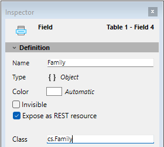

For other field properties, please refer to [doc.4d.com](https://doc.4d.com/4Dv21/4D/21/Field-properties.300-7676763.en.html).

<!-- INCLUDE my.section.id.Desc -->
<!-- INCLUDE my.section.id2.Desc -->

## Class

This property is available for fields of type **Object** (in 4D projects only). It allows you to define a **class-typed object field**, enhancing code completion, syntax checking, and runtime validation when typing code that involves object fields.

You can enter any valid class name in this property, including: 
  - User classes (e.g. `cs.MyClass`)
  - Built-in 4D classes (e.g. `4D.File`, `4D.Folder`)
  - [Exposed](../Extensions/develop-components.md#sharing-of-classes) component-defined classes (e.g. `cs.MyComponent.MyClass`)

If you enter an invalid class name, a warning is triggered and the input is rejected. 

:::note
  
[**Non-streamable classes**](../Concepts/dt_object.md#streaming-support) such as [ORDA Data Model classes](../ORDA/ordaClasses.md), [file handles](../API/FileHandleClass.md), [web server](../API/WebServerClass.md)... cannot be associated to object fields.

:::

In your code, when assigning a value to a class-typed object field, 4D verifies that it belongs to the declared class. If not or if the object has no class, an error is triggered. Accessing unknown attributes will also raise syntax errors.

To retrieve the associated class name at runtime, use the [`classID`](../API/DataClassClass.md#attributename) property, for example `ds.MyTable.MyField.classID`.

:::tip Related blog post

[Stricter class-based typing for objects](https://blog.4d.com/stricter-class-based-typing-for-objects/)

:::

### `4D.Vector` class

If you assign `4D.Vector` as the class of an Object type field, you define a **vector field**. Such fields store embessings and can be used to query data using AI features. See the [`4D.Vector` class](../API/VectorClass.md) documentation to see how to query with vectors. 

Note that the [**4D Embedding Studio** component](corner.4d.com/component/4d-embedding-studio) can help you configuring and updating your 4D.Vector fields.   

When you assign `4D.Vector` as the class of an Object type field, a specific icon is displayed as field type in the Structure editor: 

:::tip Related blog post

[Vector Indexing in 4D: Faster Similarity Search for 4D.Vector Fields](https://blog.4d.com/vector-indexing-in-4d-faster-similarity-search-for-4d-vector-fields)

:::

