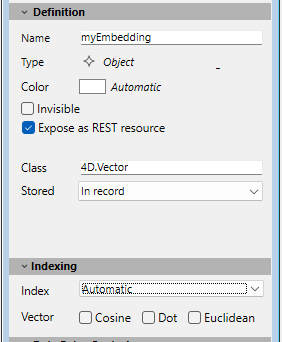
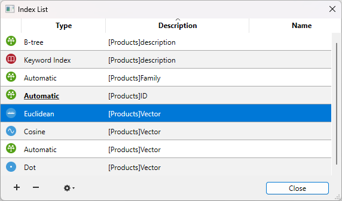

You can associate indexes with fields that you frequently use for searching and sorting. For example, you might index LastName, CompanyName, or ProductName if you plan to search or sort entities using these attributes. You also use this property for fields that establish relations between tables. 

When an index is associated with a field, 4D creates an internal index table for the field. This table allows 4D to perform rapid searches and sorts on the field. When searching or sorting on an unindexed field, 4D moves through data sequentially, examining each record in order. Indexing allows 4D to search and sort without going through every record. 

You can index fields of the Alpha, Text, Date, Time, Boolean, Integer, Long integer, Integer 64 bits, Real, Picture and Object type. As you add and delete records, 4D automatically updates its index table. If you create an index for a field that already exists, 4D automatically indexes the existing data. You can specify as many indexed fields as you want. Indexes are also rebuilt during specific operations such as conversion of earlier databases or [data compacting](../MSC/compact.md).

Each index table can contain up to:

- 128 billion keys for Alpha, Text, and Float indexes  
- 256 billion keys for other index types (scalar data)

Do not index every field. An index increases the size of the database, using more space on disk. Using many indexes also increases the time needed to save a record since 4D updates the index table with each record validation.

Indexed fields are displayed in **bold** type in the Structure editor.


## Types of indexes

4D provides different types of indexes. Choosing between the different types is generally based on the result expected and the type of data present in the field. There are four main types of indexes:

- **Standard indexes:** These are single-field indexes used to accelerate standard database operations (searches and sorts). 4D lets you choose the internal architecture of this type of index (except for Object fields): B-Tree or Cluster B-Tree.
- **Composite indexes:** This index stores the combined values of two or more fields that are often searched for together, for example LastName+FirstName.
- **Keyword indexes:** These indexes are only available for Alpha, Text and Picture type fields. They are intended to facilitate fast searching inside text or, in the case of pictures, among the keywords associated with the pictures.
- **Vector indexes**: These indexes are designed to accelerate AI-based queries on Object fields storing [embeddings](./field-properties.md#4dvector-class).  

### Standard indexes

A standard index is intended to accelerate database operations (a standard index refers to a generic index as opposed to a keyword or composite index). 4D offers two types of architectures for standard indexes: B-Tree and Cluster B-Tree.

- **B-Tree:** Standard B-Tree type index. This multipurpose index type meets most indexing requirements.
- **Cluster B-Tree:** B-Tree type index using clusters. This architecture is more efficient when the index does not contain a large number of keys, i.e. when the same values occur frequently in the data.

:::note

A B-Tree index associated with a Text type field stores the first 1024 characters of the field (maximum). Therefore in this context, searches for strings containing more than 1024 characters will fail.

:::

When you choose the index architecture, 4D also provides the Automatic option. In this case, 4D automatically selects the architecture according to the type of data concerned.
The **Automatic** option is the only option available for Object type fields. In fact, in this case, all attribute paths are automatically indexed.

### Composite indexes

Composite indexes store the combined values of two or more fields for each entry. The classic example is a composite index based on the FirstName+LastName fields. Searching for “Peter Smith” will therefore be optimized compared with a standard search (searching for “Smith” then searching for “Peter”).

4D automatically takes advantage of composite indexes during queries and sorts. For example, if a composite index “City+ZipCode” exists, it will be used in the case of a query of the type “lastname=carter and city=new york and zipcode =102@”.

In the structure editor, composite indexes can only be created using the index creation dialog box. For a detailed description of this dialog box, refer to the “Creating an index” section below.

### Keywords index

You can use a specific type of index with Alpha, Text and Picture fields: a keyword index.

- When you associate this type of index with an Alpha or Text field, the text stored in the field will be indexed word by word. All the words will be indexed even if they have only 1 or 2 characters. This type of index will accelerate subsequent keyword searches among text fields in a dramatic manner.  
  It is possible to associate both a standard index and a keyword index with Alpha and Text fields (when stored in the records). 4D will use the appropriate index depending on the context.

- When you associate this type of index with a Picture field, searches among keywords associated with pictures (metadata) are greatly accelerated. Warning: Picture keyword indexes are exclusively based on metadata of the IPTC/Keywords type. These types of metadata are supported in particular by the TIFF and JPEG formats (note that BMP, PNG and GIF do not support them). Other types of metadata are not managed by indexing.  
  Keyword indexes for pictures are updated automatically by 4D each time the Picture field is saved (when a record is created or modified, when data is imported, and so on). Metadata of the IPTC/Keywords type are indexed automatically by 4D when they are found in the picture (you do not have to call the [`SET PICTURE METADATA`](../commands/set-picture-metadata) command to include them in the index of the Picture field).

You can use the [`DISTINCT VALUES`](../commands/distinct-values) command to get the list of keywords contained in an keywords index.

You use picture or text keyword indexes through the [`%` operator](../Concepts/dt_string.md#keywords): this operator must be placed in the query or sort formulas in order to specifically use an index value. For example:

```4d
QUERY([PICTURES];[PICTURES]Photos %"cats")
// look for photos associated with the cats keyword
```

This works the same way for all the query and order by commands: [`QUERY BY FORMULA`](../commands/query-by-formula), [`QUERY SELECTION`](../commands/query-selection), [`ORDER BY`](../commands/order-by), etc.


### Vector index

A vector index can be associated to an Object type field that was configured as a `4D.Vector` [class](./field-properties.md#4dvector-class). In this case, the following options are available:



- **Cosine**: the vector index is optimized for [cosine similarity](../API/VectorClass.md#understanding-the-different-vector-computations) computations. 
- **Dot**: the vector index is optimized for [dot similarity](../API/VectorClass.md#understanding-the-different-vector-computations) computations.
- **Euclidean**: the vector index is optimized for [euclidian distance](../API/VectorClass.md#understanding-the-different-vector-computations) computations.
- **Automatic**: standard object index type ([see above](#standard-indexes)). You can select this index type to handle null vectors, it will be automatically used in this case. 

You can select one or more index types for your vector fields, the appropriate index will be automatically used depending on the actual computation. For optimization reasons, it is recommended to only select necessary index types. 

## Index List

The  button of the toolbar in the Structure editor displays the Index List window. This window displays the list of all the indexes of the structure, regardless of their type:




The Index List can be used to view the main properties of the indexes:

- **Type:** Index type. Each type of index (B-tree, Cluster B-tree, Keyword, Euclidean, Cosine, Dot) is depicted with a different icon.  
- **Description:** Table and field(s) of index. For a composite index, this list contains all the fields of the index.  
- **Name:** Index name. This property is used in particular by the language commands. You can change or add an index name by double-clicking in this column.

The **[+]** button displays the index property dialog box and allows you to edit the selected index or to add a new index when no index was selected.   
The **[-]** button deletes the selected index (a confirmation dialog box appears).  
This button can be used more particularly to delete composite indexes.  

Two additional commands are available in the menu associated with the tool button (enabled when an index is selected:

- **Edit:** Displays the properties of the selected index in the index property dialog box (see next paragraph). This command has the same effect as double-clicking on a row of the list (except for in the name area).  
- **Rebuild:** Can be used to delete and rebuild the selected index. A confirmation dialog box appears when you select this command.

## Creating an index

To create a **standard index** directly:

1. Select a field then choose a value from the "Index" menu of the **Inspector palette**. 
**OR**  
Right-click on the field then select a value from the **Index>** submenu of the context menu. 

To create a **composite index** or any other type of index using the index creation dialog box:

1. Select the **New Index...** in the context menu of the table or select **Index** in the add objects menu of the Structure editor tool bar.  
**OR**  
Select several fields while holding down the **Ctrl** (Windows) or **Command** (macOS) button then right click on one of the fields and select **New Composite Index...** in the context menu.

The index configuration dialog box then appears. 


It contains the following elements:

- **Table:** List of all the database tables. Choose the table to which the index will belong from this menu.  
- **Name:** Index name entry area. This name is used by the 4D language commands.  
- **Type:** Selection menu for type of index to be created. If you keep the "Automatic" option, 4D will automatically choose the index type according to the contents of the field.  
- **List of Fields:** This area is used to specify the field(s) associated with the index. It can contain a field by default depending on the current selection in the editor.

To add a field to the index, click on the **[+]** button. The list of fields of the selected table is displayed so that you can indicate the field to be added to the index.

- If you want to create a composite index, add each field to be included in the index successively. Once the list is completed, you can reorder the fields using the arrow buttons or using drag and drop.  
- If you create a composite index based on primary key fields, make sure you put the fields in the same order in the primary key and in the index.  
- If you have chosen the “Keyword Index” type, only Alpha or Text fields can be selected. Also in this case, you cannot include only one field in the index.

To delete a field from the index, select it in the list and click on the **[-]** button. 

Once the index has been configured, click on **OK** to generate the index.

## Deleting an index in the Structure editor

You can delete indexes that are no longer useful at any time. This can be carried out directly in the Structure editor or using the [Index List](#index-list) window. 

To delete a standard index in the Structure editor:

1. Select the field associated with the index you want to delete, then choose the **None** or uncheck the **Keyword Index** option (for a keyword index) in the Index menu of the **Inspector palette** 
**OR**  
Right-click on the field associated with the index, then choose the **None** or uncheck the **Keywords** option from the **Index>** submenu of the context menu.

The deletion (and viewing) of a composite index can only be carried out from the List Index window, see above.

## Reindexing a field

You can reindex a field at any time; in other words, rebuild the index table(s) associated with it, in accordance with the data present. This can be useful in the case of application maintenance.  

Reindexing can be carried out using the **Rebuild** command in the [Index List](#index-list) window.  

Note that modifying the [data language](../settings/database.md#text-comparison) or maintenance operations such as [compacting](../MSC/compact.md) will also cause the indexes to be rebuilt.
