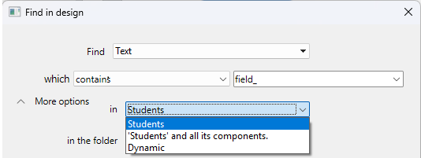
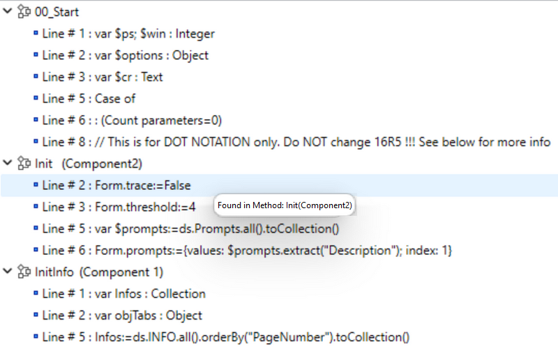

For the complete documentation of the "Search and replace" features, please refer to [doc.4d.com](https://doc.4d.com/4Dv20/4D/20.2/Searching-and-replacing-in-the-Design.200-6750077.en.html).

## Find in Design

### Search in components

When your current project references [editable components](../Extensions/develop-components.md#editing-components), you can designate one or all your components as a target for the search.

By default, a search is executed in the host only. To modify the target for a search, open the search options and deploy the **in the project** menu: 

You can select as target:

- the **host project** (default option): the search will only be executed within the host project code and forms, excluding components.
- the **host project and all its components**: the search will be executed in the host project and in all the loaded components.
- a **specific component**, among the list of all searchable components: the search will be restricted to this component only, excluding the host and other components.

:::note

When no searchable component is found, only the project name is displayed (no menu is available).   

:::

The **in the folder** menu is updated when you select a project since the availability of folders depends on the selected search target(s). The menu is disabled when you select the "host project and all its components" option. 

### Results window

The Results window lists all elements found that match the search criteria. When an element found belongs to a component, the component name is displayed in parenthesis at the right side of the element name:

You can double-click on a component method or class to open it in the [code editor](../code-editor/write-class-method.md). 

#### Replace in contents

The **Replace in contents** feature fully supports components: the contents of all elements listed in the Results window can be replaced, including elements from components that were found. 
