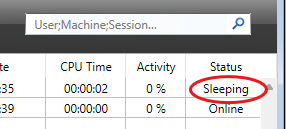

The **Sessions** page lists all active sessions connected to the server, including Client, Web, REST, and SOAP sessions.


The **Sessions** button indicates, in parentheses, the total number of active sessions (this number does not take into account any display filters applied to the window).

The page contains a dynamic search area, filtering controls, and administration buttons. You can modify the order of the columns by dragging and dropping their header areas.

You can also sort the list by clicking a column header. Click repeatedly to toggle between ascending and descending order.


## List of Sessions

Each row represents one active session.

The list provides the following information:

- **Type**: Type of session (Client, Web, REST, or SOAP).
- **4D User**: Name of the connected 4D user, or the alias defined using the [`SET USER ALIAS`](../commands/set-user-alias) command when applicable.
- **Login date**: Date and time when the session was established.
- **CPU Time**: CPU time consumed by the session since it was created.
- **Activity**: Percentage of server activity currently devoted to the session (dynamic value).

Additional information is available in the detail panel when a session is selected.

### Session Details

Selecting a session displays additional information in the lower panel.

For **Client** sessions, the following information is available:

- Operating system session name
- IP address
- Machine name
- 4D user
- Session UUID
- Additional client-specific information

For **REST**, **Web**, and **SOAP** sessions, the detail panel displays information such as:

- Guest status
- Privileges
- IP address
- User information
- Session UUID
- Additional session properties

When an IP address is displayed, you can click the lookup button to retrieve geolocation information.

If the lookup succeeds, the location is displayed below the IP address.

If no information is available, **Not found** is displayed.

## Managing Sleeping Client Sessions

4D Server specifically handles cases where a machine running a 4D remote application switches to sleep mode while its connection to the server remains active.

In this case, the remote application notifies 4D Server before entering sleep mode. The corresponding client session changes to the **Sleeping** status.



This status frees server resources while preserving the session context.

When the remote machine wakes up, the application automatically reconnects and restores the existing session.

A sleeping client session is automatically dropped after 48 hours of inactivity.

You can modify this timeout using the [`SET DATABASE PARAMETER`](../commands/set-database-parameter) command with the `Remote connection sleep timeout` selector.

## Search and Filtering

The search field filters the displayed sessions in real time.

Depending on the available columns, searches are performed on values such as:

- 4D User
- Machine name
- Session name
- IP address

Multiple search terms can be entered by separating them with semicolons (`;`).

For example:

```
John;Mary;REST
```

displays every session matching **John**, **Mary**, or **REST**.

### Session Type Filters

Four filters are available to quickly display only specific session types:

- Counted sessions
- Client sessions
- Web sessions
- REST sessions

Filters can be combined.

## Administration Buttons

The available administration buttons depend on the selected session(s).

### Send Message

Available only when one or more **Client** sessions are selected.

Clicking this button opens a dialog where you can enter a message that will be displayed on the corresponding remote machines.

> You can perform the same action programmatically using the [`SEND MESSAGE TO REMOTE USER`](../commands/send-message-to-remote-user) command.

### Watch Processes

Displays the processes associated with the selected session on the [**Processes** page](processes.md).

The process list is automatically filtered using the selected session UUID.

When multiple sessions are selected, this button is disabled.

### Drop User

Disconnects the selected Client session.

A confirmation dialog is displayed before the session is disconnected.

Hold down the **Alt** key while clicking **Drop user** to disconnect immediately without displaying the confirmation dialog.

> You can perform the same action programmatically using the [`DROP REMOTE USER`](../commands/drop-remote-user) command.