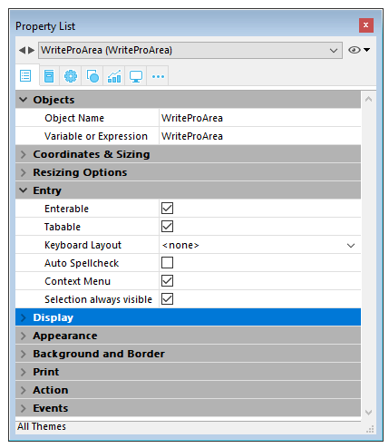
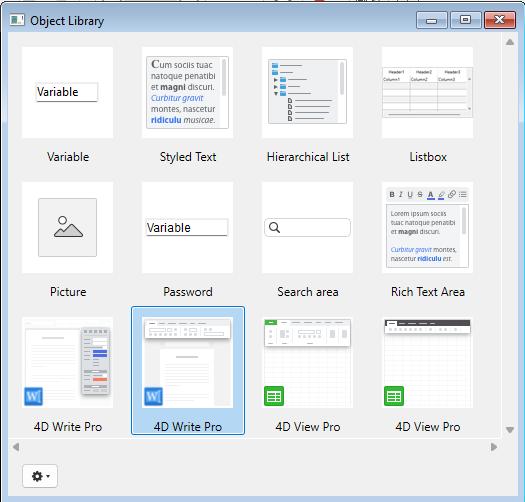
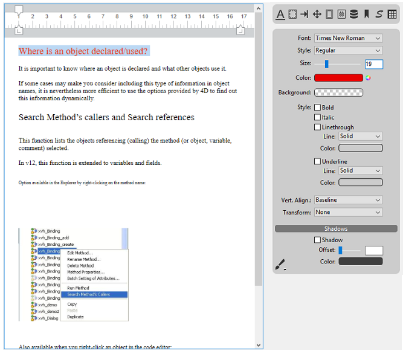
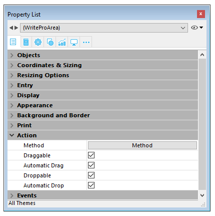

#### Using the 4D Write Pro area object 

4D Write Pro documents are displayed and edited manually in a 4D form object**: 4D Write Pro**. This object is available as part of the last tool (Plug-in Area, Web Area, etc.) found in the object bar:  
  
  

A 4D Write Pro form area is configured by means of standard properties found in the Property List, such as **Object Name** and **Variable Name**, **Coordinates**, **Entry**, **Display**, **Appearance**, and/or **Events**.  
  
  

The **Variable Name** property can be used in the language as a reference to the 4D Write Pro area. Note that the variable must be of the [Object](# "Data structured as a native 4D object") type (for more information, refer to the [C\_OBJECT](../../commands/c-object) command).

"Entry" properties manage basic features for text entry:

* **Enterable**: enables you to lock/unlock the area in order to allow or prevent editing
* **Auto Spellcheck**: available for 4D Write Pro areas
* **Context Menu**: allows you to enable/disable the context menu when the form is executed at runtime (see the *Using a 4D Write Pro area* section)
* **Selection always visible**: handles text selection as in standard text areas.

#### Using the 4D Write Pro Widgets of the Object library 

You can create preconfigured 4D Write Pro areas using the **4D Write Pro** objects found in the Object library ("Entry areas" theme):  
  
  

These areas come with either a control panel or a toolbar for managing all the attributes of the area (font, color, style, etc.):  
  
  

For more information, refer to the *4D Write Pro areas* section.

#### Configuring Drag and Drop 

To configure the drag and drop features for your 4D Write Pro areas, you need to select the appropriate options in the "Action" theme of the Property List:  
  
  

4D Write Pro areas support two drag and drop modes:

* **Custom mode:** only "Draggable" and "Droppable" options checked. In this mode, you can select text and start to move it. The object method is then called with the On Begin Drag Over event, and you can define the drop action using custom code.
* **Automatic mode**: "Draggable", "Droppable", "Automatic Drag" and "Automatic Drop" options checked. In this mode, you can automatically move or copy the selected text by pressing the **Alt/Option** key. The On Begin Drag Over event is not triggered.

**Note:** Selecting only "Automatic Drag" and "Automatic Drop" options will have no effect in the 4D Write Pro area. 

#### Configuring View properties 

Document view properties are directly available in the Property List for 4D Write Pro areas. They allow you to define how a 4D Write Pro document will be displayed by default in the 4D Write Pro area. These properties let you customize, for example, whether 4D Write Pro documents are displayed as they would be printed, or as they would be rendered in a browser. You can set different views of the same 4D Write Pro document in the same form.

**Note:** View settings can be managed dynamically using the [WP SET VIEW PROPERTIES](../commands/wp-set-view-properties) and [WP Get view properties](../commands/wp-get-view-properties) commands. 

Document view settings are handled through specific items in the **Appearance** theme of the Property List for 4D Write Pro form objects:  
  
  

* **Resolution**: Sets the screen resolution for the 4D Write Pro area contents. By default, it is set to **72 dpi (macOS)**, which is the standard resolution for 4D forms on all platforms. Setting this property to **Automatic** means that document rendering will differ between macOS and Windows platforms. Setting a specific dpi value will make the document rendering the same on both macOS and Windows platforms.
* **Zoom**: Sets the zoom percentage for displaying 4D Write Pro area contents.
* **View mode**: Sets the mode for displaying the 4D Write Pro document in the form area. Three values are available:  
   * **Page**: the most complete view mode, which includes page outlines, orientation, margins, page breaks, headers and footers, etc. For more information, please refer to the *Page view features* paragraph.  
   * **Draft**: draft mode with basic document properties  
   * **Embedded**: view mode suitable for embedded areas; it does not display margins, footers, headers, page frames, etc.  
   This mode can also be used to produce a web-like view output (if you also select the 96 dpi resolution and the **Show HTML WYSIWYG** option).  
         
   **Note:** The **View mode** property is only used for onscreen rendering. Regarding printing settings, specific rendering rules are automatically used (see *Printing 4D Write Pro documents*).
* **Show page frame**: Displays/hides the page frame when Page view mode is set to "Page".
* **Show references**: Displays all 4D formulas (or expressions) inserted in the document as *references* (see *Managing formulas*). When this option is unchecked, 4D formulas are displayed as *values*.  
**Note:** Formula references can be displayed as  symbols (see below).
* **Show headers/footers**: Displays/hides the headers and footers when Page view mode is set to "Page". For more information on headers and footers, please refer to the *Using a 4D Write Pro area* section.
* **Show background and anchored elements**: Displays/hides background images, background color, anchored images and text boxes.
* **Show hidden characters**: Displays/hides invisible characters
* **Show HTML WYSIWYG**: Enables/disables the HTML WYSIWYG view, in which any 4D Write Pro advanced attributes which are not compliant with all browsers are removed.
* **Show horizontal ruler**: Displays/hides the horizontal ruler. For more information on rulers in 4D Write Pro areas, see the *Handling rulers* section.
* **Show vertical ruler**: Displays/hides the vertical ruler when the document is in Page mode. For more information on rulers in 4D Write Pro areas, see the *Handling rulers* section.
* **Show empty or unsupported images**: Displays/hides a black rectangle for images that cannot be loaded or computed (empty images or images in an unsupported format). For more information, see the *Empty pictures* section.
* **Display formula source as symbol**: Displays source text of formulas as  symbols when expressions are shown as references (see above). Displaying formulas as symbols makes template documents more compact and more *wysiwyg*.

**Compatibility notes:**

* 4D Write Pro documents created with versions up to 4D v15 R5 are displayed using the default values for these properties, with the exception of the Resolution property, which is set to Automatic in this case.
* Horizontal rulers are available by default in databases created starting with 4D v16 R2; for databases converted from previous versions, this setting is not checked by default.