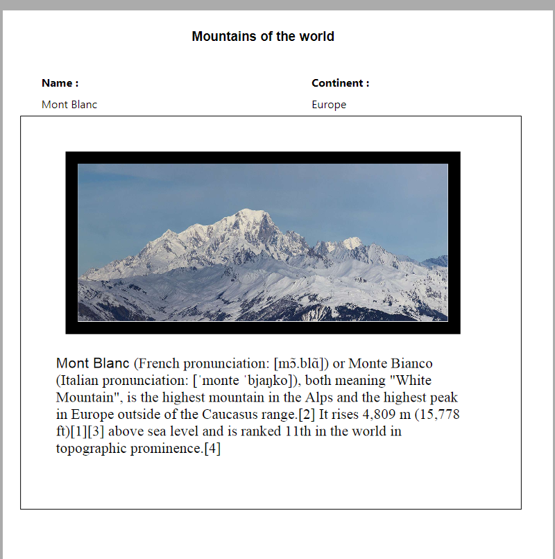

#### 

4D Write Pro documents can be printed in two ways:

* As parts of 4D forms
* As independent documents

#### Printing documents in 4D forms 

You can print 4D Write Pro embedded objects as part of any kind of 4D form (project, table, input, or output) using standard 4D printing commands such as [PRINT SELECTION](../../commands/print-selection) or [PRINT RECORD](../../commands/print-record). 

The standard *Print Variable Frame* option is also supported(\*) for 4D Write Pro areas, allowing you to manage size during printing. When this option is checked, the margins (outside and inside) and top border are only applied to the first page, and the margins (outside and inside) and bottom border are only applied to the last page. Pagination properties of the document are ignored: widow and orphan control is disabled and page breaks are not applied (these properties are only used for page rendering on screen, or for standalone printing of the document). When the **Print Variable Frame** option is selected, only objects located above the form area are printed. For more information about this option, refer to "*Print Variable Frame*" in the Design Reference manual.

(\*) The [Print object](../../commands/print-object) and [Print form](../../commands/print-form) commands are not compatible with this option. 

##### View mode for printing 

Regardless of the **View mode** set for the 4D Write Pro area (see *Configuring View properties*), it is always printed as in the **Embedded** mode when you use a 4D printing command such as [Print form](../../commands/print-form). In this case, the following Appearance settings are not taken into account for the 4D Write Pro form objects: Page view mode (always "Embedded"), Show headers, Show footers, Show page frame (always "No"), Show hidden characters (always "No"). 

##### Example 

The following example shows the effect of the **Print Variable Frame** option on a 4D Write Pro area embedded in the default output form. The following code is executed:

```4d
 ALL RECORDS([Movies])
 ORDER BY([Movies]Title)
 PRINT SELECTION([Movies])
```

* Here is the result with the Print Variable Frame option **unchecked** (off):  

* Here is the result with the Print Variable Frame option **checked** (on):  
  
  
*(Sample text source: Wikipedia)*

#### Printing independent documents 

Starting with 4D v15 R5, 4D Write Pro includes printing features allowing you to print independent 4D Write Pro documents as well as to control standard printing options such as the format, orientation, or page numbers.

##### 4D Write Pro commands 

Basically, two commands handle the 4D Write Pro printing features: **WP PRINT** and **WP USE PAGE SETUP**.

* [WP PRINT](../commands/wp-print) launches a print job for a 4D Write Pro document or adds the document to a current print job.
* [WP USE PAGE SETUP](../commands/wp-use-page-setup) modifies the current printer page settings based on the 4D Write Pro document attributes for page size and orientation.

**Note:** On machines with Windows 7 or Windows Server 2008 R2, make sure that the *Platform Update for Windows 7* has been installed so that the printing features are supported.

##### Regular 4D commands 

The following 4D commands support 4D Write Pro printing features:

* [SET PRINT OPTION](../../commands/set-print-option) and [GET PRINT OPTION](../../commands/get-print-option): All options are supported for 4D Write Pro documents printed by [WP PRINT](../commands/wp-print). For Paper option and Orientation option, you may find it more efficient to call [WP USE PAGE SETUP](../commands/wp-use-page-setup) in order to easily synchronize these attributes with the 4D Write Pro document settings. The Page range option (15) allows you to specify the page range to print.
* [PRINT SETTINGS](../../commands/print-settings): Defines print settings for the current printer; if [WP PRINT](../commands/wp-print) is called afterwards, it takes any print settings modified by means of the Print Settings dialog boxes into account (except for margins, which are always based on the 4D Write Pro document).
* [OPEN PRINTING JOB](../../commands/open-printing-job) and [CLOSE PRINTING JOB](../../commands/close-printing-job): [WP PRINT](../commands/wp-print) can be called between these commands in order to insert one or more 4D Write Pro documents into a single print job.