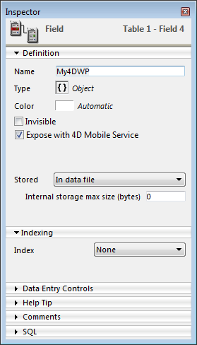

#### 

You can store your 4D Write Pro documents automatically in the 4D data file. If you created a 4D Write Pro area on a form and created an Object field to store the area’s contents, any text entered in the area is saved automatically with each record when the record is validated. You can then use the [QUERY BY ATTRIBUTE](../../commands/query-by-attribute) command in order to select records based on the value of their internal attributes. You can also add and query your own attributes with 4D Write Pro areas. 

This section describes the following features:

* Binding a 4D Object field to a 4D Write Pro area in a form
* Setting, getting, and querying custom attributes of stored 4D Write Pro documents using the [OB SET](../../commands/ob-set), [OB Get](../../commands/ob-get) standard object commands, and [QUERY BY ATTRIBUTE](../../commands/query-by-attribute).

#### Assigning a 4D Object field to a 4D Write Pro area 

To bind a 4D Write Pro area with a 4D Object field, you just need to reference the field in the Variable Name property of the area. 

##### Creating the Object field in the Structure 

In your database structure, any 4D Object field can be used to store 4D Write Pro documents. As with any Object field, you just have to define its standard properties, according to your needs:

* the field name,
* its attributes, such as "Expose with 4D Mobile Service," as well as its index,
* its storage option (for more on this, see *External data storage*).



##### Assigning the Object field to the 4D Write Pro area 

Once you have defined an Object field to store your 4D Write Pro document, you just need to reference it in the form containing the area. You can use any table or a project form.   
In the Form editor, enter the field name using the standard "\[Table\]Field" notation in the **Variable Name** area of the Property list for the 4D Write Pro area:


Your 4D Write Pro area is then associated with the field, ensuring that its contents will be saved automatically with each record. Note that if you do not use the 4D automatic action buttons, you will have to save the area manually using 4D commands. 

#### Using custom attributes 

When 4D Write Pro areas are stored in Object fields, you can save and read any custom attributes with the 4D Write Pro document, such as, for example, the writer's name, the document category, or any additional information you may find useful. You can then query your custom attributes to select records matching the criteria.

Custom attributes will be exported with the [WP EXPORT DOCUMENT](../commands/wp-export-document) or [WP EXPORT VARIABLE](../commands/wp-export-variable) commands. They will be exported as well when converting a 4D Write Pro Object field to JSON using the [JSON Stringify](../../commands/json-stringify) command (along with the 4D Write Pro main document attributes).

To set or get custom attributes, you just need to use object notation or the [OB Get](../../commands/ob-get) and [OB SET](../../commands/ob-set) commands.

For example, in the form method, you can write:

```4d
 If(Form event code=On Validate)
    [MyDocuments]My4DWP["myatt_Last edition by"]:=Current user
    [MyDocuments]My4DWP.myatt_Category:="Memo"
    [MyDocuments]My4DWP:=[MyDocuments]My4DWP //to record the edit
 End if
```

or:

```4d
 If(Form event code=On Validate)
    OB SET([MyDocuments]My4DWP;"myatt_Last edition by";Current user)
    OB SET([MyDocuments]My4DWP;"myatt_Category";"Memo")
 End if
```

You can also read custom attributes of the documents:

```4d
 vAttrib:=[MyDocuments]My4DWP.myatt_Category
```

or:

```4d
 vAttrib:=OB Get([MyDocuments]My4DWP;"myatt_Category")
```

If you have saved custom 4D Write Pro attributes in your data file, you can query these attributes to create a selection of records containing the appropriate attribute value. In the following example, you query the table containing the Object field to select records:

```4d
 QUERY BY ATTRIBUTE([MyDocuments];[MyDocuments]My4DWP;"myatt_Category";=;"Memo")
  //selects all records in MyDocuments whose "myatt_Category" custom attribute has the value "Memo"
  //in the My4DWP Object field (bound to a 4D Write Pro area)
```

**Note about custom attribute names:** Since custom attributes share the same naming space as 4D Write Pro internal attributes, we strongly recommend that you use prefixes when defining your own attribute names in order to avoid any conflicts between internal and custom attributes. Non-prefixed names are reserved for 4D Write Pro internal attributes. You can use any custom prefix (for instance, we used "myatt\_" as a prefix in the above example).

**Note:** Custom attributes cannot be handled by the [WP SET ATTRIBUTES](../commands/wp-set-attributes), [WP GET ATTRIBUTES](../commands/wp-get-attributes), and [WP RESET ATTRIBUTES](../commands/wp-reset-attributes) commands (they only support 4D Write Pro internal attributes). For more information, please refer to the *4D Write Pro Attributes* section.