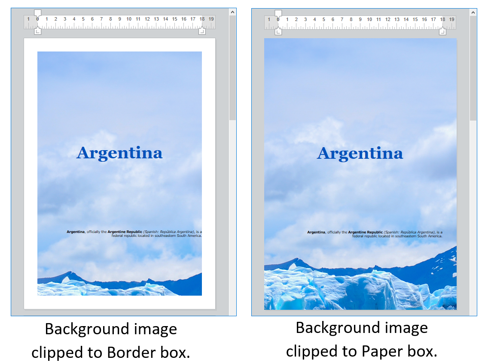
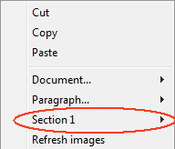
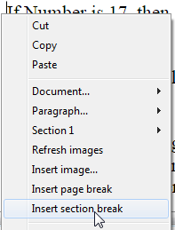
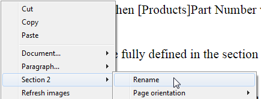
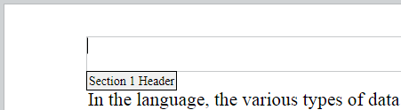
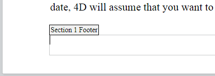
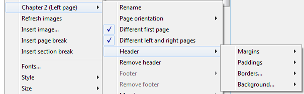
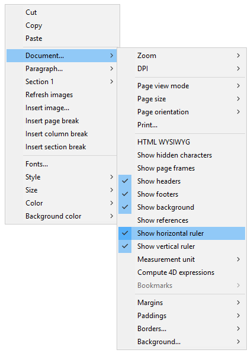
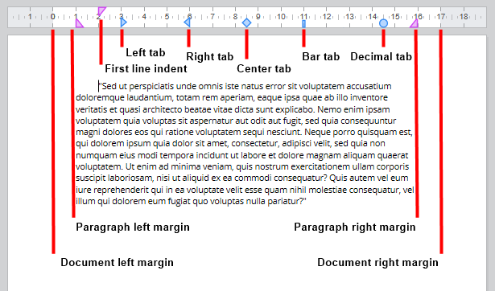

#### Managing documents in 4D Write Pro areas 

In 4D applications, 4D Write Pro documents are created, imported, and exported by means of specific commands found in the **4D Write Pro** theme (*WP EXPORT DOCUMENT*, *WP EXPORT VARIABLE*, *WP Import document*, *WP New*).

You can also associate a 4D Write Pro area with an Object field in a database form. This way, each 4D Write Pro document is automatically saved with the record and stored in the database's data (see *Storing 4D Write Pro documents in 4D Object fields*). 

#### .4wp document format 

You can save and re-open 4D Write Pro documents to and from disk without any loss using the native **.4wp** format.

The **.4wp** format consists of a zip folder whose name is the document title and whose contents are HTML text and images:

* HTML text combines regular HTML with 4D expressions (which are not computed) as well as 4D-specific tags,
* images are stored in a folder with the same name as the document title, next to the HTML file.

Since .4wp documents are based on HTML, they can be imported or opened in any external application supporting HTML.

The 4D Write Pro internal document format is a proprietary HTML extension, compatible with HTML5/XHTML5, but which supports its own subset of HTML/CSS attributes and tags. As a result, only HTML documents exported by 4D Write Pro can be opened by 4D Write Pro without any risk of data loss. Importing HTML documents that were created externally could produce errors.

For more information, you can [**download the list of 4D Write pro attributes with associated definition as CSS style or XHTML tag**](https://download.4d.com/Documents/Products%5FDocumentation/LastVersions/Line%5F19/4DWP-attributes-and-xhtml.pdf) in the 4D Write Pro XHTML.

##### Backward compatibility 

You can always reopen a .4wp document with a previous version of 4D Write Pro. If it contains attributes that were added in more recent versions, these attributes are just ignored. However, if you save the document, the attributes are removed from the document and will be lost. 

#### Context menu 

If the **Context menu** property is checked for a 4D Write Pro area (see *Defining a 4D Write Pro area*), a comprehensive context menu is available to users when the form is executed at runtime:  
  
 

This menu offers access to all the 4D Write Pro user features. 

#### Selecting the view mode 

4D Write Pro documents can be displayed in one of three page view modes:

* **Draft**: draft mode with basic properties
* **Page** (default): "print view" mode
* **Embedded**: view mode suitable for embedded areas; it does not display margins, footers, headers, columns, page frames, etc. This mode can also be used to produce a Web-like view output (if you also select the 96 dpi resolution and the **HTML WYSIWYG** option).

The page view mode can be configured by means of the area pop-up menu:  
  
  

**Note:** The page view mode is not stored with the document. 

For areas embedded in 4D forms, the view mode can also be set by default using the Property List. In this case, the view mode is stored as a property of the 4D Write Pro form object (for more information, please refer to the *Configuring View properties* paragraph). 

#### Basic properties 

When the document is in **Page** view mode, the following document properties are available for the user:

* Page outlines to represent printing limits
* Page width and Page height (default: 21x29.7 cm)
* Page orientation (default: Portrait)
* Page margin (default: 2.5 cm)

You can also use additional commands such as **Document.../Page size** or **Document.../Page orientation**.

**Note:** When a document is in **Embedded** or **Draft** view mode, page properties can be set, even if their effect is not visible. In **Draft** view mode, the following paragraph property effects are visible:

* Page height limitation (lines drawn)
* Columns
* Avoid page break inside property
* Widow and orphan control.

##### Paragraph breaks 

When displayed in Page or Draft mode (or in the context of a document printing), 4D Write Pro paragraphs can break:

* automatically, if the paragraph height is greater than the available page height,
* depending on paragraph breaks set by programming or by the user.

Breaks can be added by programming or by the user. Available actions include:

* [WP INSERT BREAK](../commands/wp-insert-break) command
* *insertPageBreak* standard action
* **Insert page break** option of the default contextual menu

**Controlling automatic breaks**

You can control automatic breaks in paragraphs using the following features: 

* **Widow and orphan control**: When this option is set for a paragraph, 4D Write Pro does not allow widows (last line of a paragraph isolated at the top of a page) or orphans (first line of a paragraph isolated at the bottom of a page) in the document. In the first case, the previous line of the paragraph is added to the top of the page so that two lines are displayed there. In the second case, the single first line is moved onto the next page.
* **Avoid page break inside**: When this option is set for a paragraph, 4D Write Pro prevents this paragraph from being broken into parts on two or more pages.
* **Keep with next:** When this option is set for a paragraph, that paragraph cannot be separated from the one that follows it by an automatic break. See wk keep with next and the corresponding standard action (*keepWithNext*, see *Using 4D Write Pro standard actions*).

These options can be set using the context menu, or attributes (wk avoid widows and orphans, wk page break inside paragraph, see *4D Write Pro Attributes*), or standard actions (*widowAndOrphanControlEnabled*, *avoidPageBreakInside*, see *Using 4D Write Pro standard actions*). 

#### Background 

The background of 4D Write Pro documents and document elements (tables, paragraphs, sections, headers/footers, etc.) can be set with the following effects:

* colors
* borders
* images
* origin, horizontal and vertical positioning
* painting area
* repeat

These attributes can be defined programmatically for either individual elements on a page and/or entire document backgrounds with the [WP SET ATTRIBUTES](../commands/wp-set-attributes) command or by *Using 4D Write Pro standard actions*. To see the full list of available background attributes and where they can be applied, see the *4D Write Pro Attributes* article. 

Users can modify background attributes via the contextual menu as shown below:

 

For an example of adding a full-sized image as a background, see the *How Do I* (HDI) demo [here](http://download.4d.com/Demos/4D%5Fv16%5FR5/HDI%5F4DWP%5FBackImagePaperBox.zip).

#### Handling headers, footers, and sections 

4D Write Pro documents support headers and footers. These headers and footers are related to sections.

A section is a part of a document which is defined by a page range and can have its own paging and common attributes. A document can contain any number of sections (from just one, up to the total number of pages). Each page can only belong to one section, except pages with continuous section breaks (see below). 

You can define a set of headers and footers for each section.

##### Defining a section 

A section is a subset of continuous pages in a 4D Write Pro document. A document can contain one or more sections. A section can contain any number of pages, from a single page to the total number of pages in the document. A section page can contain a single column or up to 20 column(s). 

By default, a document contains a single section, named **Section 1**. The 4D Write Pro contextual menu displays this section number wherever you click in the document:  
  
  

You create a new section by adding a section break in the text flow:  
  
  

When a section break has been added, the contextual menu displays an incremented number for each section. You can, however, rename any section:  
  
  

The name you entered is then used as the section name everywhere in the document:  
  
   

Note that if you have defined a different first page or different left/right pages for a section, the page type is also displayed in the menu (see below).

##### Inserting a continuous section break 

A continuous section break creates a new section on the same page. This allows you to create pages with sections that have different numbers of columns (see *Creating a page with multiple-column and single column sections*).

Sections created with continuous section breaks are counted in the document (they have section numbers), but unlike sections created with regular section breaks, their headers, footers, anchored images, etc. are only taken into account when a physical page break has occurred.

**Note:** If you change the page orientation for the new section after you insert a continuous section break, it turns into a regular section break.

##### Section attributes 

Sections inherit attributes from the document. However, common document attributes, including headers and footers, can be modified separately for each section. The contextual pop-up menu displays the properties and attributes available at the section level:  
  
  

* **Page orientation**: allows you to set a specific page orientation (Portrait or Landscape) per section.
* **Different first page**: allows you to set different attributes for the first page of the section; this feature can be used to create flyleaves, for example. When this attribute is checked, the first page of the section is handled as a subsection itself and can have its own attributes.  
    

* **Different left and right pages**: allows you to set different attributes for left and right pages of the section. When this attribute is checked, left and right pages of the section are handled as subsections and can have their own attributes.  
    

* **Columns** commands: allow to define the number and properties of columns for the section. These options are detailed below.
* **Header** and **Footer** commands: these options allow you to define separate headers and footers. These options are detailed below.
* **Margins** / **Paddings** / **Borders** / **Background**: these attributes can be defined separately for each section. For more information on these attributes, please refer the *4D Write Pro Attributes* article.

##### Inserting headers and footers 

Each section can have specific header and footer. Headers and footers are displayed only when the document page view mode is **Page**. 

 Within a section, you can define up to three different headers and footers, depending on the enabled options:

* first page,
* left page(s),
* right page(s).

To create a header or a footer: 

1. Make sure the document is in **Page** view mode.
2. Double-click in the header or footer area of the desired section and page to switch to editing mode.  
   * The header area is at the top of the page:  
     
   * The footer area is at the bottom of the page:  
   

You can then enter any static contents, which will be repeated automatically on each page of the section (except for the first page, if enabled).

You can insert dynamic contents such as the page number or the page count using the [ST INSERT EXPRESSION](../../commands/st-insert-expression) command (for more information, please refer to the *Inserting document and page expressions* paragraph). 

**Note:** You can also handle footers and headers by programming using specific commands such as [WP Get header](../commands/wp-get-header) and [WP Get footer](../commands/wp-get-footer).

Once a header or a footer has been defined for a section, you can configure its common attributes using the contextual menu:

For more information on **Margins**, **Paddings**, **Borders**, and **Background** attributes, please refer the *4D Write Pro Attributes* section. 

You can remove the entire definition of a header or a footer (contents and attributes) by selecting the **Remove header** or **Remove footer** command in the contextual menu. 

##### Compatibility 

4D Write Pro handles headers and footers of documents converted from the 4D Write plug-in with a fixed height.

The following expressions and properties are also supported and converted from the 4D Write plug-in headers and footers:

* page number and page count variables
* distinct first page
* distinct left/right pages

#### Handling text boxes 

Text boxes are areas that are anchored to a page or a section and can be filled with text, inline pictures, or tables. Text boxes can be positioned anywhere on the page and meet specific needs, for example to insert a company’s name or logo or an address area.

**Note:** A text box cannot contain headers, footers, columns, anchored images, or other text boxes. 

Text boxes are added with an absolute position, in front of/behind text, as well as anchored to a page or specific parts of a document in Page mode: header, footer, a section, all sections, or a subsection. Text boxes can also be used in embedded mode (anchored to the layer box). 

Adding a text box to a 4D Write Pro document can be accomplished in the following ways:

* using the **WP New text box** command,
* using the *insertTextBox* standard action

To select a text box, the user has to click on it (**Ctrl/Cmd+click** if the text box is on the background layer). Once selected, the text box can be moved or resized using the mouse or arrow keys. 

To remove a selected text box, you can hit the **Delete** or **Backspace** key, use the **textBox/remove** standard action, or execute the **WP DELETE TEXT BOX** command. 

Text box attributes are handled with the [WP SET ATTRIBUTES](../commands/wp-set-attributes) command or *4D Write Pro actions*. The following attributes and actions are available:

| **Property (constant)** | **Standard action**       | **Comments**                                                                |
| ----------------------- | ------------------------- | --------------------------------------------------------------------------- |
| wk width                | textBox/width             | If set to "auto", width converted to 8cm as text box width cannot be "auto" |
| wk height               | textBox/height            | If set to "auto", height is adjusted to fit the contents                    |
| wk padding              | textBox/padding           |                                                                             |
| wk border \[...\]       | textBox/border\[...\]     |                                                                             |
| wk background \[...\]   | textBox/background\[...\] |                                                                             |
| wk vertical align       | textBox/verticalAlign     |                                                                             |
| wk id                   | \-                        | cannot be empty for a text box                                              |
| wk anchor \[...\]       | textBox/anchor\[...\]     |                                                                             |
| wk owner                | \-                        | read-only                                                                   |
| wk protected            | \-                        |                                                                             |
| wk style sheet          | \-                        | read-only and always "" (no style sheet)                                    |

Text boxes support automatic text wrapping when anchored to a document with options like on the left, right, largest side, above and below, or all around provided through the property wk anchor layout or the standard action **anchorLayout**. Check this [blog post](https://blog.4d.com/4d-write-pro-more-display-options-for-anchored-pictures-and-text-boxes/) for more details.

Text boxes with text wrapping anchored to the body of the page do not affect the header or the footer (the text box is displayed in front of the header or the footer); on the contrary, text boxes anchored to the header and footer affect the body of the page if they overlap it.

**Note**: If you want to anchor a text box with text wrapping to the header or footer, you must also set the vertical alignment of the text box to the top.

Text boxes are not displayed if:

* the view mode is Draft;
* they are centered or anchored to sections and the **Show HTML WYSIWYG** option is checked;
* the "visible background" option is not enabled.

#### Handling rulers 

Horizontal rulers are available in every viewing mode of 4D Write Pro and have the following characteristics:

* Graduations in cm, mm, inches or pt according to current layout unit defined in the 4D Write Pro document. You can change measurement units using the context menu or by modifying the wk layout unit attribute.
* First line indent symbol
* Left paragraph margin symbol
* Right paragraph margin symbol
* Tabs displayed along lower edge of ruler
* Visible color contrast representing left and right page margins

Vertical rulers are available in Page mode only and have the following characteristics:

* Graduations in cm, mm, inches or pt according to current layout unit defined in the 4D Write Pro document. You can change measurement units using the context menu or by modifying the wk layout unit attribute.
* Visible color contrast representing top and bottom page margins

You can change the display status of the rulers via standard actions (see *Using 4D Write Pro standard actions*) or by checking or unchecking the **Show horizontal ruler** or **Show vertical ruler** item in the context menu of the 4D Write Pro area:  
  
  

**Note:** A specific 4D Write Pro area property allows defining the default display for the rulers (see *Configuring View properties* section).

##### Adjusting text margins and indents 

###### Horizontal ruler 

You can modify the left and right margins, indents and tab positions by clicking and dragging the corresponding symbols on the horizontal ruler:  
  
  

When you hover the mouse over one of these symbols, the cursor changes to indicate that it can be moved, and a vertical guide line appears while you drag it:  
  
  

When multiple paragraphs are selected, dragging margin or indent symbols applies these margins or indents to all selected paragraphs. Holding down the **Shift** key while dragging these symbols maintains existing intervals between indents or margins in the selected paragraphs.

###### Vertical ruler 

You can modify the top and bottom margins with the vertical ruler. When you hover the mouse over the margin limit, the cursor changes to indicate that it can be moved, and a horizontal guide line appears while you drag it:  
  
   

This action can be used to modify the spacing between the top and bottom of the page and the body and the header and footer of a document. 

##### Managing tabs 

You can use the horizontal ruler's context menu to create, modify or delete tabs:  
  
  

To create a tab, just right-click directly on the horizontal ruler and choose its type from the context menu; a single left click automatically creates a default left tab. You can also right-click on existing tabs to modify their type using the context menu.

**Remove tab** is only available when you right-click directly on an existing tab; you can also remove tabs by dragging them outside the horizontal ruler area.

**Notes:** 

* Tabs can also be defined programmatically with the [WP SET ATTRIBUTES](../commands/wp-set-attributes), [WP GET ATTRIBUTES](../commands/wp-get-attributes), and [WP RESET ATTRIBUTES](../commands/wp-reset-attributes) commands with the wk tab default and wk tabs selectors.
* For decimal tabs, 4D Write Pro considers the first dot or comma character from the right as the decimal separator; this default setting can be modified with the wk tab decimal separator selector.

###### Define leading characters 

The characters preceeding tabs (leading characters) can be defined by selecting from five predefined characters or by designating a specific character to use. The predefined characters are:

* None (no characters are displayed - *default*)
* .... (dots)
* \--- (dashes)
* \_\_ (underscores)
* \*\*\* (asterisks)

Leading characters always appear before the tab and follows the text direction (left to right or right to left). They can be defined programmatically with the [WP SET ATTRIBUTES](../commands/wp-set-attributes), [WP GET ATTRIBUTES](../commands/wp-get-attributes), and [WP RESET ATTRIBUTES](../commands/wp-reset-attributes) commands using wk leading with the wk tab default or wk tabs selectors, or via the horizontal ruler's contextual menu (as shown below).

When **Other...** is selected, a dialog is displayed where a custom leading character can be defined.

##### Multi-column rulers 

When two or more columns are defined for the document or the section, the horizontal ruler displays a specific area for each column:

**Note:** Multi-column feature is not available in **Embedded** view mode.

##### On After Edit event 

An On After Edit form event is triggered for a 4D Write Pro area form object whenever any of the tab or margin controls are moved, added or deleted, whether by dragging them or using the context menu.

#### Handling columns 

4D Write Pro allows you to manage columns in your documents. Columns are chained from the left-most column to the right-most column. In other words, when entering text, the text flow will start filling the left column and continue with the column directly to the right until it reaches the end of the page. Once the end of the page is reached, the text flow cycles through the next page. In order to be able to balance the page settings, 4D Write Pro allows you to insert column breaks.

Columns can be defined at the document level (they are displayed in the whole document) and/or at the section level (each section can have its own column configuration). 

**Note:** Columns are supported in **Page view** mode and **Draft view** mode only (they are not displayed in **Embedded** view mode), and they are exported to .docx using [WP EXPORT DOCUMENT](../commands/wp-export-document) but not to HTML and MIME HTML formats (wk web page complete format).

Columns can be set using:

* the **Columns** submenu of the 4D Write Pro area context menu,
* 4D Write Pro attributes (see *4D Write Pro Attributes*),
* 4D Write Pro standard actions (see *Using 4D Write Pro standard actions*).

You can set or get the following properties and actions for columns:

| **Property**                        | **Description**                                                                                                                                                                                                                                        | *Document* **attributes**                                                | **Standard actions**                                    |
| ----------------------------------- | ------------------------------------------------------------------------------------------------------------------------------------------------------------------------------------------------------------------------------------------------------ | ------------------------------------------------------------------------ | ------------------------------------------------------- |
| Number of columns                   | You can define up to 20 columns for the document/section                                                                                                                                                                                               | wk column count                                                          | *columnCount*                                           |
| Column spacing                      | Space between columns in pts, inches, or cm. Note that all columns will have the same size. Each column width is automatically calculated by 4D Write Pro according to the number of columns, the page width, and the spacing                          | wk column spacing                                                        | *columnSpacing*                                         |
| Column width                        | (read-only attribute) Current width for each column, i.e. computed width                                                                                                                                                                               | wk column width                                                          | \-                                                      |
| Column rule style, color, and width | You can add a vertical separator (a decorative line) between columns. These options let you design the separator style, color and width. To remove the vertical separator, select **None** as a style. | wk column rule style, wk column rule color, wk column rule width         | *columnRuleStyle*, *columnRuleColor*, *columnRuleWidth* |
| Insert break                        | Insert a column break                                                                                                                                                                                                                                  | wk column break, see also [WP INSERT BREAK](../commands/wp-insert-break) | *insertColumnBreak*                                     |
| Columns menu                        | Create a Columns sub-menu                                                                                                                                                                                                                              | \-                                                                       | *columns*                                               |

##### Creating a page with multiple-column and single column sections 

*Inserting a continuous section break* in your document allows you to have multiple-column sections and single column sections on the same page. 

For example:

You can insert a continuous section break and change the number of columns to two for the first section:

