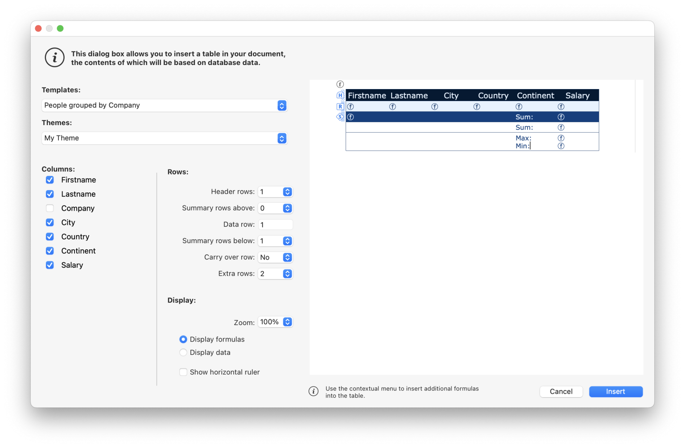

4D WritePro interface offers a set of palettes, which allow end users to easily customize a 4D Write Pro document.

A 4D developer can easily implement these palettes in his application. Thus the end user can handle all 4D Write Pro properties such as: fonts, text alignment, bookmarks, table layout, frames.

The main [4D Write Pro documentation](https://doc.4d.com/4Dv20/4D/20/Entry-areas.300-6263967.en.html) can be found in the 4D Design Reference manual.

You will find below the Table Wizard configuration documentation.

## Table Wizard

The table wizard is here to further simplifie table creation based on database data using contexts, data sources, and formulas.

The Table Wizard, accessible to end-users, loads templates provided and configured by 4D developers. This enables developers to customize the template according to the specific use cases and business requirements of the users.

The Table Wizard comes with a default interface, which developers must configure to adapt its content to match the specific requirements of the application.

To implement the Table Wizard in your application, developers need to create and configure template files.

### WP Table Wizard default interface

You open the Table Wizard dialog from the "Insert table"  menu item in 4D Write Pro interface toolbar and sidebar.



From this interface you can select a template or table in the first drop-down list  and a theme in the second one . 

##### In Columns:


Depending on your selection of a template or a table, you can view the list of fields stored in the template ( Blob and object types are automatically excluded). You can then choose which columns to display in the table by checking the box in front of the field name and order them by moving and arranging the fields list.

##### In Rows:

From the Table Wizard, you also can define the number of header rows   and extra rows  (0 to 5 each), set break rows above  or below   the data row, and choose to show/hide carry-over rows  .

##### In Display:

You adjust the zoom level according to your preference by selecting the desired option from a drop-down list  , use radio buttons  to display formulas or data for clear presentation or choose to display a horizontal ruler using a checkbox  .

After finalizing your table creation and customization, you can click on the **Insert** button to add the table to your WP document.

Once the table has been integrated into the document, you can customize its style. The formatting tools of the toolbar and sidebar are still available.

In summary, from the Wizard Table interfact you can: 
- select a template or table and a theme
- check the fields to display as columns
- sort the columns 
- define the number of header row 
- define the position of break rows 
- choose the formulas to be displayed in the break, caryy-over or extra rows

:::note

Each time an option is changed, the WP table area is recalculated to accommodate the changes seamlessly.

:::

### WP Table Wizard template configuration

The templates configuration includes:

* Defining tables and fields as well as preparing formulas adapted to the application from the [template file](#template-files).
* Translating table, field, and formula names from the [translation file](#translation-files).
* Designing graphic styles and customized  themes from the [theme file](#theme-files).

These three types of files contribute to the configuration of the Table Wizard, and while each serves a distinct purpose, none of them are considered essential components.

#### Template files

The template file allows you to define the following:

- the formula that returns an entity selection used as the table's data source,
- the dataclass attributes that can be used as table columns,
- the formulas for break, carry-over or extra rows contextual menus.
 
The template file must be stored in a "[`Resources`](../project/architecture.md#resources)/4DWP_Wizard/Templates" folder within your project.

The template file in JSON format contains the following attributes:

|Attribute|Type|Mandatory/Optional|Description|
|:----|:----|:----|:----|
|tableDataSource|Text|Mandatory|Formula of table data source|
|columns|Collection|Mandatory|Collection of table columns|
|columns.check|Text|Mandatory|True when the column is already checked in the template editor. False when the column is unchecked in the template editor.|
|columns.header|Text|Mandatory|Label shown to the user|
|columns.source|Text|Mandatory|Formula|
|breaks|Collection|Optional|Collection of break objects. The order of the breaks is important. It corresponds to the order in the document when the breaks are above the data lines.|
|breaks.label|Text|Mandatory|Label shown to the user|
|breaks.source|Text|Mandatory|Formula|
|breakFormulas|Collection|Optional|Collection of formula objects applicable to break rows|
|breakFormulas.label|Text|Mandatory|Label shown to the user|
|breakFormulas.source|Text|Mandatory|Formula|
|bcorFormulas|Collection|Optional|Collection of formula objects applicable to bottom carry over rows|
|bcorFormulas.label|Text|Mandatory|Label shown to the user|
|bcorFormulas.source|Text|Mandatory|Formula|
|extraFormulas|Collection|Optional|Collection of formula objects applicable to extra rows|
|extraFormulas.label|Text|Mandatory|Label shown to the user|
|extraFormulas.source|Text|Mandatory|Formula|

##### Example

Here's a brief example of what your file might look like:

```json
{
    "tableDataSource": "ds.People.all().orderBy(\"toCompany.name asc, continent asc, country asc, city asc\")",
    "columns": [{
            "check": true,
            "header": "Firstname",
            "source": "This.item.firstname"
        }, {
            "check": true,
            "header": "Lastname",
            "source": "This.item.lastname"
        }, {
            "check": true,
            "header": "Salary",
            "source": "String(This.item.salary;\"###,###.00\")"
        }
    ],
    "breaks": [{
            "label": "Company",
            "source": "This.item.toCompany.name"
        }
    ],
    "breakFormulas": [{
            "label": "Company",
            "source": "This.item.toCompany.name"
	}, {
            "label": "Sum of salaries",
            "source": "String(This.breakItems.sum(\"salary\"); \"###,###.00\")"
        }
    ],
    "bcorFormulas": [{
            "label": "Sum of salaries",
            "source": "String(This.tableData.sum(\"salary\"); \"###,###.00\")"
        }
    ],
    "extraFormulas": [{
            "label": "Sum of salaries",
            "source": "String(This.tableData.sum(\"salary\"); \"###,###.00\")"
        }
    ]
}

```

#### Translation files

Translation files translate the names of templates, themes, tables, fields, and formulas. These files are added to the project's "[`Resources`](../project/architecture.md#resources)/4DWP_Wizard/Translations" folder.

Each translation file must be named with the corresponding language code (for example "en" for English or "fr" for French).

The translation file in JSON format contains the following attributes:

|Attribute|Type|Mandatory/Optional|Description|
|:----|:----|:----|:----|
|tables|Collection|Optional|Collection of translated table objects|
|fields|Collection|Optional|Collection of translated field objects|
|formulas|Collection|Optional|Collection of translated formula objects|
|fileNames|Collection|Optional|Collection of translated fileName objects (applicable to the theme and template name)|

If the template name or the formula (break, carry-over row, or extra) exists in the translated file, its translation is applied in the Table Wizard. In addition, only the table defined within the translation file is displayed and translated.

The translation file serves an additional role when a user selects a table in the interface. It can filter the tables and fields proposed to the user. For example, to hide table IDs, this behavior is similar to the `SET TABLE TITLES` and `SET FIELD TITLES` commands.

##### Example

```json
{
    "tables": [{
            "original": "People",
            "translation": "Personne"
        }
    ],
    "fields": [{
            "original": "lastname",
            "translation": "Nom"
        }, {
            "original": "firstname",
            "translation": "Prénom"
        }, {
            "original": "salary",
            "translation": "Salaire"
        }, {
            "original": "company",
            "translation": "Société"
        }
    ],
    "formulas": [{
            "original": "Sum of salary",
            "translation": "Somme des salaires"
        }
    ]
}
    
```

#### Theme files

A list of themes is provided by default in the 4D Write Pro Interface component. However, you can create your own theme by placing them in the "[`Resources`](../project/architecture.md#resources)/4DWP_Wizard/Themes" folder within your project.

The theme files allow you to define the following WP attributes for a header, data, carry-over, summary, and extra rows:

|WP attributes|Default value|
|:----|:----|
|textAlign|wk left|
|backgroundColor|white|
|borderColor|black|
|borderStyle|1|
|borderWidth|0.5pt|
|font|Arial|
|color|black|
|fontFamily|Arial|
|fontSize|12pt|
|padding|2pt|

The theme file in JSON format contains the following attributes:

|Attribute|Type|Mandatory/Optional|Description|
|:----|:----|:----|:----|
|default|Object|Optional|Object containing the default style applicable to all rows.|
|table|Object|Optional|Object containing the style definition applicable to the table.|
|rows|Object|Optional|Object containing the style definition applicable to all rows.|
|cells|Object|Optional|Object containing the style definition applicable to all cells.|
|header1|Object|Optional|Object containing the style definition applicable to the first header row.|
|header2|Object|Optional|Object containing the style definition applicable to the second header row.|
|header3|Object|Optional|Object containing the style definition applicable to the third header row.|
|header4|Object|Optional|Object containing the style definition applicable to the fourth header row.|
|header5|Object|Optional|Object containing the style definition applicable to the fifth header row.|
|headers|Object|Optional|Object containing the style definition applicable to the header rows, if a specific header (like header1, header2...) is not defined.|
|data|Object|Optional|Object containing the style definition applicable to the repeated data row.|
|break1|Object|Optional|Object containing the style definition applicable to the first break row.|
|break2|Object|Optional|Object containing the style definition applicable to the second break row.|
|break3|Object|Optional|Object containing the style definition applicable to the third break row.|
|break4|Object|Optional|Object containing the style definition applicable to the fourth break row.|
|break5|Object|Optional|Object containing the style definition applicable to the fifth break row.|
|breaks|Object|Optional|Object containing the style definition applicable to the break rows, if a specific break (like break1, break2...) is not defined.|
|bcor|Object|Optional|Object containing the style definition applicable to the bottom carry-over row.|


##### Example

```json
{
    "default": {
           "backgroundColor": "#F0F0F0",
           "borderColor": "#101010",
           "borderStyle": 1,
           "borderWidth": "0.5pt",
           "font": "Times New Roman",
           "color": "#101010",
           "fontFamily": "Times New Roman",
           "fontSize": "7pt",
           "padding": "2pt"
    },
    "table": {
           "backgroundColor": "#E1EAF3"
    },
    "header1": {
           "textAlign": 2,
           "borderColor": "#41548F",
           "borderWidth": "1.5pt",
           "backgroundColor": "#979BA9",
           "color": "#F4F4FF",
           "font": "Times New Roman Bold"
    },
    "data": {
           "fontSize": "13pt",
           "textAlign": 0
    },
    "break1": {
           "textAlign": 2,
           "fontSize": "15pt"
    }
}
    
```

#### See also

[`4D Write Pro - Table Wizard (tutorial video)`](https://www.youtube.com/watch?v=2ChlTju-mtM)