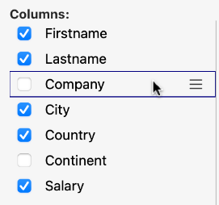
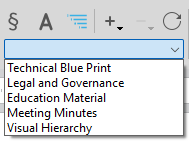
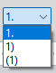
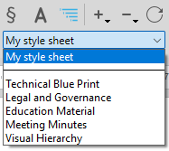

4D Write Pro Interface offers a set of palettes, which allow end users to easily customize a 4D Write Pro document.

A 4D developer can easily implement these palettes in their application. Thus, end users can manage all 4D Write Pro properties, such as fonts, text alignment, bookmarks, table layout, and frames.

## Installation & documentation

4D Write Pro Interface is a **4D component** that needs to be [installed in your project](../Project/components.md#overview). 4D Write Pro Interface source files are [provided on Github](https://github.com/4d/4D-WritePro-Interface).

The main [4D Write Pro Interface documentation](https://doc.4d.com/4Dv20/4D/20/Entry-areas.300-6263967.en.html) can be found in the *4D Design Reference manual*. You will find below: 

- the Table Wizard configuration documentation,
- the integrated A.I. documentation.

## Table Wizard

The Table Wizard is here to further simplify table creation based on database data using contexts, data sources, and formulas.

The Table Wizard, accessible to end-users, loads templates provided and configured by 4D developers. This enables developers to customize the template according to the specific use cases and business requirements of the users.

The Table Wizard comes with default templates and themes, which developers can configure to adapt its content to match the specific requirements of the application.

To implement the Table Wizard in your application, the developers are able to create and configure template files.

### WP Table Wizard interface

The user opens the Table Wizard dialog from the "Insert table"  menu item in 4D Write Pro interface toolbar and sidebar.


From this interface, the user can select a template or a table from the first drop-down list and a theme from the second.

##### In Columns:

 

Depending on the user's selection of a template or a table, the user can view the list of fields stored in the template (Blob and object types are automatically excluded). They can then select columns to display in the table by checking the box in front of the field name and order them by moving and dragging the fields list.

##### In Rows:


In the Table Wizard, the user can also define the number of header rows and extra rows (0 to 5 each), set [break rows](https://doc.4d.com/4Dv20/4D/20/Handling-tables.200-6229469.en.html#6233076) (summary rows) above or below the data row, and choose to show/hide [carry-over rows](https://doc.4d.com/4Dv20/4D/20/Handling-tables.200-6229469.en.html#6236686).

In addition, the user has the possibility to choose the table's behavior when its datasource is empty with the following options: Show data row, Hide date row, Hide table, Show placeholder row.

##### In Display:


The user adjusts the zoom level according to their preference by selecting the desired option from a drop-down list, uses radio buttons to display formulas or data for clear presentation, and chooses to display a horizontal ruler using a checkbox.

After finalizing the table creation and customization, the user can click on the **Insert** button to add the table to their WP document.

Once the table has been integrated into the document, the user can customize its style. The formatting tools of the toolbar and sidebar are still available.

### WP Table Wizard template configuration

The templates configuration includes:

* Defining tables and fields as well as preparing formulas adapted to the application from the [template file](#template-files).
* Translating table, field, and formula names from the [translation file](#translation-files).
* Designing graphic styles and customized  themes from the [theme file](#theme-files).

These three types of files contribute to the configuration of the Table Wizard, and while each serves a distinct purpose, none of them are considered essential components.

#### Template files

The template file allows you to define the following:

- the formula that returns an entity selection used as the table's data source,
- the break formulas (if any break row can be inserted)
- the dataclass attributes that can be used as table columns,
- the formulas available as contextual menus inside break rows, carry-over row, placeholder row or extra rows.
 
The template file must be stored in a "[`Resources`](../Project/architecture.md#resources)/4DWP_Wizard/Templates" folder within your project.

The template file in JSON format contains the following attributes:

|Attribute|Type|Mandatory|Description|
|:----|:----|:----|:----|
|tableDataSource|Text|x|Formula of table data source|
|columns|Collection|x|Collection of table columns|
|columns.check|Text|x|True when the column is already checked in the template editor. False when the column is unchecked in the template editor.|
|columns.header|Text|x|Label shown to the user|
|columns.source|Text|x|Formula|
|breaks|Collection| |Collection of break objects. The order of the breaks is important. It corresponds to the order in the document when the breaks are above the data lines.|
|breaks.label|Text|x|Label shown to the user|
|breaks.source|Text|x|Formula|
|breakFormulas|Collection| |Collection of formula objects applicable to break rows|
|breakFormulas.label|Text|x|Label shown to the user|
|breakFormulas.source|Text|x|Formula|
|bcorFormulas|Collection| |Collection of formula objects applicable to bottom carry over rows|
|bcorFormulas.label|Text|x|Label shown to the user|
|bcorFormulas.source|Text|x|Formula|
|extraFormulas|Collection| |Collection of formula objects applicable to extra rows|
|extraFormulas.label|Text|x|Label shown to the user|
|extraFormulas.source|Text|x|Formula|
|placeholderFormulas|Collection| |Collection of formula objects that are inserted in the placeholder row|

:::note French language

If your application is likely to be run on a 4D with language set to French, make sure that you use [tokens](https://doc.4d.com/4Dv20/4D/20/Using-tokens-in-formulas.300-6237731.en.html) in your formulas so that they are correctly interpreted no matter the user's language configuration.

:::

##### Example

Here's a brief example of what your JSON file might look like:

```json
{
    "tableDataSource": "ds.People.all().orderBy(\"toCompany.name asc, continent asc, country asc, city asc\")",
    "columns": [{
            "check": true,
            "header": "Firstname",
            "source": "This.item.firstname"
        }, {
            "check": true,
            "header": "Lastname",
            "source": "This.item.lastname"
        }, {
            "check": true,
            "header": "Salary",
            "source": "String(This.item.salary;\"###,###.00\")"
        }
    ],
    "breaks": [{
            "label": "Company",
            "source": "This.item.toCompany.name"
        }
    ],
    "breakFormulas": [{
            "label": "Company",
            "source": "This.item.toCompany.name"
	}, {
            "label": "Sum of salaries",
            "source": "String(This.breakItems.sum(\"salary\"); \"###,###.00\")"
        }
    ],
    "bcorFormulas": [{
            "label": "Sum of salaries",
            "source": "String(This.tableData.sum(\"salary\"); \"###,###.00\")"
        }
    ],
    "extraFormulas": [{
            "label": "Sum of salaries",
            "source": "String(This.tableData.sum(\"salary\"); \"###,###.00\")"
        }
    ]
}

```

#### Translation files

Translation files translate the names of templates, themes, tables, fields, and formulas. These files are added to the "[`Resources`](../Project/architecture.md#resources)/4DWP_Wizard/Translations" folder in your project.

Each translation file must be named with the corresponding language code (for example "en" for English or "fr" for French).

The translation file in JSON format contains the following attributes:

|Attribute|Type|Mandatory|Description|
|:----|:----|:----|:----|
|tables|Collection| |Collection of translated table objects|
|fields|Collection| |Collection of translated field objects|
|formulas|Collection| |Collection of translated formula objects|
|fileNames|Collection| |Collection of translated fileName objects (applicable to the theme and template name)|

Whitin each one of these attribute, the translation object includes the following attributes:

|Attribute|Type|Mandatory|Description|
|:----|:----|:----|:----|
|original|Text|x|Original text intended for translation|
|translation|Text|x|Translated version of the original text|

Defining these attributes within the translation object ensures proper organization and alignment between the source and translated content.

If the template name or the formula (break, carry-over row, or extra) exists in the translated file, its translation is applied in the Table Wizard. In addition, only the table defined within the translation file is displayed and translated.

The translation file serves an additional role when a user selects a table in the interface. It can filter the tables and fields proposed to the user. For example, to hide table IDs, this behavior is similar to the `SET TABLE TITLES` and `SET FIELD TITLES` commands.

##### Example

```json
{
    "tables": [{
            "original": "People",
            "translation": "Personne"
        }
    ],
    "fields": [{
            "original": "lastname",
            "translation": "Nom"
        }, {
            "original": "firstname",
            "translation": "Prénom"
        }, {
            "original": "salary",
            "translation": "Salaire"
        }, {
            "original": "company",
            "translation": "Société"
        }
    ],
    "formulas": [{
            "original": "Sum of salary",
            "translation": "Somme des salaires"
        }
    ]
}
    
```

#### Theme files

A list of themes is provided by default in the 4D Write Pro Interface component, such as "Arial", "CourierNew" and "YuGothic", available in multiple variations like "Blue" and "Green". However, you can create your own theme by placing it in the "[`Resources`](../Project/architecture.md#resources)/4DWP_Wizard/Themes" folder within your project.

The theme file in JSON format contains the following attributes:

|Attribute|Type|Mandatory|Description|
|:----|:----|:----|:----|
|default|Object| |Object containing the default style applicable to all rows.|
|table|Object| |Object containing the style definition applicable to the table.|
|rows|Object| |Object containing the style definition applicable to all rows.|
|cells|Object| |Object containing the style definition applicable to all cells.|
|header1|Object| |Object containing the style definition applicable to the first header row.|
|header2|Object| |Object containing the style definition applicable to the second header row.|
|header3|Object| |Object containing the style definition applicable to the third header row.|
|header4|Object| |Object containing the style definition applicable to the fourth header row.|
|header5|Object| |Object containing the style definition applicable to the fifth header row.|
|headers|Object| |Object containing the style definition applicable to the header rows, if a specific header (like header1, header2...) is not defined.|
|data|Object| |Object containing the style definition applicable to the repeated data row.|
|break1|Object| |Object containing the style definition applicable to the first break row.|
|break2|Object| |Object containing the style definition applicable to the second break row.|
|break3|Object| |Object containing the style definition applicable to the third break row.|
|break4|Object| |Object containing the style definition applicable to the fourth break row.|
|break5|Object| |Object containing the style definition applicable to the fifth break row.|
|breaks|Object| |Object containing the style definition applicable to the break rows, if a specific break (like break1, break2...) is not defined.|
|bcor|Object| |Object containing the style definition applicable to the bottom carry-over row.|
|placeholder|Object| |Object containing the default style applicable to the placeholder row.|


For every attribute used in your JSON file (header, data, carry-over, summary, and extra rows), you can define the following WP attributes, mentionned with their [corresponding WP constant](https://doc.4d.com/4Dv20/4D/20/4D-Write-Pro-Attributes.300-6229528.en.html):

|WP attributes|Corresponding WP constant|
|:----|:----|
| textAlign      | wk text align       |
| backgroundColor| wk background color |
| borderColor    | wk border color     |
| borderStyle    | wk border style     |
| borderWidth    | wk border width     |
| font           | wk font             |
| color          | wk font color       |
| fontFamily     | wk font family      |
| fontSize       | wk font size        |
| padding        | wk padding          |

##### Example

```json
{
    "default": {
           "backgroundColor": "#F0F0F0",
           "borderColor": "#101010",
           "borderStyle": 1,
           "borderWidth": "0.5pt",
           "font": "Times New Roman",
           "color": "#101010",
           "fontFamily": "Times New Roman",
           "fontSize": "7pt",
           "padding": "2pt"
    },
    "table": {
           "backgroundColor": "#E1EAF3"
    },
    "header1": {
           "textAlign": 2,
           "borderColor": "#41548F",
           "borderWidth": "1.5pt",
           "backgroundColor": "#979BA9",
           "color": "#F4F4FF",
           "font": "Times New Roman Bold"
    },
    "data": {
           "fontSize": "13pt",
           "textAlign": 0
    },
    "break1": {
           "textAlign": 2,
           "fontSize": "15pt"
    }
}
    
```

#### See also

[4D Write Pro - Table Wizard (tutorial video)](https://www.youtube.com/watch?v=2ChlTju-mtM)


## Integrated AI

You can use an integrated AI in the 4D Write Pro interface so that you can easily translate or enhance your documents without having to use an external AI application. 

Once you have enabled the AI feature, you can display a chat box over your 4D Write Pro document and interact with *chatGPT* to modify the text of the selection or of the document itself. 

:::note

The 4D Write Pro interface uses OpenAI, for which you need to provide your own key (see below).

:::

:::note Writing Tools (macOS)

On macOS, if you want to provide your users with Apple Intelligence Writing Tools so that they can proofread, rewrite, summarize, or change the tone of text directly within their documents, you might consider using the [Writing Tools feature](../FormObjects/properties_Entry.md#writing-tools).

:::

### Limitations

In the current implementation, the feature has the following limitations:

- use of a predefined AI provider and necessity to pass your OpenAI key
- basic chatting features
- no image handling
- non-configurable predefined action commands
- predefined translations English/French and French/English only


### Enabling the AI feature

The AI dialog box is available by clicking on a button in the 4D Write Pro interface. This button is **hidden by default**, you need to enable it explicitely.

To display the AI dialog box button, you need to:

1. Get an API key from the [OpenAI website](https://openai.com/api/). 
2. Execute the following 4D code:

```4d

WP SetAIKey ("<Your OpenAI Key>") //

```

:::note

No checking is done on the OpenAI key validity. If it is invalid, the *chatGPT* box will stay empty. 

:::


The **A.I.** button is then displayed: 


- in the 4D Write Pro Toolbar, in the **Import Export** tab, 
- in the 4D Write Pro Widget, in the **Font Style** tab.

Click on the button to display the AI dialog box. 

### AI dialog box

The 4D Write Pro AI dialog box allows a straightforward interaction between the chat area and the 4D Write Pro document.

#### Prompt area

At the bottom of the window, the **prompt area** allows you to enter any question to send to the AI. 

To send your question to the AI, click on the Send button:


The button icon changes when the same request is sent again:


On the left side of this area, a pop up menu provides examples of common actions that can be usually delegated to the AI. 

Selecting an action writes a corresponding question to the prompt. If necessary, you can modify the question and then to click on the Send button to actually send it:


:::note

Default translation actions are based upon the current 4D default configuration and depend on available languages. 

:::

#### Copy buttons

These buttons propose basic interactions between the chat area, the underlying 4D Write Pro document, and the clipboard:


- **Return raw text**/**Return styled text**: Copy the latest response or the selected response from the AI to the 4D Write Pro document at the current insertion point, replacing the selected text if any. 
- **Copy raw text**/**Copy styled text**: Copy the latest response or the selected response from the AI in the clipboard. 

In both cases, if the response was provided with styles, you can decide to copy the text with or without styles. 

:::note

The chat box uses the Markdown language to format text. Basic styles such as bold, italic, underline, titles are supported. When pasting styled text from the AI in the 4D Write Pro area, you may lose some formatting information. 

:::

#### Chat area

The Chat area displays the whole interaction between you and the AI. You can scroll and select and part you want. 

To empty this area, you can click on the Erase button of the History area (resets the window and all interactions). 


#### History

The History area lists all your prompts sent to the AI. You can hide/show this area using the button on the top right corner of the Chat area. 

The Erase button allows you to reset the whole window and erase all interactions. It is equivalent to close/reopen the AI dialog box. 

## 4D Write Pro Areas

The component provides two preconfigured 4D Write Pro areas that you can drag and drop onto your forms:

- A **4D Write Pro area with an integrated toolbar** for formatting and managing document contents.

  //

- A **4D Write Pro area with an integrated sidebar**, providing access to the Write Pro palettes for managing the document and its formatting.

  //

### Font Style


This panel manages the standard font styles and properties for the text of the 4D Write Pro area.

The items available in the **Style** menu vary depending on the selected font:


:::note

Font size is always displayed in points, regardless of the unit set for the document.

:::

The **Vert. Align** menu changes text to superscript or subscript, and the **Transform** menu switches between different text cases:


The **Copy/Paste** button copies the style applied to the selected text. This button's menu automatically adds a **Paste Style** item after you have copied a text selection, allowing you to reapply its style elsewhere. Note that this mechanism only copies the formatting of text with a uniformly applied style.


The **Soft hyphen** button:

- inserts a soft hyphen character at the cursor position (when nothing is selected). A soft hyphen can be inserted anywhere inside a document except at the beginning of a paragraph.
- removes all soft hyphen characters (if any) from the selection.

Soft hyphen characters indicate where long words should be split during hyphenation. They are invisible unless hidden characters are displayed.


### Margins and Alignments


This panel manages the standard text alignment properties and sets the margins for the 4D Write Pro area.

In addition to general settings applied to the entire document, text alignment and margins can be set independently for each paragraph and/or for each picture in the text. Use the icons at the top of the panel to configure these settings separately for the desired area:

-  for the document as a whole,
-  for an individual paragraph,
-  for a picture placed in the text,
-  for a selected anchored picture.

The **Copy/Paste** button can be used to copy and paste the text settings and/or margins of the selected text.

This panel also allows you to:

- manage paragraphs,
- insert breaks,
- delete sections or reset their attributes,
- configure columns,
- apply list styles and manage list formatting in [Lists](lists.md).

### Tabulations


This panel manages tab stops and leading characters for paragraphs in the 4D Write Pro area.

Any indentation value set using the slider or by entering a value directly in the area is used by default as the offset distance between any subsequent tabs added. When you choose a **Type** using one of the buttons, this type is applied to all existing tab stops for the paragraph.

You can change individual tab stops and leading characters manually in the list by entering a new **Position** value directly in the cell and/or choosing a new **Type** from the drop-down menu:


:::note

Changing the **Indentation** or **Type** using the controls at the top of the panel overrides any manual changes made to individual tabs in the list of tab stops.

:::

Clicking the **+** button adds a new default tab stop to the paragraph. You can delete a tab stop by selecting it in the list and clicking the **−** button.

Tab stops are applied to the current paragraph or to a selection of paragraphs. You can also use the **Copy/Paste** button to copy and paste tab stop settings.

### Units and Sizes


Under **Display**, the panel lets you choose between **Page**, **Draft**, and **Web** view modes. You can also display or hide elements and adjust the zoom level.

You can also set the standard unit used for the 4D Write Pro document and the sizes to apply to the paragraphs and any pictures it includes. Units are set for the document as a whole.

:::note

Regardless of the unit set for the document, the font size (see the **Fonts** panel) and the values in the **Borders** panel are always displayed in points.

:::

Paragraphs can have a fixed or variable width, and pictures can be set with a fixed size or a minimum width and/or height. When a size is set to **auto**, it is based on the contents of the element.

### Borders


This panel manages frames and padding in the 4D Write Pro area.

Frames can be set for the document as a whole and/or for individual paragraphs, or for pictures found in the text. Use the icons at the top of the panel to configure these settings separately for the desired area:

-  for the document,
-  for an individual paragraph,
-  for a picture placed in the text,
-  for a selected anchored picture.

:::note

The **Double**, **Groove**, **Ridge**, **Inset**, and **Outset** styles may not be clearly visible at the default width (1 pt).

The **Radius** setting applies rounded corners to frames. This setting cannot be defined for **Groove**, **Ridge**, or **Inset** frame styles.

:::

The **Copy/Paste** button copies and pastes the frame as well as any padding from one paragraph (or picture) to another.

### Pictures & Text boxes


This panel manages pictures, text boxes, and background pictures for the 4D Write Pro area.

This panel allows you to insert a static, URL, or formula picture (see also [Handling pictures](handling-pictures.md)) or insert a text box.

You can set the position of the selected picture or text box:

- in front of text,
- behind text,
- wrap above and below,
- wrap around,
- wrap on left,
- wrap on right,
- wrap on largest side,
- (pictures only) inline with text: convert an anchored picture to an inline picture.

For an anchored picture or a text box, you can also:

- move it forward/backward,
- set it to be displayed on a single page or all pages/sections.

Click **Advanced settings...** (pictures only) to open a dialog box where you can set the size and advanced options for the selected picture:

- for inline pictures and anchored pictures in embedded mode:


- for anchored pictures in page mode:


#### Background picture

You can drag and drop a picture or a URL directly onto the **Picture** area and click **Apply** to define it as the background picture for the element selected in the **Apply to** menu.

Background pictures can be applied to the document, paragraph, tables, etc.

You can set the position, size, origin, and other properties of the selected picture, and define custom settings. You can click **Clear** to remove an existing picture.

The **Copy/Paste** button copies and pastes the background picture along with its settings from one paragraph (or picture) to another.

### Formulas and Information


This panel inserts and manages 4D expressions and URLs in the 4D Write Pro area, and includes an area for entering useful information about the document.

The following controls are available:

- **Insert**: inserts the current page number, the page count, the current date and time, or a predefined expression.
- **Formulas**:
  - **Insert or edit 4D expression**: opens the Formula Editor so that you can create or load an expression to insert at the current location, or edit a selected 4D expression.
  - **Compute 4D expressions**: updates the values of the 4D expressions in the target area. Can be applied to the document, selection, or tables.
  - **Freeze 4D expressions**: transforms current 4D expressions into plain text (cannot be undone). Can be applied to the document, selection, or tables.
- **Expression**: displays the reference (source) of the selected 4D expression.

  :::note

  For more information on expressions, please refer to the [Filter expressions contained in a 4D Write Pro document](../WritePro/filter-expressions.md) page.

  :::

- **Display**:
  - **Values/Expressions**: toggles between displaying 4D expressions as references or their current values.
  - **Source formulas as a symbol** (only available when references are shown): displays formula references as a symbol.
- **Label/Link**: displays the link address and the label for the selected URL.
- **Set**: displays a dialog box so that you can enter or modify a URL (both the link address and its label).

:::note

The 4D Write Pro area must have the focus for the **4D Expression** and **URL** sections of this control panel to be active.

:::

#### Document

Information entered in this section is stored with the document but is not displayed elsewhere. By default, only the **Title** is visible in the New Document window.

### Bookmarks


This panel manages bookmarks for documents in the 4D Write Pro area. Bookmarks are dynamic references to specific ranges in the document; if the range associated with a bookmark is moved, extended, or reduced, the bookmark continues to reference the same range within the document.

To create a bookmark, select the range of text you want to bookmark and click the **+** button at the bottom of the panel. A **"New_Bookmark1"** label appears in the list. You can rename a bookmark at any time by clicking its name in the list. Bookmark names must be composed of standard alphanumeric characters.

You can also reset bookmark ranges without renaming them: select the bookmark you want to redefine in the list, then highlight the new range of text and click the **Refresh** button. The new range automatically replaces the one previously associated with the selected bookmark.

The list displays bookmarks in the same order they appear in the document. You can delete a bookmark by selecting it in the list and clicking the **−** button.

### Style Sheets


This panel manages style sheets for documents in the 4D Write Pro area.

- To create a **paragraph** style sheet, select the **Paragraph** button.
- To create a **character** style sheet, select the **Character** button.

Then select the range of text to which you want to apply the style and click the **+** button at the bottom of the panel. You can create a new style sheet or duplicate an existing one:


For more information about style sheets, see [Style sheets](../WritePro/style-sheets.md).

The **Style Sheets** panel also supports multi-level list style sheets for creating and managing hierarchical lists. For more information, see [Multi-level style sheets](../WritePro/style-sheets.md#multi-level-list-style-sheets).

### Multi-level list style sheets

4D Write Pro Interface allows users to create and manage [multi-level lists](./user-legacy/using-a-4d-write-pro-area.md#multi-level-lists) directly from both the toolbar and widget sidebar.

**Toolbar:**


**Sidebar:**


To manage multi-level list style sheets, click the  multi-level list button.

When the multi-level list mode is enabled, the Style Sheets panel displays the [multi-level list style sheets](./user-legacy/stylesheets.md#multi-level-list-style-sheets) defined in the document as well as [predefined templates](#predefined-templates).



#### Managing multi-level style sheets

The Style Sheets panel allows you in general to:

*  Create a new style sheet.
*  Delete a style sheet.
*  Update a style sheet.

Once a multi-level list style sheet is selected, the panel provides also tools to manage the hierarchy and numbering of the list:

*  Increase the list level of selected paragraphs.
*  Decrease the list level of selected paragraphs.
*  Append a level to the list and create a new sub-level.
*  Modify numbering formats.
*  Concatenate numbering markers between levels.

#### Creating a style sheet

To create a multi-level list style sheet you can either:

* Select and apply one of the predefined templates to the paragraph(s), the selected template and all it sub-levels are then displayed on the top part of the sytle sheets panel. You can customize its levels and formatting (such as numbering styles, colors, fonts, or hierarchy), and then create a new style sheet based on the resulting selection.

* Duplicate one of the existing style sheets via the Duplicate option in the  bottom menu.

* Click the  button and then "New style sheet based on selection" after having selected paragraph(s) to use for the style sheet according to the following:
    * If the selected paragraph(s) use(s) a list marker, a new multi-level list style sheet made of one level is created based on the current formatting.
    * If the selected paragraph(s) already use(s) a root-level or a sub-level of a multi-level list style sheet, the complete hierarchy is duplicated.

:::note 

For detailed information about creating and configuring multi-level list style sheets by programming, see [Multi-level list style sheets](./user-legacy/stylesheets.md#multi-level-list-style-sheets).

:::

#### Applying a multi-level list

You can apply either a multi-level list style sheet defined in the document or one of the predefined templates to the selected paragraphs using the Style Sheets panel:




#### Predefined templates

The interface provides the following predefined multi-level list templates:

**Technical Blueprint**

Level 1: 1  
Level 2: 1.1  
Level 3: 1.1.1  
Level 4: 1.1.1.1  
Level 5: 1.1.1.1.1

**Legal & Governance**

Level 1: I.  
Level 2: A.  
Level 3: 1.  
Level 4: a)  
Level 5: (1)  
Level 6: (a)  
Level 7: (i)

**Educational Material**

Level 1: I.  
Level 2: 1.  
Level 3: 1.1.  
Level 4: a.  
Level 5: ●

**Meeting Minutes**

Level 1: 1.  
Level 2: ●

**Visual Hierarchy**

Level 1: ♣ (Club)  
Level 2: ♦ (Diamond)  
Level 3: ■ (Square)  
Level 4: □ (Hollow Square)  
Level 5: ● (Disc)  
Level 6: ○ (Circle)  
Level 7: – (Dash)

#### Customizing predefined templates

You can customize the available templates to provide users with predefined multi-level lists that match the needs of your application.

The predefined multi-level list templates are defined in a JSON file named `multiLevelStyles.json`. This file is located in the 4D Write Pro Interface component Resources folder.

You can customize the available templates by adding your own `multiLevelStyles.json` file in either:

* the project's local Resources folder directly,
* a `4D WritePro Interface` folder located within the project Resources folder.

If a `multiLevelStyles.json` file is present in both locations, the file located in the `4D WritePro Interface` folder takes precedence.

Each template definition includes:

* a template name,
* one or more list levels,
* the 4D Write Pro attributes applied to each level. Any 4D Write Pro attribute can be used in a template definition.

You can use either the attribute names or the corresponding 4D Write Pro constants as JSON keys and values.
For example, the following definitions are equivalent:

* `"listStyleType": "wk upper roman"`
* `"wk list style type": "wk upper roman"`

##### Example

Example of a customized JSON file:

```json
{
  "predefinedMultiLevelLists": [
    {
      "name": "Technical Blue Print Updated",
      "levels": [
        { "listStyleType": "wk decimal" },
        { "listStyleType": "wk decimal", "listConcatStringFormat": true }
      ]
    }
  ]
}
```

#### See also 
* [Related blog post: Multi-Level Style Sheets in 4D Write Pro: Now With a Dedicated UI](https://blog.4d.com/multi-level-style-sheets-in-4d-write-pro-now-with-a-dedicated-ui)
* [multi-level list style sheets](./user-legacy/stylesheets.md#multi-level-list-style-sheets)
* [multi-level lists](./user-legacy/using-a-4d-write-pro-area.md#multi-level-lists)

### Tables


This panel manages tables in the 4D Write Pro area. You can insert a table, add and remove rows and columns, and define the properties of tables, rows, columns, and individual cells.

In **Insert table**, you can choose one of the proposed table templates and modify it using the **Properties** menu, or choose the **Wizard** table available at the end of the list to further simplify the table creation process. For more information, see [Table Wizard](table-wizard.md).


Once a table template has been selected and inserted, the options for modifying its properties become available:


The following table properties can be modified:

- Border (Style, Color, and Width)
- Background color
- Margins
- Alignment
- Avoid page break inside
- Number of header rows
- Bottom carry over row
- Empty datasource display


In the **Empty datasource display** menu, you can choose to **Show data row**, **Hide data row**, **Hide table**, or **Show placeholder row**.

You can also set a datasource using the **Set datasource...** menu item.

#### Rows

In the **Rows** section, you can insert/delete rows and modify row properties, as well as define a row as a break row.


The following row properties can be modified:

- Border (Style, Color, and Width)
- Background Color
- Padding
- Vertical Alignment
- Height
- Avoid page break inside
- Set datasource...
- Define as break row
- Remove break row

By selecting **Define as break row**, you can add formulas such as `"This.item.name"` to apply to the break row using the [Formula Editor](formula-editor.md). For more information, see the Formula Editor documentation.

#### Columns

In the **Columns** section, you can insert/delete columns and modify column properties.


The following column properties can be modified:

- Background Color
- Padding
- Vertical Alignment
- Width

#### Cells

In the **Cells** section, you can modify the properties of individual cells.


The following cell properties can be modified:

- Border (Style, Color, and Width)
- Background Color
- Padding
- Vertical Alignment
- Merge cells (displayed when a range containing unmerged cells or separate merged cells is selected)
- Split cells (displayed when a range containing merged cells is selected)

To modify a property, place the cursor in the element (table, row, column, or cell) and select the property to modify.

### Protection


This panel manages the protection status of the 4D Write Pro area.

You can choose which part(s) of the area to protect in the **Protection** section.

To prevent modification of the protected part(s), select the **Protection enabled** option in the **Document** section.

For more information about protecting 4D Write Pro areas, see [Protecting 4D Write Pro areas](../WritePro/protecting-write-pro-areas.md).

### Import Export


This panel allows you to print, import, and export documents.

The following document formats are supported:

- **Internal**: Lets you choose the page format and orientation.
- **Import...**: Opens a standard dialog box allowing you to select a document to import into the 4D Write Pro area. The imported document replaces the current contents of the area.
- **Export**: Exports the contents of the 4D Write Pro area in various formats.

The following document formats are supported by the **Export** menu:

| Document format | Import | Export | Comment |
|-----------------|:------:|:------:|---------|
| 4D Write Pro | ✓ | ✓ | Native 4D Write Pro document format (`.4wp`). |
| 4D Write | ✓ | – | See [Importing 4D Write documents](../WritePro/importing-4d-write.md). |
| Microsoft Word | – | ✓ | See [Importing and exporting `.docx` format](../WritePro/import-export-docx.md). |
| HTML | ✓ | ✓ | Document is saved as standard HTML and its resources are saved separately. 4D tags and links to 4D methods are removed and expressions are computed. |
| MIME HTML | – | ✓ | Standard MIME HTML with HTML resources and images embedded as MIME parts (extended `.mht` format). |
| PDF | – | ✓ | PDF format based on page view mode. |
| SVG | – | ✓ | SVG format based on page view mode. |

PDF, HTML, MIME HTML, and SVG export commands display an **Export** dialog box, allowing you to select export options. For example, here is the dialog box for SVG export:


Refer to the corresponding documentation for more information about each export option.

### Find & Replace


This panel manages text find and replace operations.

- In the **Find** section, you can search for text and specify its position. Options are available to designate conditions for the text search. Refer to the [Compare strings](../commands/compare-strings.md) command for more information about each option.
- In the **Replace** section, you can specify replacement text and choose whether or not to retain the character style.

### Customizing the widget control panel interface

The appearance of the control panels can be customized using different skins and fonts. To do so, modify the object method of the associated 4D Write Pro area.

Make sure that the 4D Write Pro area object variable contains the following mandatory attributes (automatically included in the default object method):

- **selection**: used by 4D Write Pro commands such as [WP GET ATTRIBUTES](../commands/wp-get-attributes.md) and [WP SET ATTRIBUTES](../commands/wp-set-attributes.md).
- **areaName**: used by S1 commands.

In addition, an optional third attribute named **skin** can be added to customize the appearance of the control panel. The value of this optional attribute is an object (named `$WP_skin` in the following example) that can contain the following optional attributes:

- **skinName**: values can be `"black"`, `"dark"`, `"grey"`, `"light"`, `"white"`, or `"highlight"`.
- **backgroundColor**: e.g. `0x00A0A0A0`
- **separatorColor**: e.g. `0x00D04060`
- **fontColor**: e.g. `0x002080C0`
- **separatorFontColor**: e.g. `0x00803000`
- **font**: font family, e.g. `"Times"`
- **fontSize**: e.g. `12`
- **scrollbar**: `True` or `False`

  *The scrollbar can only be used and enabled when the 4D Write Pro form object can be resized vertically (Vertical Sizing property set to **Grow**).*

For more information about 4D Write Pro attributes, refer to [4D Write Pro Attributes](../WritePro/attributes.md).

Example of code for customizing the interface of the widget control panels:

```4d
C_OBJECT($WP_skin)

OB SET($WP_skin;"skinName";$skinName) // can be "black", "dark", "grey", "light", "white", "highlight"

OB SET($WP_skin;"backgroundColor";0x00A0A0A0) //sets background color for control panel
OB SET($WP_skin;"separatorColor";0x00D04060) //sets background color for separator areas
OB SET($WP_skin;"fontColor";0x002080C0) //sets font color for control panel text
OB SET($WP_skin;"separatorFontColor";0x00803000) //sets font color for separator area text

OB SET($WP_skin;"font";"Times") // sets font used
OB SET($WP_skin;"fontSize";13) // sets size of font used

OB SET($WP_skin;"scrollbar";True)

// Then you just need to assign this custom skin to the 4D Write Pro object

OB SET($WP_object;"skin";$WP_skin)
```
### 4D Write Pro widget methods

The panels in the 4D Write Pro widget can be configured using dedicated methods. These methods are available in the **Methods** page of the Explorer, under **Component Methods > 4D WritePro Interface**.

The available methods are:

- [WP ShowTabPages](../commands/wp-show-tab-pages.md) – defines the control panel tabs to be displayed, as well as their order.
- [WP SwitchToolbar](../commands/wp-switch-toolbar.md) – switches between toolbar interfaces.
- [WP UpdateWidget](../commands/wp-update-widget.md) – updates the widget when modifications have been made.

:::note

Click the **Documentation** button in the Explorer to display the detailed description of a method.

:::