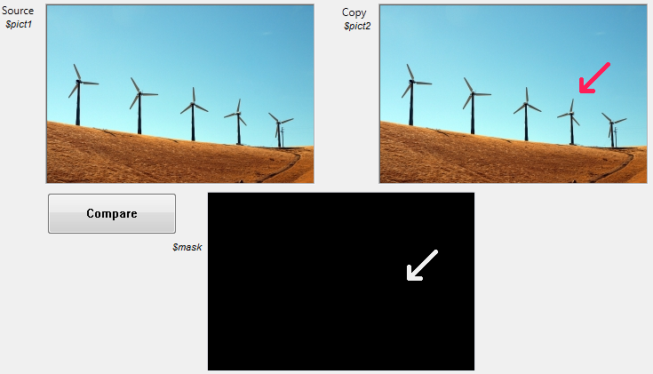

<!-- REF #_command_.Equal pictures.Syntax-->Equal pictures ( picture1 ; picture2 ; mask ) -> Function result<!-- END REF-->


<!-- REF #_command_.Equal pictures.Params -->
|Parameter|Type||Description|
|---------|--- |:---:|------|
|picture1|Picture field, Picture variable|->|Original source picture|
|picture2|Picture field, Picture variable|->|Picture to compare|
|mask|Picture field, Picture variable|<-|Resulting mask|
|Function result|Boolean|<-|True if both pictures are identical; otherwise, False|
<!-- END REF -->


#### Description


<p>The <strong>Equal pictures</strong> command precisely compares both the dimensions and the contents of two pictures.</p><p>Pass the source picture in picture1 and the picture you want to compare with it in picture2.&nbsp;</p><ul><li>If the pictures are not the same dimension, the command returns <strong>False</strong> and the mask parameter contains a blank picture.&nbsp;</li><li>If the pictures are of the same dimension but with different contents, the command returns <strong>False</strong> and the mask parameter contains the resulting picture mask based on a comparison of the two pictures. This comparison is performed pixel by pixel, and each pixel that does not match appears white on a black background.&nbsp;</li><li>If both pictures are exactly the same, the command returns <strong>True</strong> and the mask parameter contains a picture that is completely black.</li></ul>


#### System Variables or Sets


<p>If the command is executed successfully (the two pictures are compared), the system variable OK is set to 1. In the case of an anomaly, particularly if one of the pictures is not initialized (blank picture), the OK variable is set to 0.</p>


#### Example


In the following example, we compare two pictures (pict1 and pict2) and display the resulting mask:
/img/847365/pict847365.en.png

Here is the code for the <strong>Compare</strong> button:


```4d
$equal := Equal pictures ($pict1; $pict2; $mask)
```


