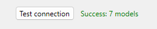

The AI page allows you to add, remove, or view the list of your AI provider(s) as well as your API keys. Registered AI providers can then be used in your code througout your 4D application, especially with the [**4D-AIKit component**](../aikit/overview.md) using the [**model aliases**](../aikit/provider-model-aliases.md) feature. 

## Deployment with an API key

When configuring an AI provider, you need to provide your own API key. It requires an external registration for getting API keys/credentials from AI providers. 

Using the Settings dialog box, the 4D developer can create a **provider alias** (for example "open-ai-v1") and use this alias in the code. They can alsi test it using their API key. 

When the 4D application is deployed with the [User settings enabled](../settings/overview.md#enabling-user-settings), the administrator can configure the User settings by using the **same AI provider name** ("open-ai-v1") and **customize the API key** to use the customer's key. Thanks to the [User settings priority rules](../settings/overview.md#priority-of-settings), the customer settings will automatically override the developer settings.

:::warning 

When using 4D in client/server mode, it is **strongly recommended** to execute AI-related code on the server side to protect API keys and credentials from exposure to remote machines.

:::

## Managing providers

4D supports [various AI providers](../aikit/compatible-openai.md) with an OpenAI-like API, each offering unique models and features for database needs.

By default, the Providers list is empty. 

### Adding a provider

To add an AI provider:

1. Click on the **+** button at the bottom of the Providers list. 
2. Enter the required [provider's configuration fields](#provider-properties), including credentials. 
3. (optional) Click the **Test connection** button to make sure the provided URL and credentials are valid. 

If the connection is successful, the number of available models is displayed on the right side of the button:

If the connection test fails, an error message is displayed (e.g. "Request failed: Not found" or "Request failed: Unauthorized"). 

4. Click **OK** to save the new provider, or **Cancel** to revert all modifications.  

### Editing a provider

To edit or remove a provider:

1. Select a registered provider in the list.
2. Edit the provider's information OR to remove a provider, click on the **-** button at the bottom of the Providers list.
3. Click **OK** to save the modifications, or **Cancel** to revert all modifications.

## Provider properties

When you select a provider in the Providers list, several properties are available. Property names in **bold** are mandatory to create a Provider.  

### Name

Local name used to identify the provider in your code, for example "claude". The name must be [compliant with property names](../Concepts/identifiers.md) since it will be used in the application's code to reference the provider. 

### Base URL

Endpoint of the provider's API, for example `https://api.openai.com/v1` or `http://localhost:11434/v1`. 

The combo box lists the main providers, you can select a value to enter the provider endpoint: 

### API Key

(optional) API key for the provider. For instructions on generating an API key, please refer to your AI provider’s official documentation. Some AI providers may also require additional specific credentials. 

### Organization

(optional, OpenAI-specific) Organization ID used by the OpenAI API.

### Project

(optional, OpenAI-specific) ID of the project. Each OpenAI API key is attached to a project. 

