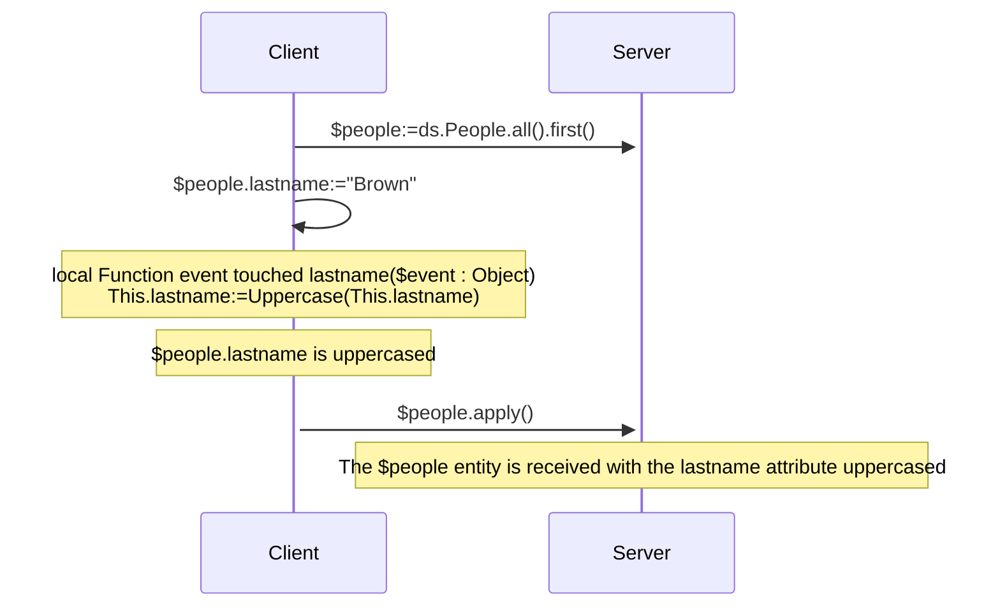
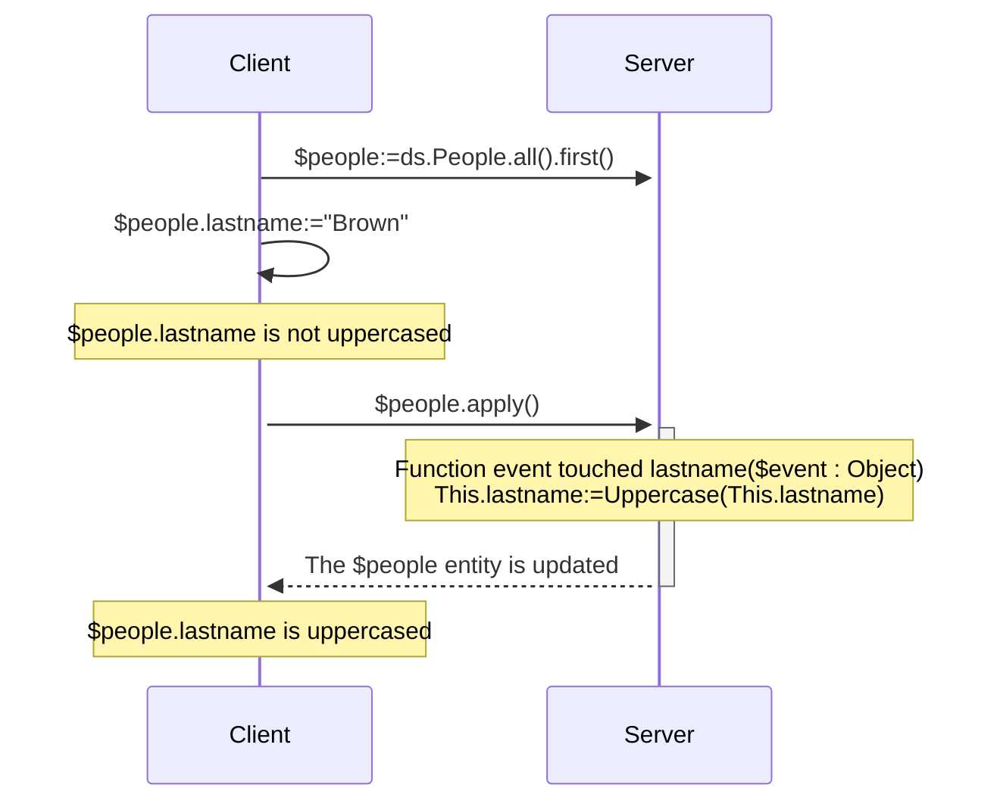
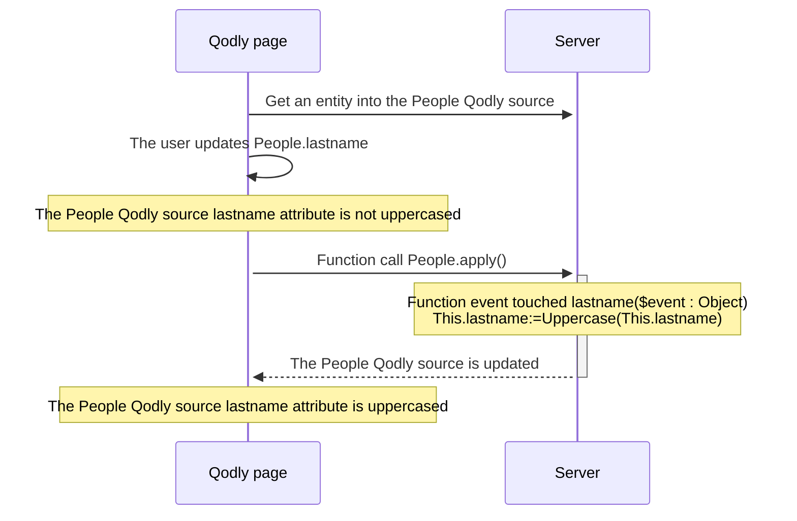

<details><summary>Historia</summary>

| Lanzamiento | Modificaciones                                                                                            |
| ----------- | --------------------------------------------------------------------------------------------------------- |
| 21          | Eventos añadidos: validateSave / saving / afterSave / validateDrop / dropping / afterDrop |
| 20 R10      | se ha añadido un evento touched                                                                           |

</details>

Los eventos de entidad son funciones que ORDA invoca automáticamente cada vez que las entidades y los atributos de entidad se manipulan (añaden, eliminan o modifican). Puede escribir eventos muy sencillos y luego hacerlos más sofisticados.

No se puede activar directamente la ejecución de la función de evento. Los eventos son llamados automáticamente por ORDA basándose en las acciones del usuario o en las operaciones realizadas mediante código sobre las entidades y sus atributos.

:::tip Entrada de blog relacionada

[ORDA - Manejar una lógica basada en eventos durante las acciones de persistencia de datos](https://blog.4d.com/orda-handle-an-event-driven-logic-during-database-operations)

:::

:::info Nota de compatibilidad

Los eventos de entidad ORDA en el almacen de datos equivalen a triggers en la base de datos 4D. Sin embargo, las acciones desencadenadas a nivel de la base de datos 4D utilizando los comandos del lenguaje clásico 4D o las acciones estándar no desencadenan eventos ORDA.

:::

## Generalidades

### Nivel del evento

Una función de evento se define siempre en la [clase Entity](../ORDA/ordaClasses.md#entity-class).

Un evento puede definirse al nivel de la **entidad** y/o a nivel del **atributo** (incluye los [**atributos calculados**](../ORDA/ordaClasses.md#computed-attributes)). En el primer caso, se activará para cualquier atributo de la entidad; en el otro caso, sólo se activará para el atributo objetivo.

Para un mismo evento, puede definir diferentes funciones para diferentes atributos.

También puede definir el mismo evento tanto a nivel del atributo como de la entidad. El evento atributo se llama primero y luego el evento entidad.

### Ejecución en configuraciones remotas

Normalmente, los eventos ORDA se ejecutan en el servidor.

Sin embargo, en la configuración cliente/servidor, la función de evento `touched()` puede ejecutarse en el **servidor o en el cliente**, dependiendo del uso de la palabra clave [`local`](./ordaClasses.md#local-functions). Una implementación específica en el lado del cliente permite la activación del evento en el cliente.

:::note

Las funciones ORDA [`constructor()`](./ordaClasses.md#class-constructor) se ejecutan siempre en el cliente.

:::

Con otras configuraciones remotas (p. ej. [aplicaciones Qodly](https://developer.4d.com/qodly), [peticiones API REST](../REST/REST_requests.md), o peticiones a través de [`Open datastore`](../commands/open-datastore.md)), la función de evento `touched()` se ejecuta siempre **del lado del servidor**. Esto significa que tiene que asegurarse de que el servidor puede "ver" que se ha tocado un atributo para activar el evento (ver abajo).

### Tabla resumen

La siguiente tabla lista los eventos ORDA junto con sus reglas.

| Evento                         | Nivel    | Nombre de la función                                    |                     (C/S) Ejecutado en                     | Can stop action by returning an error |
| :----------------------------- | :------- | :------------------------------------------------------ | :---------------------------------------------------------------------------: | ------------------------------------- |
| Instanciación de entidades     | Entity   | [`constructor()`](./ordaClasses.md#class-constructor-1) |                                     client                                    | no                                    |
| Atributo tocado                | Atributo | `event touched <attrName>()`                            | Depende de la palabra clave [`local`](../ORDA/ordaClasses.md#local-functions) | no                                    |
|                                | Entity   | `event touched()`                                       | Depende de la palabra clave [`local`](../ORDA/ordaClasses.md#local-functions) | no                                    |
| Antes de guardar una entidad   | Atributo | `validateSave <attrName>()`                             |                                     server                                    | sí                                    |
|                                | Entity   | `validateSave()`                                        |                                     server                                    | sí                                    |
| Al guardar una entidad         | Atributo | `saving <attrName>()`                                   |                                     server                                    | sí                                    |
|                                | Entity   | `saving()`                                              |                                     server                                    | sí                                    |
| Después de guardar una entidad | Entity   | `afterSave()`                                           |                                     server                                    | no                                    |
| Before dropping an entity      | Atributo | `validateDrop <attrName>()`                             |                                     server                                    | sí                                    |
|                                | Entity   | `validateDrop()`                                        |                                     server                                    | sí                                    |
| Al soltar una entidad          | Atributo | `dropping <attrName>()`                                 |                                     server                                    | sí                                    |
|                                | Entity   | `dropping()`                                            |                                     server                                    | sí                                    |
| After dropping an entity       | Entity   | `afterDrop()`                                           |                                     server                                    | no                                    |

:::note

The [`constructor()`](./ordaClasses.md#class-constructor-1) function is not actually an event function but is always called when a new entity is instantiated.

:::

## Parámetro *event*

Event functions accept a single *event* object as parameter. When the function is called, the parameter is filled with several properties:

| Nombre de propiedad | Disponibilidad                                                                                                           | Tipo                 | Descripción                                                                                                           |   |
| :------------------ | :----------------------------------------------------------------------------------------------------------------------- | :------------------- | :-------------------------------------------------------------------------------------------------------------------- | - |
| "kind"              | siempre                                                                                                                  | String               | Event name: "touched", "validateSave", "saving", "afterSave", "validateDrop", "dropping", "afterDrop" |   |
| *attributeName*     | Only for events implemented at attribute level ("validateSave", "saving", "validateDrop", "dropping") | String               | Nombre del atributo (por ejemplo, "nombre")                                                        |   |
| *dataClassName*     | siempre                                                                                                                  | String               | Nombre de la Dataclass (*ej.* "Company")                                           |   |
| "savedAttributes"   | Sólo en [`afterSave()`](#function-event-aftersave)                                                                       | Colección de cadenas | Nombres de atributos guardados correctamente                                                                          |   |
| "droppedAttributes" | Sólo en [`afterDrop()`](#function-event-afterdrop)                                                                       | Colección de cadenas | Nombres de atributos suprimidos correctamente                                                                         |   |
| "saveStatus"        | Sólo en [`afterSave()`](#function-event-aftersave)                                                                       | String               | "success" if the save was successful, "failed" otherwise                                                              |   |
| "dropStatus"        | Sólo en [`afterDrop()`](#function-event-afterdrop)                                                                       | String               | "success" if the drop was successful, "failed" otherwise                                                              |   |

## Objeto de error

[Some event functions](#summary-table) can return an **error object** to raise an error and stop the running action.

When an error occurs in an event, the other events are stopped at the first raised error and the action (save or drop) is also stopped. This error is sent before other potential errors like [stamp has changed, entity locked](../API/EntityClass.md#save), etc.

### Propiedades del objeto error

| Propiedad          | Tipo    | Descripción                                                                                                                                                                                                                                                                                                                                                                                                                                                                                                                                                                                        | Definido por el desarrollador                |
| ------------------ | ------- | -------------------------------------------------------------------------------------------------------------------------------------------------------------------------------------------------------------------------------------------------------------------------------------------------------------------------------------------------------------------------------------------------------------------------------------------------------------------------------------------------------------------------------------------------------------------------------------------------- | -------------------------------------------- |
| errCode            | Integer | Igual al comando [`Last errors`](../commands/last-errors.md)                                                                                                                                                                                                                                                                                                                                                                                                                                                                                                                                       | Sí                                           |
| message            | Text    | Igual al comando [`Last errors`](../commands/last-errors.md)                                                                                                                                                                                                                                                                                                                                                                                                                                                                                                                                       | Sí                                           |
| extraDescription   | Object  | Información libre a definir                                                                                                                                                                                                                                                                                                                                                                                                                                                                                                                                                                        | Sí                                           |
| seriousError       | Boolean | Used only with validate events (see below). <li>`True`: creates a [serious (unpredictable) error](../Concepts/error-handling.md#predictable-vs-unpredictable-errors) and triggers an exception. Adds the `dk status serious validation error` status</li><li>`False`: creates only a [silent (predictable) error](../Concepts/error-handling.md#predictable-vs-unpredictable-errors). Añade el estado `dk status validation failed`.</li> | Sí (por defecto es false) |
| componentSignature | Text    | Siempre "DBEV"                                                                                                                                                                                                                                                                                                                                                                                                                                                                                                                                                                                     | No                                           |

- [Serious errors](../Concepts/error-handling.md#predictable-vs-unpredictable-errors) are stacked in the `errors` collection property of the **Result object** returned by the [`save()`](../API/EntityClass.md#save) or [`drop()`](../API/EntityClass.md#drop) functions.
- In case of an error triggered by a **validate** event, the `seriousError` property allows you to choose the level of the error to generate:
  - If **true**: a serious error is thrown and should be handled by the [error processing code](../Concepts/error-handling.md#predictable-vs-unpredictable-errors), such as a [try catch](../Concepts/error-handling.md#trycatchend-try). In the result object of the calling function, `status` gets `dk status serious validation error` and `statusText` gets "Serious Validation Error". The error is raised at the end of the event and reach the client requesting the save/drop action (REST client for example).
  - If **false** (default): a [silent (predictable) error is generated](../Concepts/error-handling.md#predictable-vs-unpredictable-errors). It does not trigger any exception and is not stacked in the errors returned by the [`Last errors`](../commands/last-errors.md) command. In the result object of the calling function, `status` gets `dk status validation failed` and `statusText` gets "Mild Validation Error".
- In case of an error triggered by a **saving/dropping** event, when an error object is returned, the error is always raised as a serious error whatever the `seriousError` property value.

## Descripción de las funciones

### `Function event touched`

#### Sintaxis

```4d
{local} Function event touched($event : Object)
{local} Function event touched <attributeName>($event : Object)
// code
```

This event is triggered each time a value is modified in the entity.

- If you defined the function at the entity level (first syntax), it is triggered for modifications on any attribute of the entity.
- If you defined the function at the attribute level (second syntax), it is triggered only for modifications on this attribute.

This event is triggered as soon as the 4D Server / 4D engine can detect a modification of attribute value which can be due to the following actions:

- en **cliente/servidor con la [palabra clave `local`](../ORDA/ordaClasses.md#local-functions)** o en **4D monousuario**:
  - el usuario define un valor en un formulario 4D,
  - el código 4D realiza una asignación con el operador `:=`. El evento también se activa en caso de autoasignación (`$entity.attribute:=$entity.attribute`).
- in **client/server without the `local` keyword**: some 4D code that makes an assignment with the `:=` operator is [executed on the server](../commands-legacy/execute-on-server.md).
- in **client/server without the `local` keyword**, in **[Qodly application](https://developer.4d.com/qodly)** and **[remote datastore](../commands/open-datastore.md)**: the entity is received on 4D Server while calling an ORDA function (on the entity or with the entity as parameter). It means that you might have to implement a *refresh* or *preview* function on the remote application that sends an ORDA request to the server and triggers the event.
- with the REST server: the value is received on the REST server with a [REST request](../REST/$method.md#methodupdate) (`$method=update`)

The function receives an [*event* object](#event-parameter) as parameter.

If this function [throws](../commands/throw) an error, it will not stop the undergoing action.

:::note

Este evento también se activa:

- cuando los atributos son asignados por el evento [`constructor()`](./ordaClasses.md#class-constructor-1),
- when attributes are edited through the [Data Explorer](../Admin/dataExplorer.md).

:::

#### Ejemplo 1

You want to uppercase all text attributes of an entity when it is updated.

```4d
    //ProductsEntity class
Function event touched($event : Object)
	
	If (Value type(This[$event.attributeName])=Is text)
		This[$event.attributeName]:=Uppercase(This[$event.attributeName])
	End if 
```

#### Ejemplo 2

The "touched" event is useful when it is not possible to write indexed query code in [`Function query()`](./ordaClasses.md#function-query-attributename) for a [computed attribute](./ordaClasses.md#computed-attributes).

This is the case for example, when your [`query`](./ordaClasses.md#function-query-attributename) function has to compare the value of different attributes from the same entity with each other. You must use formulas in the returned ORDA query -- which triggers sequential queries.

To fully understand this case, let's examine the following two calculated attributes:

```4d
Function get onGoing() : Boolean
        return ((This.departureDate<=Current date) & (This.arrivalDate>=Current date))

Function get sameDay() : Boolean
        return (This.departureDate=This.arrivalDate)
```

Even though they are very similar, these functions cannot be associated with identical queries because they do not compare the same types of values. The first compares attributes to a given value, while the second compares attributes to each other.

- For the *onGoing* attribute, the [`query`](./ordaClasses.md#function-query-attributename) function is simple to write and uses indexed attributes:

```4d
Function query onGoing($event : Object) : Object
    var $operator : Text
    var $myQuery : Text
    var $onGoingValue : Boolean
    var $parameters : Collection
    $parameters:=New collection()

    $operator:=$event.operator
    Case of 
            : (($operator="=") | ($operator="==") | ($operator="==="))
                $onGoingValue:=Bool($event.value)
            : (($operator="!=") | ($operator="!=="))
                $onGoingValue:=Not(Bool($event.value))
            Else 
                return {query: ""; parameters: $parameters}
    End case 

    $myQuery:=($onGoingValue) ? "departureDate <= :1 AND arrivalDate >= :1" : "departureDate > :1 OR arrivalDate < :1"
        // the ORDA query string uses indexed attributes, it will be indexed
    $parameters.push(Current date)
    return {query: $myQuery; parameters: $parameters}
```

- For the *sameDay* attribute, the [`query`](./ordaClasses.md#function-query-attributename) function requires an ORDA query based on formulas and will be sequential:

```4d
Function query sameDay($event : Object) : Text
    var $operator : Text
    var $sameDayValue : Boolean

    $operator:=$event.operator
    Case of 
        : (($operator="=") | ($operator="==") | ($operator="==="))
            $sameDayValue:=Bool($event.value)
        : (($operator="!=") | ($operator="!=="))
            $sameDayValue:=Not(Bool($event.value))
        Else 
            return ""
        End case 

    return ($sameDayValue) ? "eval(This.departureDate = This.arrivalDate)" : "eval(This.departureDate != This.arrivalDate)"
        // the ORDA query string uses a formula, it will not be indexed

```

- Using a **scalar** *sameDay* attribute updated when other attributes are "touched" will save time:

```4d
    //BookingEntity class

Function event touched departureDate($event : Object) 

    This.sameDay:=(This.departureDate = This.arrivalDate) 
//
//
Function event touched arrivalDate($event : Object) 

    This.sameDay:=(This.departureDate = This.arrivalDate)

```

#### Ejemplo 3 (diagrama): cliente/servidor con la palabra clave `local`:



#### Ejemplo 4 (diagrama): cliente/servidor sin la palabra clave `local`



#### Ejemplo 5 (diagrama): Aplicación Qodly



### `Function event validateSave`

#### Sintaxis

```4d
Function event validateSave($event : Object)
Function event validateSave <attributeName>($event : Object)
// code
```

This event is triggered each time an entity is about to be saved.

- if you defined the function at the entity level (first syntax), it is called for any attribute of the entity.
- if you defined the function at the attribute level (second syntax), it is called only for this attribute. This function is **not** executed if the attribute has not been touched in the entity.

The function receives an [*event* object](#event-parameter) as parameter.

This event is triggered by the following functions:

- [`entity.save()`](../API/EntityClass.md#save)
- [`dataClass.fromCollection()`](../API/DataClassClass.md#fromcollection)

This event is triggered **before** the entity is actually saved and lets you check data consistency so that you can stop the action if needed. For example, you can check in this event that "departure date" < "arrival date".

To stop the action, the code of the function must return an [error object](#error-object).

:::note

It is not recommended to update the entity within this function (using `This`).

:::

#### Ejemplo

In this example, it is not allowed to save a product with a margin lower than 50%. In case of an invalid price attribute, you return an error object and thus, stop the save action.

```4d
// ProductsEntity class
//
// validateSave event at attribute level
Function event validateSave margin($event : Object) : Object
	
var $result : Object
	
//The user can't create a product whose margin is < 50%
If (This.margin<50)
	$result:={errCode: 1; message: "The validation of this product failed"; \
	extraDescription: {info: "The margin of this product ("+String(This.margin)+") is lower than 50%"}; seriousError: False}
End if 
return $result

```

### `Function event saving`

#### Sintaxis

```4d
Function event saving($event : Object)
Function event saving <attributeName>($event : Object)
// code
```

This event is triggered each time an entity is being saved.

- If you defined the function at the entity level (first syntax), it is called for any attribute of the entity. The function is executed even if no attribute has been touched in the entity (e.g. in case of sending data to an external app each time a save is done).
- If you defined the function at the attribute level (second syntax), it is called only for this attribute. The function is **not** executed if the attribute has not been touched in the entity.

The function receives an [*event* object](#event-parameter) as parameter.

This event is triggered by the following functions:

- [`entity.save()`](../API/EntityClass.md#save)
- [`dataClass.fromCollection()`](../API/DataClassClass.md#fromcollection)

This event is triggered **while** the entity is actually saved. If a [`validateSave()`](#function-event-validatesave) event function was defined, the `saving()` event function is called if no error was triggered by `validateSave()`. For example, you can use this event to create a document on a Google Drive account.

:::note

The business logic should raise errors which can't be detected during the `validateSave()` events, e.g. a network error

:::

During the save action, 4D engine errors can be raised (index, stamp has changed, not enough space on disk).

To stop the action, the code of the function must return an [error object](#error-object).

#### Ejemplo

When a file is saved on disk, catch errors related to disk space for example.

```4d
// ProductsEntity class
// saving event at attribute level
Function event saving userManualPath($event : Object) : Object
	
var $result : Object
var $userManualFile : 4D.File
var $fileCreated : Boolean
	
If (This.userManualPath#"")
	$userManualFile:=File(This.userManualPath)
				
	// The user manual document file is created on the disk
	// This may fail if no more space is available
	Try
		$fileCreated:=$userManualFile.create() 
	Catch
		// No more room on disk for example
		$result:={/
            errCode: 1; message: "Error during the save action for this product"; /
            extraDescription: {info: "There is no available space on disk to store the user manual"}/
        }
	End try
End if 
	
return $result

```

### `Function event afterSave`

#### Sintaxis

```4d
Función evento afterSave($event : Object)
// código
```

This event is triggered just after an entity is saved in the data file, when at least one attribute was modified. It is not executed if no attribute has been touched in the entity.

This event is useful after saving data to propagate the save action outside the application or to execute administration tasks. For example, it can be used to send a confirmation email after data have been saved. Or, in case of error while saving data, it can make a rollback to restore a consistent state of data.

The function receives an [*event* object](#event-parameter) as parameter.

- To avoid infinite loops, calling a [`save()`](../API/EntityClass.md#save) on the current entity (through `This`) in this function is **not allowed**. Se producirá un error.
- Throwing an [error object](#error-object) is **not supported** by this function.

#### Ejemplo

If an error occurred in the above saving event, the attribute value is reset accordingly in the `afterSave` event:

```4d
// ProductsEntity class
Function event afterSave($event : Object)
	
If (($event.status.success=False) && ($event.status.errors=Null))  
    // $event.status.errors is filled if the error comes from the validateSave event
		
	// The userManualPath attribute has not been properly saved
	// Its value is reset
	If ($event.savedAttributes.indexOf("userManualPath")=-1)
		This.userManualPath:=""
		This.status:="KO"
	End if 
		
End if 
```

### `Function event validateDrop`

#### Sintaxis

```4d
Function event validateDrop($event : Object)
Function event validateDrop <attributeName>($event : Object)
// code
```

This event is triggered each time an entity is about to be dropped.

- If you defined the function at the entity level (first syntax), it is called for any attribute of the entity.
- If you defined the function at the attribute level (second syntax), it is called only for this attribute.

The function receives an [*event* object](#event-parameter) as parameter.

This event is triggered by the following features:

- [`entity.drop()`](../API/EntityClass.md#drop)
- [`entitySelection.drop()`](../API/DataClassClass.md#fromcollection)
- [deletion control rules](https://doc.4d.com/4Dv20/4D/20.2/Relation-properties.300-6750290.en.html#107320) that can be defined at the database structure level.

This event is triggered **before** the entity is actually dropped, allowing you to check data consistency and if necessary, to stop the drop action.

To stop the action, the code of the function must return an [error object](#error-object).

#### Ejemplo

In this example, it is not allowed to drop a product that is not labelled "TO DELETE". In this case, you return an error object and thus, stop the drop action.

```4d
// ProductsEntity class

Function event validateDrop status($event : Object) : Object

var $result : Object

// Products must be marked as TO DELETE to be dropped
If (This.status#"TO DELETE")
    $result:={errCode: 1; message: "You can't drop this product"; \
    extraDescription: {info: "This product must be marked as To Delete"}; seriousError: False}
End if 

return $result
```

### `Function event dropping`

#### Sintaxis

```4d
Function event dropping($event : Object)
Function event dropping <attributeName>($event : Object)
// code
```

This event is triggered each time an entity is being dropped.

- If you defined the function at the entity level (first syntax), it is called for any attribute of the entity.
- If you defined the function at the attribute level (second syntax), it is called only for this attribute.

The function receives an [*event* object](#event-parameter) as parameter.

This event is triggered by the following features:

- [`entity.drop()`](../API/EntityClass.md#drop)
- [`entitySelection.drop()`](../API/DataClassClass.md#fromcollection)
- [deletion control rules](https://doc.4d.com/4Dv20/4D/20.2/Relation-properties.300-6750290.en.html#107320) that can be defined at the database structure level.

This event is triggered **while** the entity is actually dropped. If a [`validateDrop()`](#function-event-validatedrop) event function was defined, the `dropping()` event function is called if no error was triggered by `validateDrop()`.

:::note

The business logic should raise errors which cannot be detected during the `validateDrop()` events, e.g. a network error.

:::

To stop the action, the code of the function must return an [error object](#error-object).

#### Ejemplo

Here is an example of `dropping` event at entity level:

```4d
// ProductsEntity class
Function event dropping($event : Object) : Object

var $result : Object
var $userManualFile : 4D.File

$userManualFile:=File(This.userManualPath)

    // When dropping a product, its user manual is also deleted on the disk
    // This action may fail
Try
    If ($userManualFile.exists)
        $userManualFile.delete()
    End if 
Catch
    // Dropping the user manual failed
    $result:={errCode: 1; message: "Drop failed"; extraDescription: {info: "The user manual can't be dropped"}}
End try

return $result
```

### `Function event afterDrop`

#### Sintaxis

```4d
Function event afterDrop($event : Object)
// code
```

This event is triggered just after an entity is dropped.

This event is useful after dropping data to propagate the drop action outside the application or to execute administration tasks. For example, it can be used to send a cancellation email after data have been dropped. Or, in case of error while dropping data, it can log an information for the administrator to check data consistency.

The function receives an [*event* object](#event-parameter) as parameter.

- To avoid infinite loops, calling a [`drop()`](../API/EntityClass.md#drop) on the current entity (through `This`) in this function is **not allowed**. Se producirá un error.
- Throwing an [error object](#error-object) is **not supported** by this function.

:::note

The dropped entity is referenced by `This` and still exists in memory.

:::

#### Ejemplo

If the drop action failed, then the product must be checked manually:

```4d
Function event afterDrop($event : Object)

var $status : Object

If (($event.status.success=False) && ($event.status.errors=Null)) 
        //$event.status.errors is filled 
        //if the error comes from the validateDrop event
    This.status:="Check this product - Drop action failed"
    $status:=This.save()
End if 

```

