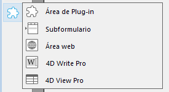
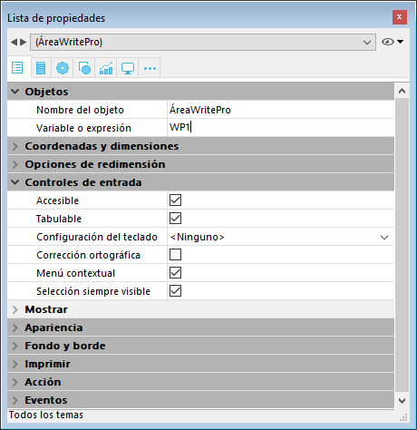
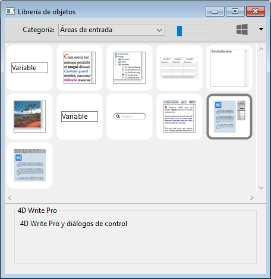
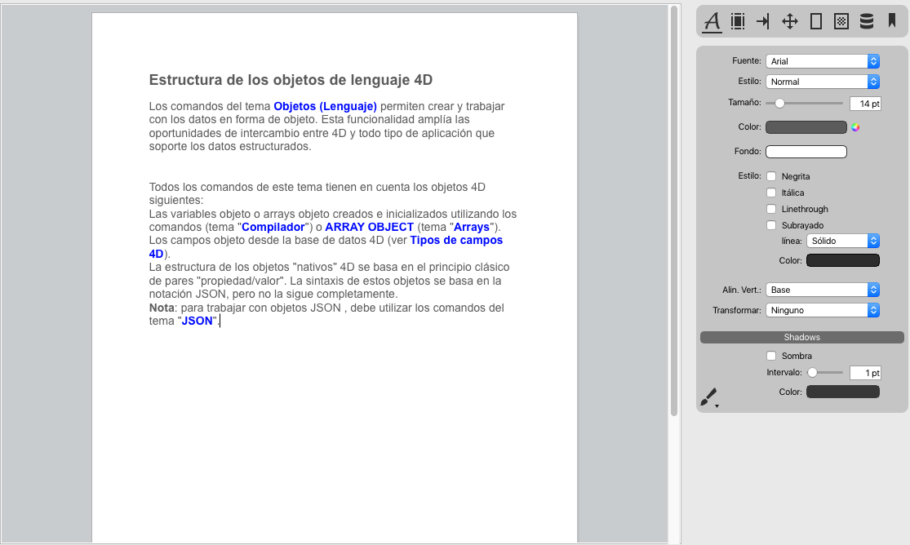
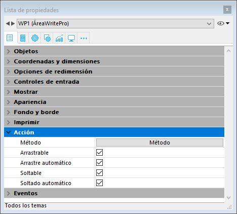

#### Uso del objeto de área de 4D Write Pro 

En 4D, los documentos 4D Write Pro se pueden mostrar y editar manualmente en un objeto formulario 4D, llamado **4D Write Pro**. Este objeto está disponible como parte de la última herramienta (Área de plug-in, área Web, etc.) de la barra de objetos  
  
  

Un área de formulario 4D Write Pro form se configura por medio de las propiedades estándar de la Lista de propiedades, tales como **nombre del objeto** y **nombre de la variable**, **coordenadas**, **entrada**, **visualización** y **apariencia**, y/o **eventos**.

  

La propiedad **Nombre de la variable** puede ser utilizada en el lenguaje como una referencia al área 4D Write Pro. Tenga en cuenta que la variable debe ser del tipo [objeto](# "Datos estructurados como forma de objeto nativo 4D") (para más información, consulte el comando [C\_OBJECT](../../commands/c-object)).

"Entry" properties manage basic features for text entry:

* **Editable**: le permite bloquear/desbloquear el área con el fin de permitir o impedir su modificación
* **Auto revisión ortográfica**: disponible para áreas 4D Write Pro
* **Menú contextual:** le permite activar/desactivar el menú contextual cuando el formulario se ejecute (ver la sección *Utilizar un área 4D Write Pro*)

* **Selección siempre visible**: se encarga de la selección de texto como en las áreas de texto estándar.

#### Utilizar el widget 4D Write Pro de la librería de objetos 

Puede crear áreas 4D Write Pro preconfigurada utilizando objetos **4D Write Pro** en la librería de objetos (tema "Áreas de entrada"):

Estas áreas vienen con un panel de control o una barra de herramientas para gestionar todos los atributos del área (fuente, color, estilo, etc.):

Para más información, consulte la sección *Área 4D Write Pro*.

#### Configurar arrastrar y soltar 

Para configurar las funcionalidades de arrastrar y soltar para sus áreas 4D Write Pro, es necesario seleccionar las opciones adecuadas en el tema "Acción" de la Lista de propiedades:

Las áreas 4D Write Pro soportan dos modos de arrastrar y soltar:

* **Modo personalizado:** solamente las opciones "Arrastrable" y "Soltable" están marcadas.  
En este modo, puede seleccionar texto y empezar a moverlo. El método del objeto se llama con el evento On Begin Drag Over, así que puede definir la acción soltar utilizando código personalizado.
* **Modo automático**: las opciones "Arrastrable", "Soltable", "Arrastrar automático" y "Soltar automático" seleccionadas.  
En este modo, puede mover o copiar de forma automática (presione la tecla **Alt/Opción**) el texto seleccionado. El evento On Begin Drag Over no se dispara.

**Nota:** seleccionando únicamente las opciones "Arrastrar automático" y "Soltar automático" no tendrá ningún efecto en el área 4D Write Pro.

#### Configurar propiedades Vista 

Las propiedades de vista del documento están disponibles directamente en la lista de propiedades para áreas 4D Write Pro para permitirle definir cómo un documento 4D Write Pro se muestra de forma predeterminada en esta área. Estas propiedades le permiten personalizar, por ejemplo, si los documentos 4D Write Pro se muestran igual que si se fueran a imprimir, o a renderizar en un navegador. Se pueden establecer diferentes vistas del mismo documento 4D Write Pro en el mismo formulario.

**Nota:** la configuración de la vista se puede administrar dinámicamente utilizando los comandos [WP SET VIEW PROPERTIES](../commands/wp-set-view-properties) y [WP Get view properties](../commands/wp-get-view-properties).

La configuración de vista del documento se manejan a través de temas específicos en el tema **Apariencia** de la lista de propiedades para objetos de formulario 4D Write Pro:

* **Resolución**: define la resolución de pantalla para los contenidos del área 4D Write Pro. De forma predeterminada, se establece en **72 dpi (macOS)**, que es la resolución estándar para formularios 4D en todas las plataformas. Al establecer esta propiedad en **Automático** significa que el documento de renderización será diferente entre las plataformas macOS y Windows. El establecimiento de un valor específico dpi hará la misma renderización del documento en ambas plataformas macOS y Windows.
* **Zoom**: establece el porcentaje de zoom para mostrar los contenidos del área 4D Write Pro.
* **Modo Vista**: establece el modo de visualización del documento 4D Write Pro en el área del formulario. Tres valores están disponibles:  
   * **Página**: el más completo modo de visualización que incluye contornos de página, orientación, márgenes, saltos de página, encabezados y pies de página, etc. Para más información, consulte el párrafo *Funcionalidades de vista página*.  
   * **Borrador**: modo borrador con propiedades de documentos básicas  
   * **Anidado**: modo de visualización adecuado para áreas anidadas; no muestra los márgenes, los pies de página, los encabezados, los marcos de página, etc.  
   Este modo también se puede utilizar para producir una vista de salida Web (si selecciona también la resolución 96 dpi y la opción **Mostrar HTML WYSIWYG**).  
         
   **Nota**: la propiedad Modo Vista sólo se utiliza para la renderización en pantalla. En cuanto a la configuración de impresión, se utilizan automáticamente las reglas de renderización específicas (ver *Impresión de documentos 4D Write Pro*).
* **Mostrar marco de página:** muestra/oculta el marco de página cuando el modo de vista Página se establece en "Página".
* **Mostrar referencias**: muestra todas las fórmulas (o expresiones) insertadas en el documento como *referencias* (ver *Gestión de fórmulas*). Cuando esta opción no está marcada, las fórmulas 4D se muestran como *valores*.  
**Nota**: las referencias de fórmula se pueden mostrar como símbolos  (ver abajo).
* **Mostrar encabezados/pies**: muestra/oculta los encabezados y pies cuando el modo de vista Página se establece en "Página" (que aparece por defecto). Para más información sobre las encabezados y pies de página, por favor consulte la sección *Utilizar un área 4D Write Pro*.
* **Mostrar fondo y elementos anclados**: muestra/oculta imágenes de fondo, color de fondo, imágenes ancladas y cajas de texto.
* **Mostrar caracteres ocultos**: muestra/oculta caracteres invisibles.
* **Mostrar HTML WYSIWYG**: activa/desactiva la vista HTML WYSIWYG, en la que todos los atributos 4D Write Pro avanzados que no son compatibles con todos los navegadores son retirados.
* **Mostrar regla horizontal**: horizontal. Para más información acerca de las reglas en las áreas 4D Write Pro, consulte la sección *Gestión de reglas*.
* **Mostrar regla vertical**: muestra/oculta la regla vertical cuando el documento está en modo Página. Para mayor información sobre reglas en áreas 4D Write Pro, ver la sección *Gestión de reglas*.
* **Mostrar imágenes vacías o no soportadas**: muestra/oculta un rectángulo negro para las imágenes que no se pueden cargar o calcular (imágenes vacías o en un formato no soportado). Para más información, consulte la sección *Imágenes vacías*.
* **Mostrar la fuente de la fórmula como símbolo**: muestra el texto fuente de las fórmulas como  símbolos cuando las expresiones se muestran como referencias (ver arriba). Mostrar las fórmulas como símbolos hace que los documentos de plantilla sean más compactos y más *wysiwyg*.

**Notas de compatibilidad:**

* Los documentos 4D Write Pro creados con versiones hasta 4D v16 se muestran utilizando los valores predeterminados para estas propiedades, con la excepción de la propiedad Resolución, que se define en Automático en este caso.
* La regla horizontal se muestra en las bases de datos creadas a partir de 4D v16 R2; Para las bases convertidas de versiones anteriores, esta configuración no está seleccionada por defecto.