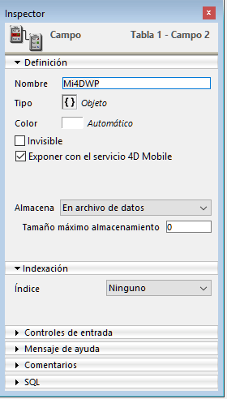
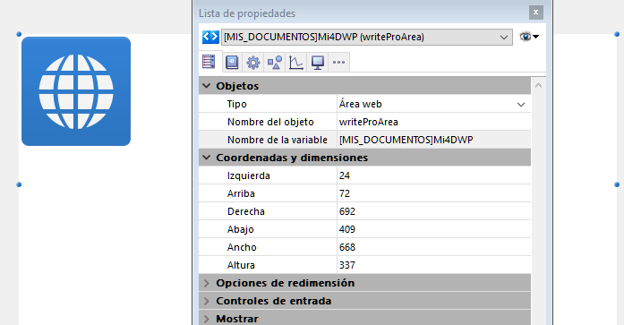

#### 

Puede guardar automáticamente sus documentos 4D Write Pro en el archivo de datos de 4D. Si ha creado un área 4D Write Pro en un formulario y crear un campo Objeto para almacenar el contenido del área, el texto introducido en el área y se guarda automáticamente con cada registro cuando se valida el registro. Luego puede utilizar el comando [QUERY BY ATTRIBUTE](../../commands/query-by-attribute) para seleccionar los registros en función del valor de sus atributos internos. También puede añadir y consultar sus propios atributos con las áreas 4D Write Pro. 

Esta sección describe las siguientes funcionalidades:

* Asociar un campo objeto 4D a un área 4D Write Pro en un formulario
* Definir, leer o buscar atributos personalizados en los documentos 4D Write Pro, utilizando los comandos estándar [OB SET](../../commands/ob-set), [OB Get](../../commands/ob-get) y [QUERY BY ATTRIBUTE](../../commands/query-by-attribute).

#### Asociar un campo objeto 4D a un área 4D Write Pro 

Para asociar un área 4D Write Pro con un campo 4D Objeto, sólo tiene que hacer referencia al campo en la propiedad Nombre de la variable del área.

##### Crear el campo objeto en estructura 

En la estructura de su base de datos, todo campo objeto 4D se puede utilizar para almacenar los documentos 4D Write Pro. Como en cualquier campo Objeto, debe definir, en función de sus necesidades:

* el nombre del campo,
* los atributos, como "Exponer con servicio 4D Mobile," así como también el índice,
* la opción de almacenamiento (ver *Almacenamiento externo de los datos*).



Estos parámetros son estándar para los campos Objeto.

##### Asignar el campo objeto al área 4D Write Pro 

Una vez haya definido el campo objeto destinado a almacenar sus documentos 4D Write Pro, sólo tiene que hacer referencia a él en el formulario que contiene el área. Puede utilizar cualquier tabla o formulario proyecto.  
En el editor de formularios, escriba el nombre del campo, utilizando la notación estándar "\[Tabla\]Campo" en el área **Nombre de la variable** de la Lista de propiedades para el área 4D Write Pro:



Su área 4D Write Pro se asocia a continuación al campo, lo que garantiza que su contenido se guardará automáticamente con cada registro. Tenga en cuenta que si no utiliza los botones automáticos de 4D, tendrá que guardar el área de forma manual utilizando los comandos 4D.

#### Utilizar atributos personalizados 

Cuando las áreas 4D Write Pro se almacenan en los campos de tipo Objeto, puede guardar y leer los atributos personalizados en los documentos 4D Write Pro, tal como, por ejemplo, el nombre del autor, la categoría del documento, o cualquier información adicional que puede resultar útil. A continuación, puede buscar los atributos personalizados con el fin de seleccionar los registros que cumplen los criterios.

Los atributos personalizados se exportarán con los comandos [WP EXPORT DOCUMENT](../commands/wp-export-document) o [WP EXPORT VARIABLE](../commands/wp-export-variable). Los atributos personalizados se exportarán al convertir un campo objeto 4D Write Pro a JSON utilizando el comando [JSON Stringify](../../commands/json-stringify) (junto con los atributos del documento principal 4D Write Pro).

Para definir o leer los atributos personalizados, puede utilizar notación objeto o los comandos [OB Get](../../commands/ob-get) y [OB SET](../../commands/ob-set).

Por ejemplo, en el método de formulario, puede escribir:

```4d
 If(Form event code=On Validate)
    [MyDocuments]My4DWP["myatt_Last edition by"]:=Current user
    [MyDocuments]My4DWP.myatt_Category:="Memo"
    [MyDocuments]My4DWP:=[MyDocuments]My4DWP //to record the edit
 End if
```

o:

```4d
 If(Form event code=On Validate)
    OB SET([MyDocuments]My4DWP;"myatt_Last edition by";Current user)
    OB SET([MyDocuments]My4DWP;"myatt_Category";"Memo")
 End if
```

También puede leer los atributos personalizados de los documentos:

```4d
 vAttrib:=[MyDocuments]My4DWP.myatt_Category
```

o:

```4d
 vAttrib:=OB Get([MyDocuments]My4DWP;"myatt_Category")
```

Si ha guardado los atributos personalizados con los documentos 4D Write Pro en su archivo de datos, puede efectuar las búsqueda en estos atributos para crear una selección de registros que contienen el valor del atributo apropiado. En el siguiente ejemplo, se consulta la tabla que contiene el campo Objeto para seleccionar registros:

```4d
 QUERY BY ATTRIBUTE([MyDocuments];[MyDocuments]My4DWP;"myatt_Category";=;"Memo")
  //selecciona todos los registros en MyDocuments cuyo atributo personalizado "myatt_Category" tiene el valor "Memo"
  //en el campo objeto My4DWP (asociado a un área 4D Write Pro)
```

**Nota sobre los nombres de los atributos personalizados:** como los atributos personalizados comparten el mismo espacio de nombre que los atributos internos de los documentos 4D Write Pro, le recomendamos encarecidamente que utilice prefijos al definir sus propios nombres de atributos, con el fin de evitar cualquier conflicto entre los atributos internos y personalizados. Los nombres sin prefijo están reservados para los atributos internos de 4D Write Pro. Puede utilizar cualquier prefijo personalizado (utilizamos "myatt\_" como prefijo en el ejemplo anterior).

**Nota:** Los atributos personalizados no pueden ser gestionados por los comandos [WP SET ATTRIBUTES](../commands/wp-set-attributes), [WP GET ATTRIBUTES](../commands/wp-get-attributes), y [WP RESET ATTRIBUTES](../commands/wp-reset-attributes) (sólo soportan atributos internos de 4D Write Pro). Para mayor información, por favor consulte la sección *Atributos 4D Write Pro*.