#### Gestión de los documentos en las áreas 4D Write Pro 

En las aplicaciones 4D, los documentos, 4D Write Pro son creados importados y exportados por medio de comandos específicos que se encuentran en el tema **4D Write Pro** (*WP EXPORT DOCUMENT*, *WP EXPORT VARIABLE*, *WP Import document*, *WP New*). 

También puede asociar un área 4D Write Pro con un campo Objeto de la base en un formulario. De esta manera, cada documento 4D Write Pro se guarda automáticamente con el registro y se almacena en los datos de la base (ver *Almacenar los documentos 4D Write Pro en los campos objeto 4D*).

#### Formato del documento .4wp 

Puede guardar los documentos 4D Write Pro en el disco y reabrirlos sin pérdidas con el formato **.4wp** nativo.

El formato **.4wp** consiste en una carpeta zip cuyo nombre es el título del documento y cuyo contenido es el texto HTML y las imágenes:

* el texto HTML combina HTML estándar con expresiones 4D (no interpretadas), así como también etiquetas 4D específicas,
* las imágenes se almacenan en una carpeta con el mismo nombre que el título del documento, junto al archivo HTML.

Como los documentos .4wp se basan en HTML, pueden importarse o abrirse en cualquier aplicación externa que soporte HTML.

El formato interno de los documentos 4D Write Pro es HTML extendido propietario, compatible con HTML5/XHTML5, pero utiliza su propio subconjunto de atributos y de etiquetas HTML/CSS. Como resultado, sólo los documentos HTML exportados por 4D Write Pro pueden ser abiertos por 4D Write Pro sin riesgo de perder información. La importación de documentos HTML creados externamente puede producir errores.

Para mayor información puede [descargar la lista de atributos de 4D Write pro con la definición asociada como estilo CSS o etiqueta XHTML](https://download.4d.com/Documents/Products%5FDocumentation/LastVersions/Line%5F19/4DWP-attributes-and-xhtml.pdf) en 4D Write Pro XHTML.

##### Retrocompatibilidad 

Siempre puede reabrir un documento .4wp con una versión anterior de 4D Write Pro. Si contiene atributos que fueron añadidos en versiones más recientes, estos atributos son simplemente ignorados. Sin embargo, si guarda el documento, los atributos se eliminan del documento y se pierden.

#### Menú contextual 

Si la propiedad **Menú contextual** está seleccionada por un área 4D Write Pro (ver *Definir un área 4D Write Pro*), un menú contextual completo está disponible para los usuarios en modo Aplicación:  
  
 

Este menú ofrece acceso a todas las funcionalidades de 4D Write Pro.

#### Seleccionar el modo vista 

Los documentos 4D Write Pro se pueden visualizar en tres modos de vista de página:

* **Borrador**: modo borrador con propiedades básicas
* **Página** (por defecto): modo "vista imprimir"
* **Embebido**: modo de vista conveniente para áreas anidadas; no muestra márgenes, pies de página, encabezados, columnas, marcos de página, etc.  
Este modo también se puede utilizar para producir una salida de vista como Web (si selecciona también la resolución 96 dpi y la opción **HTML WYSIWYG**).
El modo de visualización de la página se puede configurar mediante el menú emergente de área:

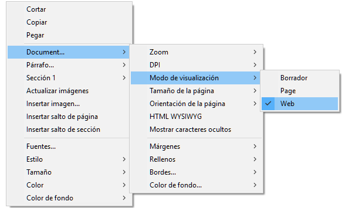

**Nota:** el modo de visualización de la página no se almacena con el documento.

Para las áreas anidadas en formularios 4D, el modo de visualización también se puede configurar por defecto utilizando la lista de propiedades. En este caso, el modo de visualización se almacena como una propiedad del objeto de formulario 4D Write Pro (para más información, consulte el párrafo *Configurar propiedades Vista*). 

#### Selección de vista página 

Cuando el documento está en el modo de vista **Página**, las siguientes propiedades del documento se muestran al usuario:

* Trazos de página para representar los límites de impresión
* Ancho de página y Altura de la página (por defecto: 21x29.7 cm)
* Orientación de la página (por defecto: retrato)
* Margen de la página (por defecto: 2.5 cm)

También puede utilizar comandos adicionales relacionados con la página como **Document.../Page size** o **Document.../Page orientation**.

**Nota:** cuando un documento está en modo vista **Anidado** o **Borrador**, las propiedades de la página se pueden definir, aunque su efecto no sea visible. En el modo **Borrador**, los siguientes efectos propiedad de párrafo son visibles: 
* Limitación de altura página (líneas dibujadas)
* Columnas
* Evitar salto de página dentro de la propiedad
* Control de viudas y huérfanos.

##### Saltos de párrafo 

Cuando se muestra en modo Página o Borrador (o en el contexto de la impresión de un documento), los párrafos de 4D Write Pro pueden romperse

* automáticamente, si la altura del párrafo es mayor que la altura de la página disponible,
* en función de los saltos de párrafo establecidos por la programación o por el usuario.

Los saltos pueden ser añadidos por programación o por el usuario. Las acciones disponibles son:

* comando [WP INSERT BREAK](../commands/wp-insert-break)
* acción estándar *insertPageBreak*
* Opción **Inserción de salto de página** del menú contextual por defecto

**Controlar los saltos automáticos**

Puede controlar los saltos automáticos en los párrafos mediante las siguientes funcionalidades:

* **Control de viudos y huérfanos**: cuando se define esta opción para un párrafo, 4D Write Pro no permite viudas (última línea de un párrafo aislada en la parte superior de una página) ni huérfanas (primera línea de un párrafo aislada en la parte inferior de una página) en el documento. En el primer caso, la línea anterior del párrafo se añade a la parte superior de la página para que se muestren allí dos líneas. En el segundo caso, la primera línea aislada se traslada a la página siguiente.
* **Evitar el salto de página en el interior**: cuando se define esta opción para un párrafo, 4D Write Pro impide que este párrafo se divida en partes en dos o más páginas.
* **Mantener con el siguiente**: cuando se establece esta opción para un párrafo, ese párrafo no puede separarse del que le sigue por un salto automático. Ver wk keep with next y la acción estándar correspondiente (*keepWithNext*, ver *Utilizar las acciones estándar 4D Write Pro*).

Estas opciones pueden definirse mediante el menú contextual, o los atributos (wk avoid widows and orphans, wk page break inside paragraph, ver *Atributos 4D Write Pro*), o las acciones estándar (*widowAndOrphanControlEnabled*, *avoidPageBreakInside*, ver *Utilizar las acciones estándar 4D Write Pro*).

#### Fondo 

El fondo de los documentos 4D Write Pro y los elementos del documento (tablas, párrafos, secciones, encabezados/pies, etc.) se pueden configurar con los siguientes efectos:

* colores
* bordes
* imágenes
* origen, posicionamiento horizontal y vertical
* área de dibujo
* repetir

Estos atributos se pueden definir por programación para elementos individuales en una página y/ o fondos de documento completos con el comando [WP SET ATTRIBUTES](../commands/wp-set-attributes) o por *Utilizar las acciones estándar 4D Write Pro*. Para ver la lista completa de atributos de fondo disponibles y dónde se pueden aplicar, consulte el artículo *Atributos 4D Write Pro*. 

Los usuarios pueden modificar atributos de fondo a través del menú contextual como se muestra a continuación:

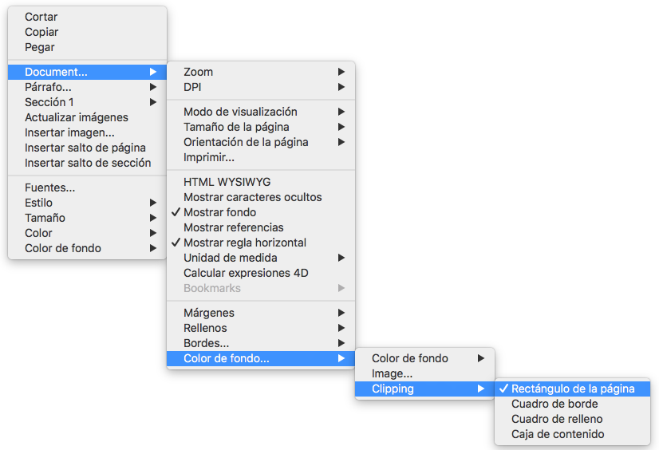

Para ver un ejemplo de cómo añadir una imagen de tamaño completo como fondo, vea la demostración de cómo hacerlo [aquí](http://download.4d.com/Demos/).

#### Manejo de encabezados, pies y secciones 

Los documentos 4D Write Pro soportan encabezados y pies de página. Los encabezados y pies de página están relacionados con las secciones.

Una sección es una parte de un documento que está definida por un rango de páginas y puede tener su propia paginación y atributos comunes. Un documento puede contener cualquier número de secciones (de uno al número total de páginas). Cada página sólo puede pertenecer a una sección, excepto las páginas con saltos de sección continuos (ver abajo).

Se puede definir un conjunto de encabezados y pies de página para cada sección.

##### Definir una sección 

Una sección es un subconjunto de páginas continuas en un documento 4D Write Pro. Un documento puede contener una o más secciones. Una sección puede contener cualquier número de páginas, desde una sola página a el número total de páginas del documento. Una sección puede contener una sola columna o hasta 20 columna(s). 

Por defecto, un documento contiene una sola sección, llamada **Sección 1**. 4D Write Pro muestra el menú contextual de este número de la sección donde se hace clic en el documento:

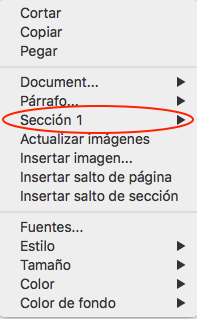

Se crea una nueva sección añadiendo una ruptura de sesión en el flujo de texto:

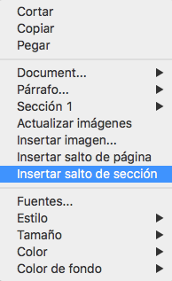

Cuando se ha añadido una ruptura de sección, el menú contextual muestra un número incrementado para cada sección. Sin embargo, puede cambiar el nombre de cualquier sección:

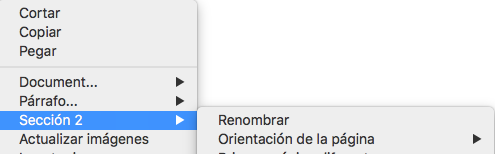

El nombre introducido se utiliza como el nombre de sección en todo el documento:

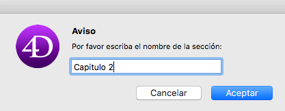 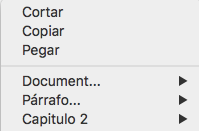

Tenga en cuenta que si se ha definido una primera página diferente o diferentes páginas izquierda/derecha para una sección, el tipo de página también se muestra en el menú (ver abajo).

##### Insertar un salto de sección continuo 

Un salto de sección continuo crea una nueva sección en la misma página. Esto permite crear páginas con secciones que tienen diferentes números de columnas (vet *Creación de una página con secciones de varias columnas y de una sola columna*).

Las secciones creadas con saltos de sección continuos se cuentan en el documento (tienen números de sección), pero a diferencia de las secciones creadas con saltos de sección estándar, sus encabezados, pies, imágenes ancladas, etc. sólo se tienen en cuenta cuando se ha producido un salto de página físico.

**Nota:** si cambia la orientación de la página de la nueva sección después de insertar un salto de sección continuo, éste se convierte en un salto de sección estándar.

##### Atributos Sección 

Las secciones heredan atributos de los documentos. Sin embargo, los atributos de documentos comunes, incluyendo los encabezados y pies de página, se pueden modificar por separado para cada sección. El menú emergente contextual muestra las propiedades y atributos disponibles en el nivel de sección:  
  
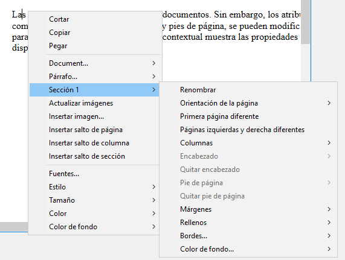

* **Orientación de página**: le permite definir una orientación de página específica (vertical u horizontal) por sección
* **Primera página diferente**: le permite definir diferentes atributos para la primera página de la sección; esta funcionalidad se puede utilizar para crear hojas de guarda, por ejemplo. Cuando se selecciona este atributo, la primera página de la sección se maneja como una subsección y puede tener sus propios atributos.  
 ">/\]
* **Diferentes páginas derecha e izquierda**: le permite establecer diferentes atributos para las páginas izquierda y derecha de la sección. Cuando se activa este atributo, las páginas izquierda y derecha de la sección se manejan como subsecciones y puede tener sus propios atributos.  
 ">/\]
* Comandos **Columnas**: permiten definir el número y propiedades de columnas para la sección. Estas opciones se detallan a continuación.
* Comandos **Header** y **Footer**: estas opciones permiten definir encabezados y pies de página separados. Estas opciones se detallan a continuación.
* **Márgenes**/**Relleno**/**Bordes**/**Fondo**: estos atributos pueden definirse por separado para cada sección. Para más información acerca de estos atributos, consulte el artículo *Atributos 4D Write Pro*.

##### Insertar encabezados y pies de página 

Cada sección puede tener encabezado y pie de página específicos. Los encabezados y pies de página sólo se muestran cuando el documento modo vista página está en **Página**.  
  
Dentro de una sección, puede definir hasta tres encabezados y pies diferentes, dependiendo de las opciones activadas:

* primera página,
* página(s) izquierda(s),
* página(s) derecha(s).

Para crear un encabezado o un pie de página: 

1. Asegúrese de que el documento está en el modo de visualización **Página**.
2. Haga doble clic en el área de encabezado o pie de página de la sección y página deseada para entrar en el modo de edición.  
   * El área de encabezado está en la parte superior de la página:  
   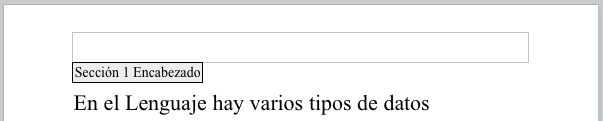  
   * El área de pie de página es en la parte inferior de la página:  
   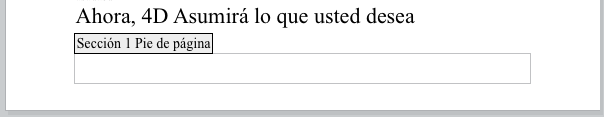

  
A continuación, puede introducir contenidos estáticos, que se repetirán automáticamente en cada página de la sección (a excepción de la primera página, si está habilitada).

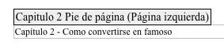

También puede insertar contenidos dinámicos tales como el número de página o el conteo de páginas utilizando el comando [ST INSERT EXPRESSION](../../commands/st-insert-expression) (para más información, consulte el párrafo *Insertar expresiones de documento y de página*).

Una vez definidos un encabezado o un pie de página para una sección, puede configurar sus atributos comunes utilizando el menú contextual:

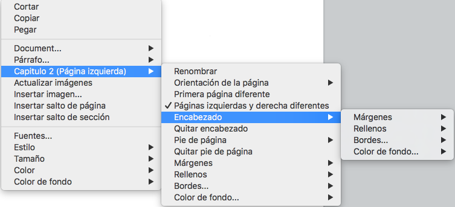

Para más información sobre atributos **Márgenes**, **Rellenos**, **Bordes** y **Fondo**, consulte la sección *Atributos 4D Write Pro*. 

Puede eliminar toda la definición de un encabezado o de un pie de página (contenidos y atributos) seleccionando **Eliminar encabezado** o **Eliminar pie** en el menú contextual.

##### Compatibilidad 

4D Write Pro maneja encabezados y pies de página de documentos convertidos desde el plug-in 4D Write conuna altura fija.

Las siguientes expresiones y propiedades también son soportadas y se convierten de los encabezados y pies de página del plug-in 4D Write:

* número de página y variables de conteo de página
* distinta primera página
* distintas páginas izquierda/derecha

#### Gestión de cajas de texto 

Las cajas de texto son áreas que se anclan a una página o sección y pueden llenarse con texto, imágenes en línea o tablas. Las cajas de texto pueden colocarse en cualquier lugar de la página y responder a necesidades específicas, por ejemplo, para insertar el nombre o el logotipo de una empresa o un área de direcciones.

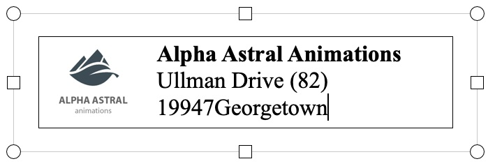

**Nota:** una caja de texto no puede contener encabezados, pies de página, columnas, imágenes ancladas u otras cajas de texto.

Las cajas de texto se añaden con una posición absoluta, delante/detrás del texto, así como ancladas a una página o a partes específicas de un documento en el modo Página: encabezado, pie de página, una sección, todas las secciones o una subsección. Las cajas de texto también pueden utilizarse en modo anidado (ancladas a la caja de capa).

Añadir una caja de texto a un documento 4D Write Pro puede hacerse de las siguientes maneras:

* utilizando el comando **WP New text box**,
* utilizando la acción estándar *insertTextBox*

Para seleccionar una caja de texto, el usuario tiene que hacer clic sobre ella (**Ctrl/Cmd+clic** si la caja de texto está en la capa de fondo). Una vez seleccionado, se puede mover o redimensionar la caja de texto utilizando el ratón o las teclas de flecha.

Para eliminar una caja de texto seleccionada, puede presionar la tecla **Suprimir** o **Retroceso**, utilizar la acción estándar **textBox/eliminar**, o ejecutar el comando **WP DELETE TEXT BOX**.

Los atributos de las cajas de texto se manejan con el comando [WP SET ATTRIBUTES](../commands/wp-set-attributes) o *Acciones 4D Write Pro*. Están disponibles los siguientes atributos y acciones:  
  
| **Propiedad (constante)** | **Acción estándar**   | **Comentarios**                                                                                              |
| ------------------------- | --------------------- | ------------------------------------------------------------------------------------------------------------ |
| wk width                  | textBox/ancho         | Si se define en "auto", el ancho se convierte a 8cm ya que el ancho de la caja de texto no puede ser "auto". |
| wk height                 | textBox/alto          | Si está en "auto", la altura se ajusta al contenido.                                                         |
| wk padding                | textBox/relleno       |                                                                                                              |
| wk border \[...\]         | textBox/borde\[...\]  |                                                                                                              |
| wk background \[...\]     | textBox/fondo\[...\]  |                                                                                                              |
| wk vertical align         | textBox/verticalAlign |                                                                                                              |
| wk id                     | \-                    | no puede estar vacío para una caja de texto                                                                  |
| wk anchor \[...\]         | textBox/anchor\[...\] |                                                                                                              |
| wk owner                  | \-                    | sólo lectura                                                                                                 |
| wk protected              | \-                    |                                                                                                              |
| wk style sheet            | \-                    | sólo lectura y siempre "" (sin hoja de estilo)                                                               |

Las cajas de texto soportan el ajuste automático del texto cuando se anclan a un documento con opciones como a la izquierda, a la derecha, en el lado más grande, arriba y abajo, o todo alrededor suministradas a través de la propiedad wk anchor layout o la acción estándar anchorLayout. Ver esta entrada del blog para más detalles.

Las cajas de texto con ajuste de texto ancladas al cuerpo de la página no afectan al encabezado ni al pie de página (la caja de texto se muestra delante del encabezado o del pie de página); por el contrario, las cajas de texto ancladas al encabezado y al pie de página afectan al cuerpo de la página si se solapan con él.  
  
**Nota**: si desea anclar una caja de texto con ajuste de texto al encabezado o al pie de página, también debe definir la alineación vertical de la caja de texto en la parte superior.

Las cajas de texto no se muestran si:

* el modo de vista es Borrador;
* están centrados o anclados a secciones y la opción **Mostrar HTML WYSIWYG** está marcada;
* la opción "fondo visible" no está activada.

#### Gestión de reglas 

Las reglas están disponibles en todos los modos de visualización de 4D Write Pro y tienen las siguientes características:

* Graduaciones en cm, mm, pulgadas o pt de acuerdo con la unidad de diseño actual definida en el documento 4D Write Pro. Puede cambiar las unidades de medida mediante el menú contextual o modificando el atributo wk layout unit.
* Símbolo de indentación de primera línea
* Símbolo de margen de párrafo izquierdo
* Símbolo de margen de párrafo derecho
* Tabulaciones mostradas a lo largo del borde inferior de la regla
* El contraste de color visible representa los márgenes de página izquierdo y derecho

Las reglas verticales están disponibles solo en modo Página y tienen las siguientes características:

* Graduaciones en cm, mm, pulgadas o pt según la unidad de diseño actual definida en el documento 4D Write Pro. Puede cambiar las unidades de medida utilizando el menú contextual o modificando el atributo wk layout unit.
* Contraste de color visible que representa los márgenes superior e inferior de la página.

Puede cambiar el estado de visualización de las reglas por medio de acciones estándar (ver *Utilizar las acciones estándar 4D Write Pro*) o marcando o desmarcando la opción **Mostrar regla horizontal** o **Mostrar regla vertical** en el menú contextual del área 4D Write Pro:  
  
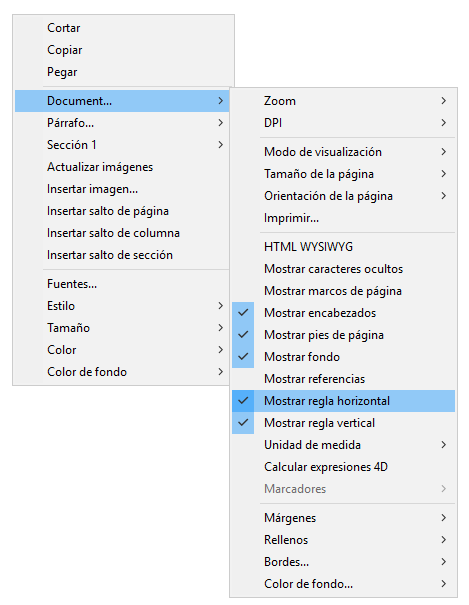  

**Nota:** una propiedad específica del área 4D Write Pro permite definir la visualización predeterminada para las reglas (ver la sección *Configurar propiedades Vista*).

##### Ajustar márgenes de texto e indentaciones 

###### Regla horizontal 

Puede modificar márgenes izquierda y derecha, indentaciones y posiciones de tabulación haciendo clic y arrastrando los símbolos correspondientes en la regla horizontal:

Cuando coloca el ratón sobre uno de estos símbolos, el cursor cambia para indicar que puede moverse y aparece una línea de guía vertical mientras lo arrastra:  
  

Cuando se seleccionan varios párrafos, arrastrar márgenes o símbolos de indentación aplica estos márgenes o indentaciones a todos los párrafos seleccionados. Manteniendo presionada la tecla Mayús mientras arrastra estos símbolos mantiene los intervalos existentes entre indentaciones o márgenes en los párrafos seleccionados.

###### Regla Vertical 

Puede modificar los márgenes superior e inferior con la regla vertical. Cuando mueve el ratón sobre el límite del margen, el cursor cambia para indicar que se puede mover, y aparece una línea de guía horizontal mientras lo arrastra:  
  
 

Esta acción se puede utilizar para modificar el espacio entre la parte superior e inferior de la página y el cuerpo y el encabezado y pie de página de un documento. 

##### Gestión de tabulaciones 

Puede utilizar el menú contextual de la regla para crear, modificar o eliminar tabulaciones:  
  
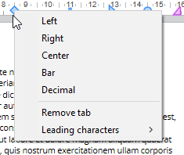  

Para crear una tabulación, simplemente haga clic directamente en la regla y elija su tipo en el menú contextual. Un solo clic izquierdo crea automáticamente una tabulación izquierda predeterminada. También puede hacer clic con el botón derecho en las tabulaciones existentes para modificar su tipo utilizando el menú contextual.

**Eliminar tabulación** solo está disponible cuando hace clic con el botón derecho del ratón directamente en una tabulación existente; También puede eliminar tabulaciones arrastrándolas fuera del área de la regla horizontal.

**Notas:** 

* La tabulación también se pueden definir por programación con los comandos [WP SET ATTRIBUTES](../commands/wp-set-attributes), [WP GET ATTRIBUTES](../commands/wp-get-attributes), y [WP RESET ATTRIBUTES](../commands/wp-reset-attributes) con los selectores wk tab default y wk tabs.
* Para las tabulaciones decimales, 4D Write Pro considera el primer punto o coma de la derecha como el separador decimal; esta configuración predeterminada puede modificarse con el selector wk tab decimal separator.

###### Definir caracteres iniciales 

Los caracteres que preceden a las tabulaciones (caracteres iniciales) se pueden definir seleccionando entre cinco caracteres predefinidos o designando un carácter específico a usar. Los caracteres predefinidos son:

* Ninguno (no se muestran los caracteres - *predeterminado*)
* .... (puntos)
* \--- (guiones)
* \_\_ (guiones bajos)
* \*\*\* (asteriscos)

Los caracteres iniciales siempre aparecen antes de la tabulación y siguen la dirección del texto (de izquierda a derecha o de derecha a izquierda). Se pueden definir por programación con los comandos [WP SET ATTRIBUTES](../commands/wp-set-attributes), [WP GET ATTRIBUTES](../commands/wp-get-attributes) y [WP RESET ATTRIBUTES](../commands/wp-reset-attributes) utilizando wk leading con los selectores wk tab default o wk tabs, o vía el menú contextual de regla horizontal (como se muestra a continuación).

Cuando se selecciona **Otro** **...**, se muestra un diálogo donde se puede definir un carácter principal personalizado.

##### Reglas Multi columnas 

Cuando se definen dos o más columnas para el documento o la sección, la regla horizontal muestra un área específica para cada columna:

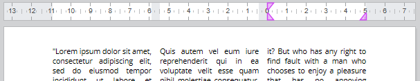

**Nota:** la funcionalidad de múltiples columnas no está disponible en el modo de vista **Embebido**.

##### Evento On After Edit 

 Un evento de formulario On After Edit se dispara para un objeto de formulario de área 4D Write Pro siempre que se muevan, agreguen o eliminen cualquier tabulación o control de margen, ya sea arrastrándolos o utilizando el menú contextual.

#### Gestión de columnas 

4D Write Pro le permite administrar columnas en sus documentos. Las columnas están encadenadas desde la columna de la izquierda hasta la columna de la derecha. En otras palabras, al ingresar texto, el flujo de texto comenzará a llenar la columna izquierda y continuará con la columna directamente hacia la derecha hasta que llegue al final de la página. Una vez que se llega al final de la página, el flujo de texto pasa por la siguiente página. Para poder equilibrar la configuración de la página, 4D Write Pro le permite insertar saltos de columna.

Las columnas se pueden definir a nivel de documento (se muestran en el documento completo) y/o en el nivel de sección (cada sección puede tener su propia configuración de columna).

**Nota:** las columnas solo se soportan en el modo **Vista de página** y **Vista Borrador** (no se muestran en modo de vista **Embebido**) y se exportan a .docx utilizando [WP EXPORT DOCUMENT](../commands/wp-export-document) pero no a formatos HTML y MIME HTML wk web page complete).

Las columnas se pueden configurar utilizando:

* el submenú **Columnas** del menú contextual del área 4D Write Pro,
* Atributos 4D Write Pro (ver *Atributos 4D Write Pro*),
* Acciones estándar 4D Write Pro (ver *Utilizar las acciones estándar 4D Write Pro*).

Puede definir u obtener las siguientes propiedades y acciones para las columnas:

| **Propiedad**                                | **Descripción**                                                                                                                                                                                                                                                                      | **Atributos** *Documento*                                                   | **Acciones estándar**                                   |
| -------------------------------------------- | ------------------------------------------------------------------------------------------------------------------------------------------------------------------------------------------------------------------------------------------------------------------------------------ | --------------------------------------------------------------------------- | ------------------------------------------------------- |
| Número de columnas                           | Puede definir hasta 20 columnas para el documento/sección                                                                                                                                                                                                                            | wk column count                                                             | *columnCount*                                           |
| Espacio entre columnas                       | Espacio entre columnas en pts, pulgadas o cm. Tenga en cuenta que todas las columnas tendrán el mismo tamaño. Cada ancho de columna se calcula automáticamente con 4D Write Pro según el número de columnas, el ancho de página y el espaciado                                       | wk column spacing                                                           | *columnSpacing*                                         |
| Ancho de columna                             | (atributo de solo lectura) Ancho actual para cada columna, es decir, ancho calculado                                                                                                                                                                                                 | wk column width                                                             | \-                                                      |
| Estilo, color y ancho de la regla de columna | Puede agregar un separador vertical (una línea decorativa) entre columnas. Estas opciones le permiten diseñar el estilo, el color y el ancho del separador. Para eliminar el separador vertical, seleccione **Ninguno** como estilo. | wk column rule style, wk column rule color, wk column rule width            | *columnRuleStyle*, *columnRuleColor*, *columnRuleWidth* |
| Insertar salto                               | Insertar salto de columna                                                                                                                                                                                                                                                            | wk column break, ver también [WP INSERT BREAK](../commands/wp-insert-break) | *insertColumnBreak*                                     |
| Menú Columnas                                | Crear un submenú Columna                                                                                                                                                                                                                                                             | \-                                                                          | *columns*                                               |

##### Creación de una página con secciones de varias columnas y de una sola columna 

*Insertar un salto de sección continuo* en su documento le permite tener secciones de varias columnas y secciones de una columna en la misma página. 

Por ejemplo:

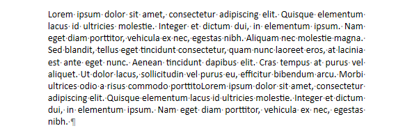

Puede insertar un salto de sección continuo y cambiar el número de columnas a dos para la primera sección:

