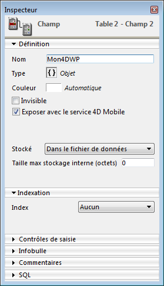
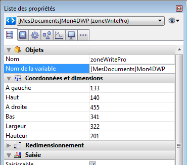

#### 

Vous pouvez stocker automatiquement vos documents 4D Write Pro dans le fichier de données de 4D. Si vous avez créé une zone 4D Write Pro dans un formulaire ainsi qu'un champ de type Objet pour stocker le contenu de la zone, le texte saisi dans la zone est automatiquement sauvegardé dans les données au moment de la validation de l'enregistrement. Vous pouvez alors utiliser la commande [CHERCHER PAR ATTRIBUT](../../commands/chercher-par-attribut) afin de sélectionner des enregistrements en fonction de la valeur de leurs attributs internes. Vous pouvez également ajouter des attributs personnalisés aux zones 4D Write Pro et les utiliser pour des recherches. 

Cette section décrit les fonctionnalités suivantes :

* Associer un champ objet 4D à une zone 4D Write Pro dans un formulaire.
* Fixer, lire et rechercher des attributs personnalisés dans les documents 4D Write Pro, à l'aide des commandes standard [OB FIXER](../../commands/ob-fixer), [OB Lire](../../commands/ob-lire) et [CHERCHER PAR ATTRIBUT](../../commands/chercher-par-attribut).

#### Associer un champ objet 4D à une zone 4D Write Pro 

Pour associer une zone 4D Write Pro à un champ 4D de type Objet, il vous suffit de référencer le champ dans la propriété "Nom de variable" de la zone. 

##### Créer le champ objet en structure 

Dans la structure de votre base de données, tout champ objet 4D peut être utilisé pour stocker des documents 4D Write Pro. Vous devez simplement définir, en fonction de vos besoins, ses propriétés standard :

* le nom du champ,
* ses attributs, tels que "Exposer avec le service 4D Mobile" et son index,
* son option de stockage (voir à ce sujet le paragraphe *Stockage externe des données*).



##### Affecter le champ objet à la zone 4D Write Pro 

Une fois que le champ objet destiné à stocker vos documents 4D Write Pro est défini, il vous suffit de le référencer dans le formulaire contenant la zone. Vous pouvez utiliser un formulaire table ou un formulaire projet.   
Dans l'éditeur de formulaires, saisissez le nom du champ, en utilisant la notation standard "\[Table\]Champ", dans la zone **Nom de la variable** de la Liste des propriétés pour la zone 4D Write Pro : 



Votre zone 4D Write Pro est alors associée au champ, ce qui vous donne l'assurance que son contenu sera automatiquement sauvegardé avec chaque enregistrement. A noter que si vous n'utilisez pas les boutons à action automatique de 4D, vous devrez programmer vous-même la sauvegarde de la zone, à l'aide des commandes 4D. 

#### Utiliser des attributs personnalisés 

Lorsque les zones 4D Write Pro sont stockées dans des champs de type Objet, vous pouvez écrire et lire des attributs personnalisés dans les documents 4D Write Pro, comme par exemple le nom de l'auteur, la catégorie du document, ou toute information supplémentaire qui vous serait utile. Vous pouvez effectuer des recherches parmi les attributs personnalisés afin de sélectionner des enregistrements en fonction de critères spécifiques.

Les attributs personnalisés sont exportés avec les commandes [WP EXPORTER DOCUMENT](../commands/wp-exporter-document) et [WP EXPORTER VARIABLE](../commands/wp-exporter-variable). Ils sont également exportés lorsque vous convertissez un champ objet 4D Write Pro en JSON à l'aide de la commande [JSON Stringify](../../commands/json-stringify) (en plus des attributs principaux de document de 4D Write Pro).

Pour écrire ou lire des attributs personnalisés, vous pouvez utiliser la notation objet ou les commandes [OB Lire](../../commands/ob-lire) et [OB FIXER](../../commands/ob-fixer).

Par exemple, dans la méthode du formulaire, vous pouvez écrire :

```4d
 Si(Evenement formulaire code=Sur validation)
    [MesDocuments]Mon4DWP["monatt_Dernière modif par"]:=Utilisateur courant
    [MesDocuments]Mon4DWP.monatt_Catégorie:=Memo
    [MesDocuments]Mon4DWP:=[MesDocuments]Mon4DWP //enregistrer la modification
 Fin de si
```

ou :

```4d
 Si(Evenement formulaire code=Sur validation)
    OB FIXER([MesDocuments]Mon4DWP;"monatt_Dernière modif par";Utilisateur courant)
    OB FIXER([MesDocuments]Mon4DWP;"monatt_Catégorie";"Memo")
 Fin de si
```

Vous pouvez bien entendu lire les attributs personnalisés des documents :

```4d
 vAttrib:=[MesDocuments]Mon4DWP.monatt_Catégorie
```

ou :

```4d
 vAttrib:=OB Lire([MesDocuments]Mon4DWP;"monatt_Catégorie")
```

Si vous avez stocké des attributs personnalisés avec les documents 4D Write Pro dans votre fichier de données, vous pouvez effectuer des recherches sur ces attributs afin de créer des sélections d'enregistrements contenant les valeurs recherchées. Exemple :

```4d
 CHERCHER PAR ATTRIBUT([MesDocuments];[MesDocuments]Mon4DWP;"monatt_Catégorie";=;"Memo")
  //sélectionne tous les enregistrements de la table MesDocuments dont l'attribut personnalisé "monatt_Catégorie" contient la valeur "Memo"
  //dans le champ objet Mon4DWP (associé à une zone 4D Write Pro)
```

**Note sur les noms des attributs personnalisés :** Comme les attributs personnalisés partagent le même espace de nommage que les attributs internes des documents 4D Write Pro, nous recommandons fortement l'utilisation de préfixes lorsque vous définissez les noms de vos attributs, afin d'éviter tout conflit entre les attributs internes et personnalisés. Les noms sans préfixe sont réservés aux attributs internes de 4D Write Pro. En revanche, la définition des préfixes est libre (nous utilisons par exemple le préfixe "monatt\_" dans les exemples ci-dessus).

**Note** : Les attributs personnalisés ne peuvent pas être gérés par les commandes [WP FIXER ATTRIBUTS](../commands/wp-fixer-attributs), [WP LIRE ATTRIBUTS](../commands/wp-lire-attributs), et [WP REINITIALISER ATTRIBUTS](../commands/wp-reinitialiser-attributs) (ils ne supportent que les attributs internes de 4D Write Pro). Pour plus d'information, veuillez vous reporter à la section *Attributs 4D Write Pro*.