#### Gestion des documents dans les zones 4D Write Pro 

Dans les applications 4D, les documents 4D Write Pro sont créés, importés et/ou exportés via des commandes dédiées placées dans le thème **4D Write Pro** (*WP EXPORTER DOCUMENT*, *WP EXPORTER VARIABLE*, *WP Importer document*, *WP Nouveau*). 

Vous pouvez également associer une zone 4D Write Pro à un champ objet de la base dans un formulaire. De cette manière, chaque document 4D Write Pro est automatiquement sauvegardé avec l'enregistrement et est conservé dans les données de la base (cf. section *Stocker les documents 4D Write Pro dans des champs objet 4D*).

#### Format de document .4wp 

Vous pouvez sauvegarder des documents 4D Write Pro sur disque et les rouvrir sans aucune perte de données grâce au format natif **.4wp**.

Le format **.4wp** est constitué d'un dossier zip dont le nom est le titre du document, et contenant du texte HTML et des images :

* le texte HTML combine du HTML standard et des expressions 4D (non interprétées) ainsi que des balises 4D spécifiques,
* les images sont stockées dans un dossier du même nom que le document, situé à côté du fichier HTML.

Comme les documents .4wp sont basés sur du HTML, ils peuvent être importés et ouverts dans toute application tierce qui prend en charge le format HTML.

Le format interne des documents 4D Write Pro est du HTML étendu propriétaire, compatible HTML5/XHTML5, mais utilisant son propre sous-ensemble d'attributs et de balises HTML/CSS. Par conséquent, seuls les documents HTML exportés par 4D Write Pro peuvent être ouverts par 4D Write Pro sans risque de perte d'informations. Importer des documents HTML qui ont été créés par une source externe peut provoquer des erreurs.

Pour plus d'informations, vous pouvez **[télécharger la liste des attributs de 4D Write pro avec la définition associée en tant que style CSS ou balise XHTML](https://download.4d.com/Documents/Products%5FDocumentation/LastVersions/Line%5F19/4DWP-attributes-and-xhtml.pdf)** dans le 4D Write Pro XHTML.

##### Rétrocompatibilité 

Vous pouvez toujours rouvrir un document .4wp avec une version antérieure de 4D Write Pro. S'il contient des attributs qui ont été ajoutés dans des versions plus récentes, ces attributs sont simplement ignorés. Cependant, si vous enregistrez le document, les attributs sont supprimés du document et seront perdus. 

#### Interface utilisateur 

Lorsque la propriété **Menu contextuel** est cochée pour une zone 4D Write Pro (voir *Définir une zone 4D Write Pro*), un menu contextuel complet est disponible pour les utilisateurs lorsque le formulaire est lancé à l'exécution :

 

Ce menu donne accès à l'ensemble des fonctions de 4D Write Pro.

#### Sélectionner le mode d'affichage 

4D Write Pro propose trois modes d'affichage pour les documents :

* Brouillon : Mode brouillon avec des propriétés basiques
* **Page** (défaut) : Mode "vue impression"
* Inclus : Mode adapté aux zones incluses dans les formulaires ; dans ce mode, les marges, pieds de page, colonnes, en-têtes, cadres, etc, ne sont pas affichés.  
Ce mode peut également être utilisé pour obtenir un affichage de type Web (si vous avez également sélectionné la résolution 96 dpi et l'option HTML WYSIWYG).

Le mode d'affichage peut être configuré via le menu contextuel de la zone :

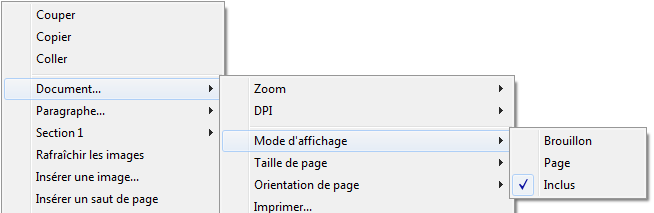

**Note :** Le mode d'affichage n'est pas stocké avec le document.

Pour les zones incluses dans les formulaires 4D, le mode d'affichage peut également être défini par défaut à l'aide de la Liste des propriétés. Dans ce cas, le mode d'affichage est une propriété de l'objet de formulaire 4D Write Pro (pour plus d'informations, veuillez vous reporter au paragraphe *Configurer les propriétés d'affichage*).

#### Fonctionnalités de l'affichage en page 

Lorsqu'un document est en mode d'affichage **Page**, les propriétés de document suivantes sont apparentes pour l'utilisateur :

* les contours des pages, qui représentent les limites d'impression
* la largeur et la hauteur des pages (21x29,7 cm par défaut)
* l'orientation des pages (portrait par défaut)
* les marges (2,5 cm par défaut)

Vous pouvez également utiliser des commandes supplémentaires telles que Document.../Taille de la page ou Document.../Orientation de la page.

**Note :** Lorsque le mode d'affichage d'un document est **Inclus** ou **Brouillon**, les propriétés de page peuvent être définies, même si leur effet n'est pas visible. En mode Brouillon, les effets des propriétés de paragraphe suivantes sont toutefois visibles :

* Limites des hauteurs de pages (des lignes sont dessinées)
* Colonnes
* Propriété "Eviter les sauts de pages intérieurs"
* Propriété "Contrôle des veuves et des orphelins".

##### Sauts de paragraphe 

Lorsqu'ils sont affichés en mode Page ou Brouillon (ou dans le contexte de l'impression d'un document), les paragraphes de 4D Write Pro peuvent être rompus :

* automatiquement, si la hauteur du paragraphe est supérieure à la hauteur de page disponible,
* en fonction des sauts de paragraphe définis par programmation ou par l'utilisateur.

Les ruptures peuvent être ajoutées par programmation ou par l'utilisateur. Les actions disponibles sont les suivantes :

* commande [WP INSERER RUPTURE](../commands/wp-inserer-rupture)
* action standard *insertPageBreak*
* l'option **Insérer un saut de page** du menu contextuel par défaut.

**Contrôle des sauts de page automatiques**

Vous pouvez contrôler les sauts de paragraphe automatiques à l'aide des fonctions suivantes : 

* **Contrôle des veuves et des orphelins** : Lorsque cette option est définie pour un paragraphe, 4D Write Pro n'autorise pas les veuves (dernière ligne d'un paragraphe isolée en haut d'une page) ou les orphelins (première ligne d'un paragraphe isolée en bas d'une page) dans le document. Dans le premier cas, la ligne précédente du paragraphe est ajoutée en haut de la page de sorte que deux lignes y sont affichées. Dans le second cas, la première ligne isolée est déplacée sur la page suivante.
* **Éviter le saut de page à l'intérieur** : Lorsque cette option est définie pour un paragraphe, 4D Write Pro empêche ce paragraphe d'être divisé en parties sur deux pages ou plus.
* **Paragraphe solidaire :** Lorsque cette option est définie pour un paragraphe, ce paragraphe ne peut pas être séparé de celui qui le suit par un saut automatique. Voir wk keep with next et l'action standard correspondante (*keepWithNext*, voir *Utiliser les actions standard 4D Write Pro*).

Ces options peuvent être définies à l'aide du menu contextuel, ou des attributs (wk avoid widows and orphans, wk page break inside paragraph, voir *Attributs 4D Write Pro*), ou des actions standard (widowAndOrphanControlEnabled, avoidPageBreakInside, voir *Utiliser les actions standard 4D Write Pro*).

#### Fond 

L'arrière-plan (le fond) des documents et des éléments de documents de 4D Write Pro (tableaux, paragraphes, sections, en-têtes/pieds de pages, etc.) peut être défini à l'aide des attributs suivants :

* couleurs
* bordures
* images
* positionnement horizontal, vertical et origine
* rectangle d'application
* répétition

Ces attributs peuvent être définis par programmation pour le fond des éléments individuels dans la page et/ou de l'ensemble du document via la commande [WP FIXER ATTRIBUTS](../commands/wp-fixer-attributs) ou les *Utiliser les actions standard 4D Write Pro*. Pour obtenir la liste complète des attributs de gestion des arrières-plans ainsi que les éléments auxquels ils peuvent s'appliquer, reportez-vous à la section *Attributs 4D Write Pro*. 

Les utilisateurs peuvent modifier les attributs d'arrière-plan à l'aide du menu contextuel de la zone : 

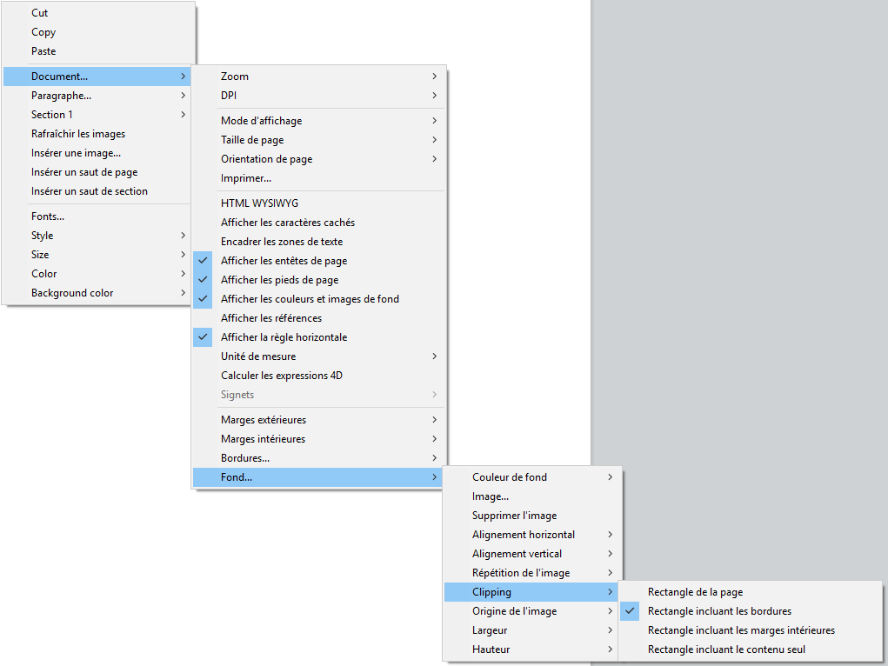 

Pour un exemple d'ajout d'image d'arrière-plan en taille réelle, [téléchargez la base *How Do I* (HDI) dédiée](http://download.4d.com/Demos/4D%5Fv16%5FR5/HDI%5F4DWP%5FBackImagePaperBox.zip).

#### Gestion des en-têtes, pieds de pages et sections 

Les documents 4D Write Pro peuvent contenir des en-têtes et des pieds de page. Les en-têtes et les pieds de page sont liés aux sections.

Une section est une partie d'un document qui est définie par un intervalle de pages, et qui peut comporter des attributs de pagination et communs qui lui sont propres. Un document peut contenir de une à *N* sections, *N* étant le nombre total de pages. Chaque page ne peut appartenir qu'à une seule section, à l'exception des pages contenant des sauts de section continus (voir ci-dessous). 

Vous pouvez définir un ensemble d'en-têtes et de pieds de page pour chaque section.

##### Définir une section 

Une section est un sous-ensemble de pages contiguës d'un document 4D Write Pro. Un document peut contenir une ou plusieurs sections, chaque section pouvant elle-même contenir un nombre variable de pages, depuis une page unique jusqu'au nombre total de pages du document. Une section peut contenir une seule colonne ou jusqu'à 20 colonnes par page. 

Par défaut, un document contient une seule section, nommée **Section 1**. Le menu contextuel de 4D Write Pro affiche ce numéro de section dans toutes les pages du document :

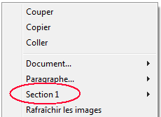

Vous créez une nouvelle section en ajoutant un saut de section dans le texte :

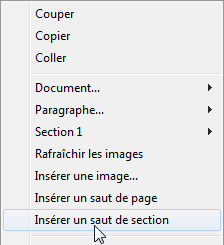

Lorsqu'un ou plusieurs sauts de section ont été ajoutés, le menu contextuel affiche un numéro incrémenté pour chaque section. Vous pouvez cependant renommer les sections :

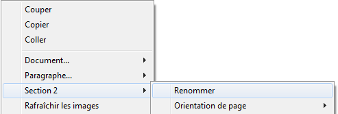

Le nom que vous saisissez est alors utilisé comme nom de section pour le document : 

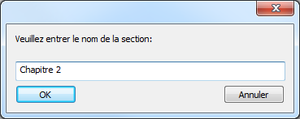 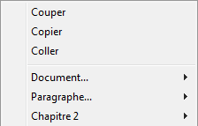

Notez que si vous avez défini une première page différente ou des pages droite/gauche différentes pour une section, le type de page est également affiché dans le menu (voir ci-dessous). 

##### Insérer un saut de section continu 

Un saut de section continu crée une nouvelle section sur la même page. Cela vous permet de créer des pages avec des sections qui ont différents nombres de colonnes (voir *Créer une page avec des sections multi-colonnes et des section à une seule colonne*).

Les sections créées avec des sauts de section continus sont comptées dans le document (elles possèdent des numéros de section), mais contrairement aux sections créées avec des sauts de section standard, leurs en-têtes, pieds, images ancrées, etc. sont pris en compte uniquement lorsqu'un saut de page physique s'est produit.

**Note** : Si vous modifiez l'orientation de la page pour la nouvelle section après avoir inséré un saut de section continu, celui-ci se transforme en un saut de section standard.

##### Attributs de section 

Les sections héritent des attributs du document. Cependant, les attributs de documents communs, y compris les en-têtes et pieds de page, peuvent être modifiés séparément pour chaque section. Le menu contextuel affiche les propriétés et attributs disponibles au niveau des sections :

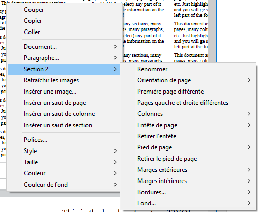

* **Orientation de page** : permet de définir une orientation de page spécifique (portrait ou paysage) par section
* **Première page différente** : permet de définir des attributs spécifiques pour la première page de la section ; cette fonction peut être utilisée pour créer des pages de garde, par exemple. Lorsque cette option est cochée, la première page de la section est considérée elle-même comme une sous-section et peut disposer de ses propres attributs.  

* **Pages gauche et droite différentes** : permet de définir des attributs différents pour les pages gauches et droites de la section. Lorsque cette option est cochée, les pages gauches et droites de la section sont considérées comme des sous-sections et peuvent disposer de leurs propres attributs.  

* **Colonnes**: permet de définir le nombre et les propriétés des colonnes pour la section. Ces options sont détaillées ci-dessous.
* **Entête** et **Pied de page** : ces options vous permettent de définir des en-têtes et pieds de page spécifiques. Elles sont détaillées ci-dessous.
* **Marges extérieures** et **intérieures** / **Bordures** / **Fond** : ces attributs peuvent être définis séparément pour chaque section. Pour plus d'informations sur ces attributs, veuillez vous reporter à la page *Attributs 4D Write Pro*.

##### Insérer des en-têtes et des pieds de page 

Chaque section peut comporter un en-tête et un pied de page spécifiques. Les en-têtes et les pieds de page sont visibles uniquement lorsque le mode d'affichage du document est **Page**. 

 A l'intérieur d'une section, vous pouvez définir jusqu'à trois en-têtes et pieds de page différents, en fonction des options activées :

* première page,
* page(s) gauche(s),
* page(s) droite(s),

Pour créer un en-tête ou un pied de page : 

1. Assurez-vous que le document est en mode d'affichage **Page**.
2. Double-cliquez dans la zone d'en-tête ou de pied de la section et de la page souhaitées afin de passer en édition.  
   * La zone d'en-tête est en haut de la page :  
   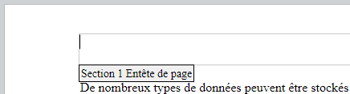  
   * La zone d'en-tête est en bas de la page :  
   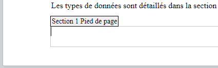

Vous pouvez ajouter tout contenu statique, qui sera automatiquement répété sur chaque page de la section (à l'exception de la première page, si l'option est activée). 

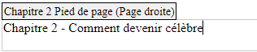

Vous pouvez ajouter du contenu dynamique tel que le numéro de page ou le nombre de pages, à l'aide de la commande [ST INSERER EXPRESSION](../../commands/st-inserer-expression) (pour plus d'informations, veuillez vous reporter au paragraphe *Insérer des expressions de page et de document*).

**Note :** Vous pouvez également gérer les en-têtes et pieds de page par programmation à l'aide de commandes spécifiques telles que [WP Lire entete](../commands/wp-lire-entete) et [WP Lire pied](../commands/wp-lire-pied).

Une fois qu'un en-tête ou un pied de page a été défini pour une section, vous pouvez configurer ses attributs communs à l'aide du menu contextuel :

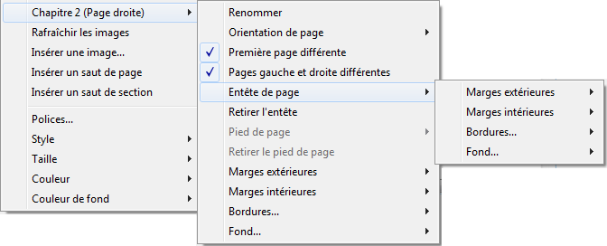

Pour plus d'informations sur les attributs **Marges extérieures**, **Marges intérieures**, **Bordures** et **Fond**, veuillez vous reporter à la section *Attributs 4D Write Pro*. 

Vous pouvez supprimer l'ensemble de la définition d'un en-tête ou d'un pied de page (contenu et attributs) en sélectionnant la commande **Retirer l'entête** ou **Retirer le pied de page**  dans le menu contextuel. 

##### Compatibilité 

4D Write Pro prend en charge les en-têtes et les pieds de page des documents convertis depuis le plug-in 4D Write dont la hauteur est fixe.

Les expressions et propriétés suivantes sont également prises en charge et converties lorsqu'elles étaient présentes dans les en-têtes et pieds de page des documents du plug-in 4D Write :

* variables numéros et nombre de pages
* première page différente
* pages gauche/droite différentes

#### Gestion des zones de texte 

Les zones de texte sont des zones ancrées à une page ou à une section et qui peuvent contenir du texte, des images en ligne ou des tableaux. Les zones de texte peuvent être positionnées n'importe où sur la page et répondre à des besoins spécifiques, par exemple pour insérer le nom ou le logo d'une entreprise ou une zone d'adresse.

**Note :** Une zone de texte ne peut pas contenir des en-têtes, des pieds de page, des colonnes, des images ancrées ou d'autres zones de texte.

Les zones de texte sont ajoutées avec une position absolue, devant/derrière le texte, ainsi qu'ancrées à une page ou à des parties spécifiques d'un document en mode Page : en-tête, pied de page, une section, toutes les sections ou une sous-section. Les zones de texte peuvent également être utilisées en mode intégré (ancrées à la zone de calque).

L'ajout d'une zone de texte à un document 4D Write Pro peut être réalisé de la manière suivante :

* en utilisant la commande **WP New text box,**
* en utilisant l'action standard insertTextBox

Pour sélectionner une zone de texte, l'utilisateur doit cliquer dessus (**Ctrl/Cmd+clic** si la zone de texte se trouve sur la couche de fond). Une fois sélectionnée, la zone de texte peut être déplacée ou redimensionnée à l'aide de la souris ou des flèches du clavier.

Pour supprimer une zone de texte sélectionnée, vous pouvez appuyer sur la touche **Effacer** ou **Retour arrière**, utiliser l'action standard **textBox/remove** ou exécuter la commande **WP DELETE TEXT BOX**. 

Les attributs des zones de texte sont gérés par la commande [WP FIXER ATTRIBUTS](../commands/wp-fixer-attributs) ou la commande *Actions 4D Write Pro*. Les attributs et actions suivants sont disponibles :

| **Propriété (constante)** | **Standard action**       | **Commentaires**                                                                                                            |
| ------------------------- | ------------------------- | --------------------------------------------------------------------------------------------------------------------------- |
| wk width                  | textBox/width             | Si elle est réglée sur "auto", la largeur est convertie en 8 cm car la largeur de la zone de texte ne peut pas être "auto". |
| wk height                 | textBox/height            | Si la valeur est "auto", la hauteur est ajustée en fonction du contenu.                                                     |
| wk padding                | textBox/padding           |                                                                                                                             |
| wk border \[...\]         | textBox/border\[...\]     |                                                                                                                             |
| wk background \[...\]     | textBox/background\[...\] |                                                                                                                             |
| wk vertical align         | textBox/verticalAlign     |                                                                                                                             |
| wk id                     | \-                        | ne peut pas être vide pour une zone de texte                                                                                |
| wk anchor \[...\]         | textBox/anchor\[...\]     |                                                                                                                             |
| wk owner                  | \-                        | en lecture uniquement                                                                                                       |
| wk protected              | \-                        |                                                                                                                             |
| wk style sheet            | \-                        | en lecture uniquement et toujours "" (pas de feuille de style)                                                              |

Les zones de texte supportent l'habillage automatique du texte lorsqu'elles sont ancrées dans un document avec des options telles que à gauche, à droite, sur le plus grand côté, au-dessus et au-dessous, ou tout autour, fournies par la propriété wk anchor layout ou l'action standard **anchorLayout**. Consultez cet [article de blog](https://blog.4d.com/fr/4d-write-pro-more-display-options-for-anchored-pictures-and-text-boxes/) pour plus de détails.

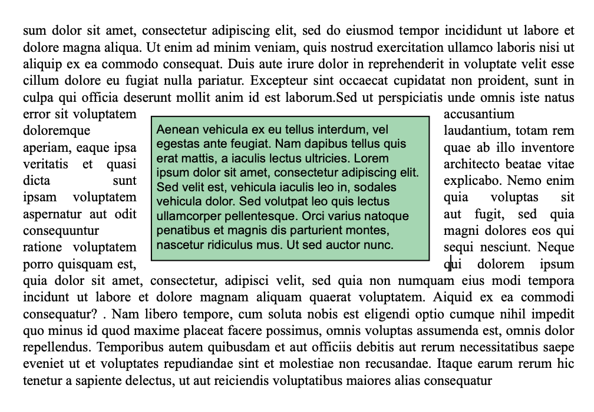

Les zones de texte avec habillage ancrées dans le corps de la page n'affectent pas l'en-tête ou le pied de page (la zone de texte est affichée devant l'en-tête ou le pied de page) ; au contraire, les zones de texte ancrées dans l'en-tête et le pied de page affectent le corps de la page si elles le chevauchent.

**Note :** Si vous souhaitez ancrer une zone de texte avec habillage de texte à l'en-tête ou au pied de page, vous devez également définir l'alignement vertical de la zone de texte sur le haut.

Les zones de texte ne sont pas affichées si :

* le mode d'affichage est Brouillon ;
* ils sont centrés ou ancrés à des sections et l'option **Show HTML WYSIWYG** est cochée ;
* l'option "fond visible" n'est pas activée.

#### Utiliser les règles 

Les règles horizontales sont disponibles dans tous les modes d'affichage de 4D Write Pro et ont les caractéristiques suivantes : 

* Graduations en cm, mm, pouces ou pt en fonction de l'unité courante définie dans le document 4D Write Pro. Vous pouvez changer l'unité de mesure du document à l'aide du menu contextuel ou via l'attribut wk layout unit.
* Symbole de retrait première ligne
* Symbole de marge de paragraphe gauche
* Symbole de marge de paragraphe droite
* Tabulations affichées sur le bord inférieur de la règle
* Zones de couleur représentant les marges gauche et droite de la page

Les règles verticales ne sont disponibles qu'en mode Page et ont les caractéristiques suivantes : 

* Graduations en cm, mm, pouces ou pt en fonction de l'unité courante définie dans le document 4D Write Pro. Vous pouvez changer l'unité de mesure du document à l'aide du menu contextuel ou via l'attribut wk layout unit.
* Zones de couleur représentant les marges haute et basse de la page

Vous pouvez afficher ou masquer les règles via des actions standard (voir *Utiliser les actions standard 4D Write Pro*) ou en utilisant la ligne **Afficher la règle horizontale** ou **Afficher la règle verticale** dans le menu contextuel de la zone 4D Write Pro :

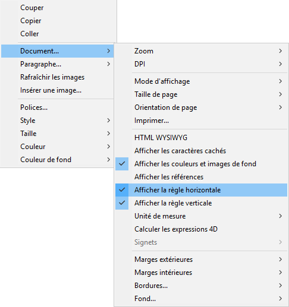

**Note :** Une option des propriétés de la zone permet également de définir l'affichage par défaut des règles (cf. section *Configurer les propriétés d'affichage*).

##### Ajuster les marges et le retrait 

Vous pouvez modifier les marges, l'indentation (le retrait) des premières lignes et les positions des tabulations en déplaçant les symboles correspondants à l'aide de la souris :

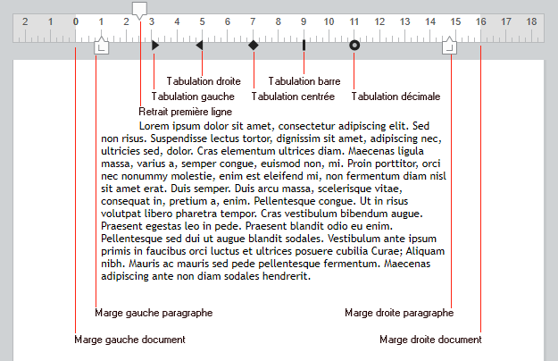

Lorsque vous survolez l'un de ces symboles avec la souris, le curseur est modifié pour indiquer qu'il peut être déplacé, et une ligne de repère verticale apparaît lorsque vous le déplacez :

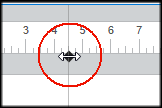

Lorsque plusieurs paragraphes sont sélectionnés, le déplacement d'un symbole de marge ou d'indentation est appliqué à tous les paragraphes sélectionnés. Si vous maintenez la touche **Majuscule** enfoncée pendant le déplacement, les intervalles existants entre les marges sont conservés dans les paragraphes sélectionnés. 

###### Règle horizontale 

Vous pouvez modifier les marges droites et gauches, les retraits et la position des tabulations en cliquant et en glissant les symboles correspondants sur la règle horizontale :  
  
  

Lorsque vous faites passer la souris sur l'un de ces symboles, le curseur change pour indiquer qu'il peut être déplacé, et une ligne verticale apparait au cours du déplacement :  
  
  

Lorsque plusieurs paragraphes sont sélectionnés, le fait de glisser les symboles de marge ou de retrait permet d'appliquer ces marges ou retraits à tous les paragraphes sélectionnés. En maintenant la touche Maj enfoncée tout en glissant ces symboles, vous conservez les intervalles existants entre les retraits ou les marges dans les paragraphes sélectionnés. 

###### Règle verticale 

Vous pouvez modifier les marges hautes et basses à l'aide de la règle verticale. Lorsque vous passez la souris sur la limite de la marge, le curseur change pour indiquer qu'il peut être déplacé, et une ligne horizontale apparait au cours du déplacement :   
  
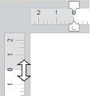   

Cette action peut être utilisée pour modifier l'espacement entre le haut et le bas de la page et le corps, l'en-tête et le pied d'un document. 

##### Gestion des tabulations 

Vous pouvez utiliser le menu contextuel de la règle horizontale pour créer, modifier ou supprimer des tabulations :

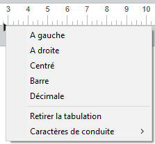

Pour créer une tabulation, cliquez sur la règle horizontale avec le bouton droit de la souris et choisissez son type depuis le menu contextuel ; un clic simple avec le bouton gauche de la souris crée automatiquement une tabulation gauche par défaut. Vous pouvez également effectuer un clic droit sur une tabulation existante pour modifier son type dans le menu contextuel.

Le libellé **Retirer la tabulation** est disponible en cas de clic droit sur une tabulation existante. Vous pouvez également supprimer des tabulations en les faisant glisser hors de la zone de la règle horizontale. 

**Notes :** 

* Les tabulations peuvent également être définies par programmation à l'aide des commandes [WP FIXER ATTRIBUTS](../commands/wp-fixer-attributs), [WP LIRE ATTRIBUTS](../commands/wp-lire-attributs), et [WP REINITIALISER ATTRIBUTS](../commands/wp-reinitialiser-attributs) avec les sélecteurs wk tab default et wk tabs.
* Pour les tabulations décimales, 4D Write Pro considère le premier point ou la première virgule de droite comme un séparateur décimal ; ce paramètre par défaut peut être modifié avec le sélecteur wk tab decimal separator.

###### Définir les caractères de conduite 

Vous pouvez définir les caractères qui précèdent les tabulations (caractères de conduite) en sélectionnant un caractère prédéfini ou en saisissant le caractère à utiliser. Les caractères prédéfinis sont :

* Aucun (aucun caractère n'est affiché - *défaut*)
* .... (points)
* \--- (tirets)
* \_\_ (traits de soulignement)
* \*\*\* (astérisques)

Les caractères de conduite apparaissent toujours avant la tabulation et suivent la direction du texte (gauche à droite ou droite à gauche). Ils peuvent être définis soit par programmation avec les commandes [WP FIXER ATTRIBUTS](../commands/wp-fixer-attributs), [WP LIRE ATTRIBUTS](../commands/wp-lire-attributs) ou [WP REINITIALISER ATTRIBUTS](../commands/wp-reinitialiser-attributs) à l'aide de wk leading et des sélecteurs wk tab default ou wk tabs, soit via le menu contextuel de la règle horizontale (comme illustré ci-dessous) :

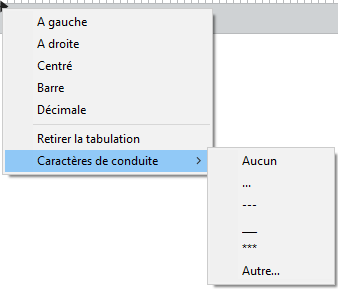

L'option Autre.. affiche une boîte de dialogue permettant de saisir un caractère de conduite personnalisé.

##### Règles multi-colonnes 

Lorsque deux ou plusieurs colonnes sont définies pour le document ou la section, la règle horizontale affiche une zone spécifique pour chaque colonne :

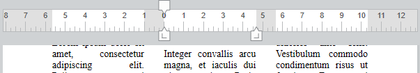

**Note :** La fonctionnalité multi-colonnes n'est pas disponible en mode d'affichage **Inclus**. 

##### Evénement Sur après modification 

Un événement Sur après modification est généré dans l'objet de formulaire 4D Write Pro à chaque déplacement d'une tabulation ou d'une marge, ainsi qu'à chaque ajout ou suppression d'une tabulation, que l'action ait été effectuée via le menu contextuel ou par glisser-déposer. 

#### Gestion des colonnes 

4D Write Pro vous permet de créer des documents comportant plusieurs colonnes. Les colonnes sont chaînées depuis la colonne la plus à gauche jusqu'à la colonne la plus à droite. Autrement dit, lorsque vous saisissez du texte, le flux de texte commencera par remplir la colonne de gauche puis continuera dans la colonne à sa droite, puis ainsi de suite jusqu'à ce qu'il atteigne la fin de la page. Une fois que le bas de la page est atteint, le flux de texte est dirigé sur la page suivante. Pour que vous puissiez contrôler ce fonctionnement, 4D Write Pro permet d’insérer des sauts de colonnes.

Les colonnes peuvent être définies au niveau du document (elles sont alors affichées dans l'ensemble du document) et/ou au niveau de la section (chaque section peut avoir sa propre configuration de colonne).

**Note :** Les colonnes sont prises en charge uniquement dans les modes d'affichage **Page** et **Brouillon** (elles ne sont pas affichées en mode **Inclus),** et sont exportées en .docx à l'aide de [WP EXPORTER DOCUMENT](../commands/wp-exporter-document) mais pas aux formats HTML et MIME HTML (format wk page web complète).

Les colonnes peuvent être définies via :

* le sous-menu **Colonnes** du menu contextuel de la zone 4D Write Pro,
* les attributs 4D Write Pro (voir *Attributs 4D Write Pro*),
* les actions standard 4D Write Pro (voir *Utiliser les actions standard 4D Write Pro*).

Vous pouvez définir ou lire les propriétés et actions suivantes pour les colonnes :

| **Propriétés**                                       | **Description**                                                                                                                                                                                                                                                                                        | **Attributs de** *Document*                                                      | **Actions standard**                                    |
| ---------------------------------------------------- | ------------------------------------------------------------------------------------------------------------------------------------------------------------------------------------------------------------------------------------------------------------------------------------------------------ | -------------------------------------------------------------------------------- | ------------------------------------------------------- |
| Nombre de colonnes                                   | Vous pouvez définir jusqu'à 20 colonnes par document/section                                                                                                                                                                                                                                           | wk column count                                                                  | *columnCount*                                           |
| Espacement de colonne                                | Espacement entre les colonnes en pts, pouces ou cm. A noter que toutes les colonnes ont la même largeur. La largeur de chaque colonne est calculée automatiquement par 4D Write Pro en fonction du nombre de colonnes, de la largeur de la page et de l'espacement                                     | wk column spacing                                                                | *columnSpacing*                                         |
| Largeur de colonne                                   | (attribut en lecture seule) Largeur actuelle de chaque colonne, i.e. largeur calculée                                                                                                                                                                                                                  | wk column width                                                                  | \-                                                      |
| Style, couleur et épaisseur du séparateur de colonne | Vous pouvez ajouter un séparateur vertical (une ligne décorative) entre les colonnes. Ces options vous permettent de définir le style, la couleur et l'épaisseur de la ligne. Pour supprimer le séparateur vertical, choisissez **Aucun** comme style. | wk column rule style, wk column rule color, wk column rule width                 | *columnRuleStyle*, *columnRuleColor*, *columnRuleWidth* |
| Insérer saut                                         | Insérer un saut de colonne                                                                                                                                                                                                                                                                             | wk column break, voir aussi [WP INSERER RUPTURE](../commands/wp-inserer-rupture) | *insertColumnBreak*                                     |
| Menu Colonnes                                        | Créer un sous-menu Colonnes                                                                                                                                                                                                                                                                            | \-                                                                               | *columns*                                               |

##### Créer une page avec des sections multi-colonnes et des section à une seule colonne 

*Insérer un saut de section continu* dans votre document vous permet d'avoir des sections à plusieurs colonnes et des sections à une seule colonne sur la même page.

Par exemple :

Vous pouvez insérer un saut de section continu et modifier le nombre de colonnes et le définir sur deux colonnes pour la première section :

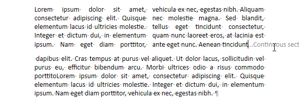