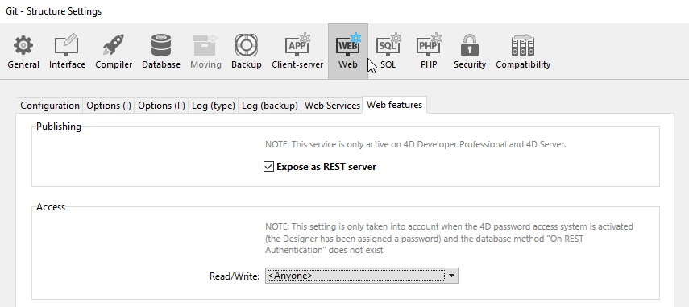

Using standard HTTP requests, the 4D REST Server allows external applications to access the data of your application directly, _i.e._ to retrieve information about the dataclasses in your project, manipulate data, log into your web application, and much more.

Pour commencer à utiliser les fonctionnalités REST, vous devez démarrer et configurer le serveur 4D REST.

> - On 4D Server, opening a REST session requires that a free 4D client licence is available.<br/>
> - On 4D single-user, you can open up to three REST sessions for testing purposes.
> - You need to manage the [session](authUsers.md) for your requesting application.

## Démarrage du serveur REST

Pour des raisons de sécurité, par défaut, 4D ne répond pas aux requêtes REST. If you want to start the REST Server, you must check the **Expose as REST server** option in the **Web** > **Web Features** page of the structure settings in order for REST requests to be processed.



> Les services REST utilisent le serveur HTTP 4D; vous devez donc vous assurer que le serveur web 4D est lancé.

Le message d'avertissement "Attention, vérifiez les privilèges d'accès" s'affiche lorsque vous cochez cette option, pour attirer votre attention sur le fait que lorsque les services REST sont activés, l'accès par défaut aux objets de base de données est gratuit tant que les accès REST n'ont pas été configurés.

> You must restart the 4D application for your changes to take effect.

## Configuration de l'accès REST

Par défaut, les accès REST sont ouverts à tous les utilisateurs, ce qui n'est évidemment pas recommandé pour des raisons de sécurité et de contrôle de l'utilisation des licences clientes.

Vous pouvez configurer les accès REST de l'une des manières suivantes :

- assigning a **Read/Write** user group to REST services in the "**Web** > **Web Features**" page of the Structure Settings;
- writing an `On REST Authentication` database method to intercept and handle every initial REST request.

> Vous ne pouvez pas utiliser les deux fonctionnalités simultanément. Once an `On REST Authentication` database method has been defined, 4D fully delegates control of REST requests to it: any setting made using the "Read/Write" menu on the **Web** > **Web Features** page of the Structure Settings is ignored.

### Utilisation des Paramètres de la Structure

The **Read/Write** menu in the "**Web** > **Web Features**" page of the structure settings specifies a group of 4D users that is authorized to establish the link to the 4D application using REST queries.

By default, the menu displays `\<Anyone>`, which means that REST accesses are open to all users. Once you have specified a group, only a 4D user account that belongs to this group may be used to [access 4D by means of a REST request](authUsers.md). Si un compte utilisé n'appartient pas à ce groupe, 4D renvoie une erreur d'authentification à l'expéditeur de la requête.

> In order for this setting to take effect, the `On REST Authentication` database method must not be defined. S'il existe, 4D ignore les paramètres d'accès définis dans les propriétés de la structure.

### Méthode base On REST Authentication

The `On REST Authentication` database method provides you with a custom way of controlling the opening of REST sessions on 4D. Cette méthode base est automatiquement appelée lorsqu'une nouvelle session est ouverte à l'aide d'une requête REST. When a [request to open a REST session](authUsers.md) is received, the connection identifiers are provided in the header of the request. The `On REST Authentication` database method is called so that you can evaluate these identifiers. Pour obtenir plus d'informations, veuillez vous reporter à la <a href="https://doc.4d.com/4Dv18/4D/18/On-REST-Authentication-database-method.301-4505004.fe.html">documentation</a> de la méthode base <code>On REST Authentication</code>.
For more information, refer to the `On REST Authentication` database method [documentation](https://doc.4d.com/4Dv18/4D/18/On-REST-Authentication-database-method.301-4505004.en.html).

## Exposer les tables et les champs

Once REST services are enabled in the 4D application, by default a REST session can access all tables and fields of the 4D database through the [datastore interface](ORDA/dsMapping.md#datastore). Ainsi, elle peut utiliser leurs données. Par exemple, si votre base de données contient une table [Employee], il est possible d'écrire :

```
http://127.0.0.1:8044/rest/Employee/?$filter="salary>10000"

```

Cette requête retournera tous les employés dont le champ "salary" est supérieur à 10 000.

> Les tables et/ou champs 4D dont l'attribut est "invisible" sont également exposés par défaut dans REST.

Si vous souhaitez personnaliser les objets du datastore accessibles via REST, vous devez désactiver l'exposition de chaque table et/ou champ que vous souhaitez masquer. Lorsqu'une requête REST tente d'accéder à une ressource non autorisée, 4D retourne une erreur.

### Exposer des tables

Par défaut, toutes les tables sont exposées dans REST.

Pour des raisons de sécurité, vous pouvez choisir d'exposer uniquement certaines tables du datastore aux appels REST. Par exemple, si vous avez créé une table [Users] stockant les noms d'utilisateur et les mots de passe, il serait préférable de ne pas l'exposer.

Pour supprimer l'exposition REST d'une table :

1. Affichez l'Inspecteur de table dans l'Editeur de structure et sélectionnez la table à modifier.

2. Uncheck the **Expose as REST resource** option:
   
   Do this for each table whose exposure needs to be modified.

### Exposer des champs

Par défaut, touts les champs d'une base 4D sont exposés dans REST.

Vous pouvez choisir d'exposer certains champs de vos tables à REST. Par exemple, si vous ne souhaitez pas exposer le champ [Employees]Salary.

Pour supprimer l'exposition REST d'un champ :

1. Affichez l'Inspecteur de champ dans l'Editeur de structure et sélectionnez le champ à modifier.

2. Uncheck the **Expose as REST resource** for the field.
   
   Repeat this for each field whose exposure needs to be modified.

> Pour qu'un champ soit accessible via REST, la table parente doit l'être également. Si la table parente n'est pas exposée, aucun de ses champs ne le sera, quel que soit leur statut.
