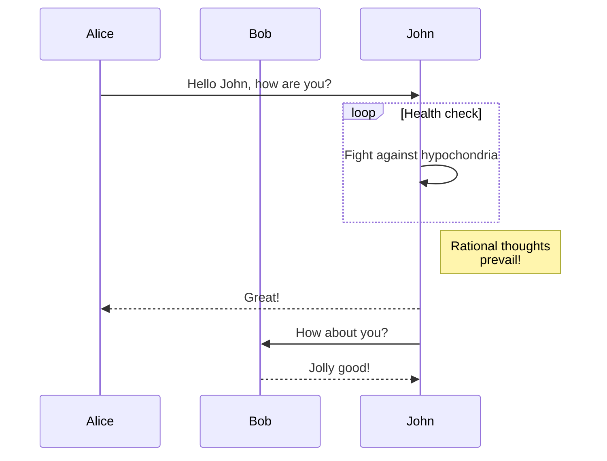

4Dでは、参照を 4D変数や式に挿入したり、様々な処理をソーステキスト ("テンプレート") に対して実行したりするための変換タグのセットを用意しています。 これらのタグは、ソーステキストが実行されてアウトプットテキストが生成されたときに解釈されます。

This principle is used in particular by the 4D Web server to build [web template pages](WebServer/templates.md).

These tags are generally to be inserted as HTML type comments (`<!--#Tag Contents-->`) but an [xml-compliant alternative syntax](#alternative-syntax-for-4dtext-4dhtml-4deval) is available for some of them.

複数タイプのタグを混用することも可能です。 たとえば、以下の HTML構造は、問題なく実行可能です:

```html
<HTML>
<BODY>
<!--#4DSCRIPT/PRE_PROCESS-->   (Method call)
<!--#4DIF (myvar=1)-->   (If condition)
   <!--#4DINCLUDE banner1.html-->   (Subpage insertion)
<!--#4DENDIF-->   (End if)
<!--#4DIF (mtvar=2)-->
   <!--#4DINCLUDE banner2.html-->
<!--#4DENDIF-->

<!--#4DLOOP [TABLE]-->   (Loop on the current selection)
<!--#4DIF ([TABLE]ValNum>10)-->   (If [TABLE]ValNum>10)
   <!--#4DINCLUDE subpage.html-->   (Subpage insertion)
<!--#4DELSE-->   (Else)
   <B>Value: <!--#4DTEXT [TABLE]ValNum--></B><br/>   (Field display)
<!--#4DENDIF-->
<!--#4DENDLOOP-->   ](End for)
</BODY>
</HTML>
```



## タグ利用の原則

### 解析

Parsing the contents of a _template_ source is done in two contexts:

- Using the `PROCESS 4D TAGS` command; this command accepts a _template_ as input, as well as optional parameters and returns a text resulting from the processing.

- Using 4D's integrated HTTP server: [template pages](WebServer/templates.md) sent by means of the `WEB SEND FILE` (.htm, .html, .shtm, .shtml), `WEB SEND BLOB` (text/html type BLOB), `WEB SEND TEXT` commands, or called using URLs. URL で呼び出す場合、".htm" と ".html" で終わるページは最適化のため解析されません。 In order to parse HTML pages in this case, you must add the suffix “.shtm” or “.shtml” (for example, http\://www\.server.com/dir/page.shtm).

### 再起的処理

4Dタグは繰り返し解釈されます。4D は常に変換の結果を解釈しようとし、新しい変換が起きた際にはそれに伴う新しい解釈が実行され、取得結果の変換が必要がなくなるまで繰り返されます。 たとえば、以下のようなステートメントがあった場合:

```html
<!--#4DHTML [Mail]Letter_type-->
```

If the `[Mail]Letter_type` text field itself contains a tag, for example `<!--#4DSCRIPT/m_Gender-->`, this tag will be evaluated recursively after the interpretation of the 4DHTML tag.

この強力な原則は、テキスト変換に関連するほとんどの需要を満たすことができます。 Note, however, that in some cases this can also allow malicious code to be inserted in the web context, [which can be avoided](WebServer/templates.md#prevention-of-malicious-code-insertion).

### トークンを使用した識別子

4D のバージョンや言語設定に左右されずに、タグ経由の式の評価が正しくおこなわれることを確実にするため、バージョン間で名前が変わりうる要素 (コマンド、テーブル、フィールド、定数) については、トークンシンタックスを使用することが推奨されます。 For example, to insert the `Current time` command, enter `Current time:C178`.

### "." を小数点として使用

4D always uses the period character (.) as a decimal separator when evaluating a numerical expression using a 4D tag `4DTEXT`, `4DHTML`, and `4DEVAL`. リージョン設定は無視されます。 この機能により、4Dの言語設定とバージョンが異なっていてもメンテナンスが容易となり互換性が保たれます。

## 4DBASE

#### Syntax: `<!--#4DBASE folderPath-->`

The `<!--#4DBASE -->` tag designates the working directory to be used by the `<!--#4DINCLUDE-->` tag.

When it is called in a Web page, the `<!--#4DBASE -->` tag modifies all subsequent `<!--#4DINCLUDE-->` calls on this page, until the next `<!--........-->`, if any. If the`<!--#4DBASE -->` folder is modified from within an included file, it retrieves its original value from the parent file.

The _folderPath_ parameter must contain a pathname relative to the current page and it must end with a slash (`/`). また、指定フォルダーは Webフォルダー内になければなりません。

"WEBFOLDER" キーワードを渡すと、(そのページに対して相対の) デフォルトパスに戻されます。

以下のように、各呼び出しごとに相対パスを指定したコードは:

```html
<!--#4DINCLUDE subpage.html-->
<!--#4DINCLUDE folder/subpage1.html-->
<!--#4DINCLUDE folder/subpage2.html-->
<!--#4DINCLUDE folder/subpage3.html-->
<!--#4DINCLUDE ../folder/subpage.html-->
```

... is equivalent to:

```html
<!--#4DINCLUDE subpage.html-->
<!--#4DBASE folder/-->
<!--#4DINCLUDE subpage1.html-->
<!--#4DINCLUDE subpage2.html-->
<!--#4DINCLUDE subpage3.html-->
<!--#4DBASE ../folder/-->
<!--#4DINCLUDE subpage.html-->
<!--#4DBASE WEBFOLDER-->
```

たとえば、ホームページのディレクトリを設定する場合:

```html
/* Index.html */
<!--#4DIF LangFR=True-->
    <!--#4DBASE FR/-->
<!--#4DELSE-->
    <!--#4DBASE US/-->
<!--#4DENDIF-->
<!--#4DINCLUDE head.html-->
<!--#4DINCLUDE body.html-->
<!--#4DINCLUDE footer.html-->
```

In the "head.html" file, the current folder is modified through `<!--#4DBASE -->`, without this changing its value in "Index.html":

```html
/* Head.htm */
/* the working directory here is relative to the included file (FR/ or US/) */
<!--#4DBASE Styles/-->
<!--#4DINCLUDE main.css-->
<!--#4DINCLUDE product.css-->
<!--#4DBASE Scripts/-->
<!--#4DINCLUDE main.js-->
<!--#4DINCLUDE product.js-->
```

## 4DCODE

#### Syntax: `<!--#4DCODE codeLines-->`

The `4DCODE` tag allows you to insert a multi-line 4D code block in a template.

When a `<!--#4DCODE` sequence is detected that is followed by a space, a CR or a LF character, 4D interprets all the lines of code up to the next `-->` sequence. コードブロック自体はキャリッジリターンもラインフィードも、あるいはその両方も含むことができ、4D によってシーケンシャルに解釈されます。

たとえば、以下のようにテンプレートに書くことができます:

```html
<!--#4DCODE
//PARAMETERS initialization
C_OBJECT:C1216($graphParameters)
OB SET:C1220($graphParameters;"graphType";1)
$graphType:=1
//...your code here
If(OB Is defined:C1231($graphParameters;"graphType"))
    $graphType:=OB GET:C1224($graphParameters;"graphType")
    If($graphType=7)
        $nbSeries:=1
        If($nbValues>8)
            DELETE FROM ARRAY:C228 ($yValuesArrPtr{1}->;9;100000)
            $nbValues:=8
        End if
    End if
End if
-->
```

4DCODE タグの機能は以下の通りです:

- The `TRACE` command is supported and activates the 4D debugger, thus allowing you to debug your template code.
- エラーは標準のエラーダイアログを表示します。これを使って、ユーザーはコードの実行を中止したりデバッグモードに入ったりすることができます。
- The text in between `<!--#4DCODE` and `-->` is split into lines accepting any line-ending convention (cr, lf, or crlf).
- The text is tokenized within the context of the database that called `PROCESS 4D TAGS`. これは、たとえばプロジェクトメソッドの認識等において重要です。 The [Available through tags and 4D URLs (4DACTION ...)](WebServer/allowProject.md) method property is not taken into account.
- テキストが常に English-US設定であったとしても、4Dのバージョン間においてコマンドや定数名が改名されることによる問題を避けるため、コマンド名や定数名はトークンシンタックスを使用することが推奨されいます。

> 4DCODE タグがあらゆる 4Dランゲージコマンドおよびプロジェクトメソッドを呼び出せるという事実は、とくにデータベースが HTTP経由で使用可能な場合等に、セキュリティ上の問題になり得ます。 しかしながら、タグはサーバー側のコードをテンプレートファイルから実行するため、タグそのものはセキュリティ上の問題になりません。 このようなコンテキストにおいては、あらゆる Webサーバーと同様に、セキュリティは主にサーバーファイルへのリモートアクセスレベルにおいて管理されています。

## 4DEACH と 4DENDEACH

#### Syntax: `<!--#4DEACH variable in expression-->` `<!--#4DENDEACH-->`

The `<!--#4DEACH-->` comment allows iterating a specified item over all values of the _expression_. The item is set to a _variable_ whose type depends on the _expression_ type.

The `<!--#4DEACH-->` comment can iterate through three expression types:

- [collections](#--4deach-item-in-collection--): loop through each element of the collection,
- [entity selections](#--4deach-entity-in-entityselection--): loop through each entity,
- [objects](#--4deach-property-in-object--): loop through each object property.

ループの数は開始時に評価され、処理中に変化することはありません。 ループ中に項目を追加・削除することは、繰り返しの不足・重複を引き起こすことがあるため、一般的には推奨されません。

### `<!--#4DEACH item in collection-->`

This syntax iterates on each _item_ of the _collection_. The code portion located between `<!--#4DEACH -->` and `<!--#4DENDEACH-->` is repeated for each collection element.

The _item_ parameter is a variable of the same type as the collection elements.

The collection must contain only **elements of the same type**, otherwise an error is returned as soon as the _item_ variable is assigned the first mismatched value type.

ループの回数はコレクションの要素数に基づいています。 At each iteration, the _item_ variable is automatically filled with the matching element of the collection. このとき、以下の点に注意する必要があります:

- If the _item_ variable is of the object type or collection type (i.e. if _expression_ is a collection of objects or of collections), modifying this variable will automatically modify the matching element of the collection (because objects and collections share the same references). 変数がスカラー型である場合には、変数のみが変更されます。
- The _item_ variable gets the same type as the first collection element. コレクション要素のどれか一つでも、変数と異なる型のものがあった場合、エラーが生成され、ループは停止します。
- If the collection contains elements with a Null value, an error is generated if the _item_ variable type does not support Null values (such as longint variables).

#### 例題: スカラー値のコレクション

_getNames_ returns a collection of strings. The method has been declared as "[available through 4D tags and URLs](WebServer/allowProject.md)".

```html
 <table class="table">    

        <tr><th>Name</th></tr>

          <!--#4DEACH $name in getNames-->
        <tr>
            <td><!--#4DTEXT $name--></td>
        </tr>
          <!--#4DENDEACH-->
    </table>
```

#### 例題: オブジェクトのコレクション

_getSalesPersons_ returns a collection of objects.

```html
    <table class="table">    
         <!--#4DCODE
            $salePersons:=getSalesPersons
          -->          
       <tr><th>ID</th><th>Firstname</th><th>Lastname</th></tr>

          <!--#4DEACH $salesPerson in $salePersons-->
        <tr>
            <td><!--#4DTEXT $salesPerson.ID--></td>
            <td><!--#4DTEXT $salesPerson.firstname--></td>
            <td><!--#4DTEXT $salesPerson.lastname--></td>
        </tr>
          <!--#4DENDEACH-->
    </table>
```

### `<!--#4DEACH entity in entitySelection-->`

This syntax iterates on each _entity_ of the _entitySelection_. The code portion located between `<!--#4DEACH -->` and `<!--#4DENDEACH-->` is repeated for each entity of the entity selection.

The _entity_ parameter is an object variable of the entity selection class.

ループの回数はエンティティセレクション内のエンティティの数に基づきます。 At each iteration, the _entity_ object variable is automatically filled with the matching entity of the entity selection.

#### 例題: html のテーブル

```html
    <table class="table">     

        <tr><th>ID</th><th>Name</th><th>Total purchase</th></tr>

          <!--#4DEACH $customer in ds.Customers.all()-->
        <tr>
            <td><!--#4DTEXT $customer.ID--></td>
            <td><!--#4DTEXT $customer.name--></td>
            <td><center><!--#4DTEXT String($customer.totalPurchase;"$###,##0")--></center></td>
        </tr>
          <!--#4DENDEACH-->
    </table>
```

#### Example with `PROCESS 4D TAGS`

```4d
var customers : cs.CustomersSelection
var $input; $output : Text

customers:=ds.Customers.all()
$input:="<!--#4DEACH $cust in customers-->"
$input:=$input+"<!--#4DTEXT $cust.name -->"+Char(Carriage return)
$input:=$input+"<!--#4DENDEACH-->"
PROCESS 4D TAGS($input; $output)
TEXT TO DOCUMENT("customers.txt"; $output)
```

### `<!--#4DEACH property in object-->`

This syntax iterates on each _property_ of the _object_. The code portion located between `<!--#4DEACH -->` and `<!--#4DENDEACH-->` is repeated for each property of the object.

The _property_ parameter is a text variable automatically filled with the name of the currently processed property.

オブジェクトのプロパティは作成順に処理されていきます。 ループ中、プロパティをオブジェクトに追加/削除することが可能ですが、その場合でも残りのループ回数は、オブジェクトの元のプロパティ数に基づいているため、変化しません。

#### 例題: オブジェクトのプロパティ

_getGamers_ is a project method that returns an object like ("Mary"; 10; "Ann"; 20; "John"; 40) to figure gamer scores.

```html
    <table class="table">    
          <!--#4DCODE
           $gamers:=getGamers
          -->          

        <tr><th>Gamers</th><th>Scores</th></tr>

          <!--#4DEACH $key in $gamers-->
        <tr>
            <td ><!--#4DTEXT $key--></td>
            <td ><!--#4DTEXT $gamers[$key]--></td>
        </tr>
          <!--#4DENDEACH-->
    </table>
```

## 4DEVAL

#### Syntax: `<!--#4DEVAL expression-->`

#### Alternative syntax: `$4DEVAL(expression)`

The `4DEVAL` tag allows you to assess a 4D variable or expression. Like the [`4DHTML`](#4dhtml) tag, `4DEVAL` does not escape HTML characters when returning text. However, unlike `4DHTML` or [`4DTEXT`](#4dtext), `4DEVAL` allows you to execute any valid 4D statement, including assignments and expressions that do not return any value.

たとえば、以下の様なコードを実行することができます:

```
 $input:="<!--#4DEVAL a:=42-->" //assignment
 $input:=$input+"<!--#4DEVAL a+1-->" //calculation
 PROCESS 4D TAGS($input;$output)
  //$output = "43"
```

In case of an error during interpretation, the text inserted will be in the form: `<!--#4DEVAL expr-->: ## error # error code`.

> For security reasons, it is recommended to use the [`4DTEXT`](#4dtext) tag when processing data introduced from outside the application, in order to prevent the [insertion of malicious code](#prevention-of-malicious-code-insertion).

## 4DHTML

#### Syntax: `<!--#4DHTML expression-->`

#### Alternative syntax: `$4DHTML(expression)`

Just like the `4DTEXT` tag, this tag lets you assess a 4D variable or expression that returns a value, and insert it as an HTML expression. Unlike the `4DTEXT` tag, this tag does not escape HTML special characters (e.g. ">").

たとえば、4Dタグを使用して 4Dのテキスト変数 myvar を処理した結果は以下の様になります:

| myvar の値       | タグ                     | 戻り値                         |
| -------------- | ---------------------- | --------------------------- |
| `myvar:="<B>"` | `<!--#4DTEXT myvar-->` | `&amp;lt;B&amp;gt;` |
| `myvar:="<B>"` | `<!--#4DHTML myvar-->` | `<B>`                       |

In case of an interpretation error, the inserted text will be `<!--#4DHTML myvar--> : ## error # error code`.

> For security reasons, it is recommended to use the [`4DTEXT`](#4dtext) tag when processing data introduced from outside the application, in order to prevent the [insertion of malicious code](#prevention-of-malicious-code-insertion).

## 4DIF, 4DELSE, 4DELSEIF と 4DENDIF

#### Syntax: `<!--#4DIF expression-->` {`<!--#4DELSEIF expression2-->...<!--#4DELSEIF expressionN-->`} {`<!--#4DELSE-->`} `<!--#4DENDIF-->`

Used with the `<!--#4DELSEIF-->` (optional), `<!--#4DELSE-->` (optional) and `<!--#4DENDIF-->` comments, the `<!--#4DIF expression-->` comment offers the possibility to execute portions of code conditionally.

The _expression_ parameter can contain any valid 4D expression returning a Boolean value. 式は括弧の中に記述され、4Dのシンタックスルールに準拠していなければなりません。

The `<!--#4DIF expression-->` ... `<!--#4DENDIF-->` blocks can be nested in several levels. Like in 4D, each `<!--#4DIF expression-->` must match a `<!--#4DENDIF-->`.

In case of an interpretation error, the text "`<!--#4DIF expression-->`: A Boolean expression was expected" is inserted instead of the contents located between `<!--#4DIF -->` and `<!--#4DENDIF-->`. Likewise, if there are not as many `<!--#4DENDIF-->` as `<!--#4DIF -->`, the text "`<!--#4DIF expression-->`: 4DENDIF expected" is inserted instead of the contents located between `<!--#4DIF -->` and `<!--#4DENDIF-->`.

Using the `<!--#4DELSEIF-->` tag, you can test an unlimited number of conditions. Only the code that follows the first condition evaluated as `True` is executed. If no conditions are true, no statement is executed (if there is no final `<!--#4DELSE-->`).
You can use a `<!--#4DELSE-->` tag after the last `<!--#4DELSEIF-->`. If all the conditions are false, the statements following the `<!--#4DELSE-->` are executed.

以下の2つのコードは同等です。

Code using `4DELSE` only:

```html
<!--#4DIF Condition1-->
  /* Condition1 is true*/
<!--#4DELSE-->
    <!--#4DIF Condition2-->
        /* Condition2 is true*/
    <!--#4DELSE-->
        <!--#4DIF Condition3-->
            /* Condition3 is true */
        <!--#4DELSE-->
            /*None of the conditions are true*/
        <!--#4DENDIF-->
    <!--#4DENDIF-->
<!--#4DENDIF-->
```

Similar code using the `4DELSEIF` tag:

```
<!--#4DIF Condition1-->
     /* Condition1 is true*/
<!--#4DELSEIF Condition2-->
     /* Condition2 is true*/
<!--#4DELSEIF Condition3-->
    /* Condition3 is true */
<!--#4DELSE-->
    /* None of the conditions are true*/
<!--#4DENDIF-->
```

This example of code inserted in a static HTML page displays a different label according the `vname#""` expression result:

```html
<BODY>
...
<!--#4DIF (vname#"")-->
Names starting with <!--#4DTEXT vname-->.
<!--#4DELSE-->
No name has been found.
<!--#4DENDIF-->
...
</BODY>
```

この例題は接続したユーザーによって異なるページを返します:

```html
<!--#4DIF LoggedIn=False-->
    <!--#4DINCLUDE Login.htm -->
<!--#4DELSEIF User="Admin" -->
    <!--#4DINCLUDE AdminPanel.htm -->
<!--#4DELSEIF User="Manager" -->
    <!--#4DINCLUDE SalesDashboard.htm -->
<!--#4DELSE-->
    <!--#4DINCLUDE ItemList.htm -->
<!--#4DENDIF-->
```

## 4DINCLUDE

#### Syntax: `<!--#4DINCLUDE path-->`

This tag is mainly designed to include an HTML page (indicated by the _path_ parameter) in another HTML page. By default, only the body of the specified HTML page, i.e. the contents found within the `<body>` and `</body>` tags, is included (the tags themselves are not included). これにより、ヘッダーに含まれるメタタグ関連の衝突が回避されます。

However, if the HTML page specified does not contain `<body>``</body>` tags, the entire page is included. この場合、メタタグの整合性を管理するのは開発者の役割です。

The `<!--#4DINCLUDE -->` comment is very useful for tests (`<!--#4DIF-->`) or loops (`<!--#4DLOOP-->`). 条件に基づきあるいはランダムにバナーなどを挿入する便利な方法です。
When including, regardless of the file name extension, 4D analyzes the called page and then inserts the contents (modified or not) in the page originating the `4DINCLUDE` call.

An included page with the `<!--#4DINCLUDE -->` comment is loaded in the Web server cache the same way as pages called via a URL or sent with the `WEB SEND FILE` command.

In _path_, put the path leading to the document to include. Warning: In the case of a `4DINCLUDE` call, the path is relative to the document being analyzed, that is, the "parent" document. Use the slash character (/) as a folder separator and the two dots (..) to go up one level (HTML syntax). When you use the `4DINCLUDE` tag with the `PROCESS 4D TAGS` command, the default folder is the project folder.

> You can modify the default folder used by the `4DINCLUDE` tag in the current page, using the `<!--#4DBASE -->` tag (see below).

The number of `<!--#4DINCLUDE path-->` within a page is unlimited. However, the `<!--#4DINCLUDE path-->` calls can be made only at one level. This means that, for example, you cannot insert `<!--#4DINCLUDE mydoc3.html-->` in the _mydoc2.html_ body page, which is called by `<!--#4DINCLUDE mydoc2-->` inserted in _mydoc1.html_. さらに、4Dはインクルードが再帰的かどうかを確認します。

In case of error, the inserted text is "`<!--#4DINCLUDE path-->` :The document cannot be opened".

例:

```html
<!--#4DINCLUDE subpage.html-->
<!--#4DINCLUDE folder/subpage.html-->
<!--#4DINCLUDE ../folder/subpage.html-->
```

## 4DLOOP と 4DENDLOOP

#### Syntax: `<!--#4DLOOP condition-->` `<!--#4DENDLOOP-->`

このコメントを使用して、条件を満たす間、コードの一部を繰り返すことができます。 The portion is delimited by `<!--#4DLOOP-->` and `<!--#4DENDLOOP-->`.

The `<!--#4DLOOP condition-->` ... `<!--#4DENDLOOP-->` blocks can be nested. Like in 4D, each `<!--#4DLOOP condition-->` must match a `<!--#4DENDLOOP-->`.

5種類の条件を使用できます:

### `<!--#4DLOOP [table]-->`

このシンタックスは、カレントプロセスのカレントセレクションに基づき、指定したテーブルのレコード毎にループします。 カレントセレクションレコード毎に、2つのコメントの間のコードは繰り返されます。

> When the `4DLOOP` tag is used with a table, records are loaded in "Read only" mode.

以下のコードは:

```html
<!--#4DLOOP [People]-->
<!--#4DTEXT [People]Name--> <!--#4DTEXT [People]Surname--><br/>
<!--#4DENDLOOP-->
```

... could be expressed in 4D language in the following way:

```4d
 FIRST RECORD([People])
 While(Not(End selec tion([People])))
    ...
    NEXT RECORD([People])
 End while
```

### `<!--#4DLOOP array-->`

このシンタックスは、配列項目ごとにループします。 2つのコメントの間のコードが繰り返されるたびに、配列のカレント項目がインクリメントされます。

> このシンタックスで二次元配列を使用することはできません。 この場合には、代わりにメソッドを条件としたループをネストして使用します。

以下のコードは:

```html
<!--#4DLOOP arr_names-->
<!--#4DTEXT arr_names{arr_names}--><br/>
<!--#4DENDLOOP-->
```

... could be expressed in 4D language in the following way:

```4d
 For($Elem;1;Size of array(arr_names))
    arr_names:=$Elem
    ...
 End for
```

### `<!--#4DLOOP method-->`

This syntax makes a loop as long as the method returns `True`. メソッドは、倍長整数タイプの引数を受け取ります。 First it is called with the value 0 to allow an initialization stage (if necessary); it is then called with the values 1 ,then 2, then 3 and so on, as long as it returns `True`.

For security reasons, within a Web process, the `On Web Authentication` database method can be called once just before the initialization stage (method execution with 0 as parameter). 認証に成功すると、初期化に進みます。

`C_BOOLEAN($0)` and `C_LONGINT($1)` MUST be declared within the method for compilation purposes.

以下のコードは:

```html
<!--#4DLOOP my_method-->
<!--#4DTEXT var--> <br/>
<!--#4DENDLOOP-->
```

... could be expressed in 4D language in the following way:

```4d
 If(AuthenticationWebOK)
    If(my_method(0))
       $counter:=1
       While(my_method($counter))
          ...
          $counter:=$counter+1
       End while
    End if
 End if
```

The `my_method` method can be as follows:

```4d
 C_LONGINT($1)
 C_BOOLEAN($0)
 If($1=0) `Initialisation
    $0:=True
 Else
    If($1<50)
       ...
       var:=...
       $0:=True
    Else
       $0:=False `Stops the loop
    End if
 End if
```

### `<!--#4DLOOP expression-->`

With this syntax, the `4DLOOP` tag makes a loop as long as the _expression_ returns `True`. 式は有効なブール式であればよく、無限ループを防ぐために、ループごとに評価される変数部分を含んでいる必要があります。

たとえば、以下のコードは:

```html
<!--#4DEVAL $i:=0-->
<!--#4DLOOP ($i<4)-->
<!--#4DEVAL $i-->
<!--#4DEVAL $i:=$i+1-->
<!--#4DENDLOOP-->
```

以下の結果を生成します:

```

0

1
2
3
```

### `<!--#4DLOOP pointerArray-->`

In this case, the `4DLOOP` tag works like it does with an array: it makes a loop for each element of the array referenced by the pointer. カレントの配列要素は、コードが繰り返される度に増加していきます。

This syntax is useful when you pass an array pointer as a parameter to the `PROCESS 4D TAGS` command.

例:

```4d
 ARRAY TEXT($array;2)
 $array{1}:="hello"
 $array{2}:="world"
 $input:="<!--#4DEVAL $1-->"
 $input:=$input+"<!--#4DLOOP $2-->"
 $input:=$input+"<!--#4DEVAL $2->{$2->}--> "
 $input:=$input+"<!--#4DENDLOOP-->"
 PROCESS 4D TAGS($input;$output;"elements = ";->$array)
  // $output = "elements = hello world "
```

In case of an interpretation error, the text "`<!--#4DLOOP expression-->`: description" is inserted instead of the contents located between `<!--#4DLOOP -->` and `<!--#4DENDLOOP-->`.

以下のメッセージが表示されます:

- 予期しない式のタイプ (標準のエラー);
- テーブル名が正しくありません (テーブル名のエラー);
- 配列が必要です (変数が配列でないか、二次元配列が指定された);
- メソッドが存在しません;
- シンタックスエラー (メソッド実行時);
- アクセス権エラー (テーブルやメソッドにアクセスする権限がない);
- 4DENDLOOP expected (the `<!--#4DENDLOOP-->` number does not match the `<!--#4DLOOP -->`).

## 4DSCRIPT/

#### Syntax: `<!--#4DSCRIPT/MethodName/MyParam-->`

The `4DSCRIPT` tag allows you to execute 4D methods when processing the template. The presence of the `<!--#4DSCRIPT/MyMethod/MyParam-->` tag as an HTML comment launches the execution of the `MyMethod` method with the `Param` parameter as a string in `$1`.

> If the tag is called in the context of a Web process, when the page is loaded, 4D calls the `On Web Authentication` database method (if it exists). このメソッドが <code>true</code> を返すと、4Dはメソッドを実行します。

The method must return text in `$0`. If the string starts with the code character 1, it is considered as HTML (the same principle is true for the `4DHTML` tag).

For example, let’s say that you insert the following comment `“Today is <!--#4DSCRIPT/MYMETH/MYPARAM-->”` into a template Web page. When loading the page, 4D calls the `On Web Authentication` database method, then calls the `MYMETH` method and passes the string “/MYPARAM” as the parameter `$1`. The method returns text in $0 (for example "12/31/21"); the expression "`Today is <!--#4DSCRIPT/MYMETH/MYPARAM––>`" therefore becomes "Today is 12/31/21".

The `MYMETH` method is as follows:

```4d
  //MYMETH
 C_TEXT($0;$1) //These parameters must always be declared
 $0:=String(Current date)
```

> A method called by `4DSCRIPT` must not call interface elements (`DIALOG`, `ALERT`, etc.).

4Dはメソッドを見つけた順に実行するため、ドキュメントの後の方で参照される変数の値を設定するメソッドを呼び出すことも可能です。モードは関係ありません。 You can insert as many `<!--#4DSCRIPT...-->` comments as you want in a template.

## 4DTEXT

#### Syntax: `<!--#4DTEXT expression-->`

#### Alternative syntax: `$4DTEXT(expression)`

The tag `<!--#4DTEXT expression-->` allows you to insert a reference to a 4D variable or expression returning a value. たとえば、(HTMLページ内にて) 以下のように記述すると:

```html
<P>Welcome to <!--#4DTEXT vtSiteName-->!</P>
```

The value of the 4D variable `vtSiteName` will be inserted in the HTML page when it is sent. This value is inserted as simple text, special HTML characters such as ">" are automatically escaped.

4DTEXT タグを使用して、4D式も挿入できます。 You can for example directly insert the contents of a field (`<!--#4DTEXT [tableName]fieldName-->`), an array element (`<!--#4DTEXT tabarr{1}-->`) or a method returning a value (`<!--#4DTEXT mymethod-->`). 式の変換には、変数の場合と同じルールが適用されます。 さらに、式は 4Dのシンタックスルールに適合していなければなりません。

> For security reasons, it is recommended to use this tag when processing data introduced from outside the application, in order to prevent the [insertion of malicious code](#prevention-of-malicious-code-insertion).

In case of an evaluation error, the inserted text will appear as `<!--#4DTEXT myvar--> : ## error # error code`.

- プロセス変数を使用する必要があります。
- ピクチャーフィールドの内容を表示できます。 しかし、ピクチャー配列の要素を表示することはできません。
- 4D式を使用して、オブジェクトフィールドの中身を表示させることができます。 For example, you can write `<!--#4DTEXT OB Get:C1224([Rect]Desc;\"color\")-->`.
- 通常はテキスト変数を使用します。 しかし、BLOB変数を使用することもできます。 You just need to generate BLOBs in `Text without length` mode.

## 4DTEXT, 4DHTML, 4DEVAL の代替シンタックス

いくつかの既存の 4D変換タグは、$-ベースのシンタックスを使用して表現することができます:

#### $4dtag (expression)

という表記を次の代わりに使用することができます:

#### `<!--#4dtag expression-->`

この代替シンタックスは、処理後の値を返すタグにおいてのみ使用可能です:

- [4DTEXT](#4dtext)
- [4DHTML](#4dhtml)
- [4DEVAL](#4deval)

(その他のタグ、たとえば 4DIF や 4DSCRIPT などでは、通常のシンタックスを使用しなければなりません)。

たとえば:

```html
$4DEVAL(UserName)
```

は次の代わりになります:

```html
<!--#4DEVAL(UserName)-->
```

このシンタックスの主な利点は、XML準拠のテンプレートが書けることです。 一部の 4Dデベロッパーは、XML準拠のテンプレートを標準の XMLパーサーツールで作成・評価する必要があります。 Since the "<" character is invalid in an XML attribute value, it was not possible to use the "`<!-- -->`" syntax of 4D tags without breaking the document syntax. On the other hand, escaping the "<" character will prevent 4D from interpreting the tags correctly.

For example, the following code would cause an XML parsing error because of the first "<" character in the attribute value:

```xml
<line x1="<!--#4DEVAL $x-->" y1="<!--#4DEVAL $graphY1-->"/>
```

$シンタックスを使用すると、パーサーによって以下のコードが評価されます:

```xml
<line x1="$4DEVAL($x)" y1="$4DEVAL($graphY1)"/>
```

Note that `$4dtag` and `<--#4dtag -->` are not strictly equivalent: unlike `<--#4dtag -->`, `$4dtag` processing does not interpret 4D tags [recursively](#recursive-processing). `$` tags are always evaluated once and the result is considered as plain text.

この違いの理由は、悪意あるコードの侵入を防ぐためにあります。 As [explained below](#prevention-of-malicious-code-insertion), it is strongly recommended to use `4DTEXT` tags instead of `4DHTML` tags when handling user text to protect against unwanted reinterpretation of tags: with `4DTEXT`, special characters such as "<" are escaped, thus any 4D tags using the `<!--#4dtag expression -->` syntax will lose their particular meaning. However, since `4DTEXT` does not escape the `$` symbol, we decided to break support for recursion in order to prevent malicious injection using the `$4dtag (expression)` syntax.

以下の例では、使用されるシンタックスとタグによる処理の結果の違いを表しています:

```4d
  // example 1
 myName:="<!--#4DHTML QUIT 4D-->" //malicious injection
 input:="My name is: <!--#4DHTML myName-->"
 PROCESS 4D TAGS(input;output)
  //4D will quit!
```

```4d
  // example 2
 myName:="<!--#4DHTML QUIT 4D-->" //malicious injection
 input:="My name is: <!--#4DTEXT myName-->"
 PROCESS 4D TAGS(input;output)
  //output is "My name is: <!--#4DHTML QUIT 4D-->"
```

```4d
  // example 3
 myName:="$4DEVAL(QUIT 4D)" //malicious injection
 input:="My name is: <!--#4DTEXT myName-->"
 PROCESS 4D TAGS(input;output)
  //output is "My name is: $4DEVAL(QUIT 4D)"
```

Note that the `$4dtag` syntax supports matching pairs of enclosed quotes or parenthesis. たとえば、以下の (非現実的な) 文字列を評価しなければならない場合:

```
String(1) + "\"(hello)\""
```

以下のように書くことができます:

```4d
 input:="$4DEVAL( String(1)+\"\\\"(hello)\\\"\")"
 PROCESS 4D TAGS(input;output)
 -->output is 1"(hello)"
```
