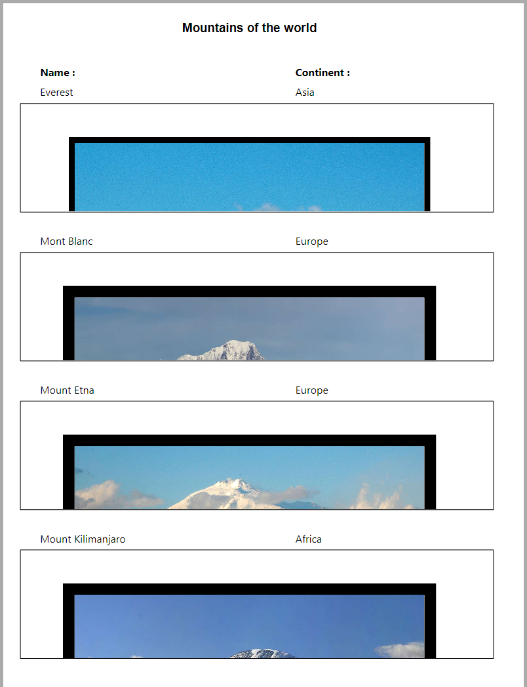

#### 

4D Write Pro ドキュメントの印刷には次の方法があります:

* 4D フォームの一部として
* 独立したドキュメントとして

#### 4D フォーム内ドキュメントの印刷 

[PRINT SELECTION](../../commands/print-selection) や [PRINT RECORD](../../commands/print-record) などの標準の 4D印刷コマンドを使用して、どのような 4Dフォームでも (プロジェクトフォーム、テーブルフォーム、入力フォーム、出力フォーム)、その中に埋め込まれた 4D Write Pro オブジェクトを印刷することができます。

標準の *印刷時可変* オプションは 4D Write Pro エリアでもサポートされている (\*) ため、印刷時にサイズを操作することができます。このオプションがチェックされているとき、マージン (内側・外側) と上マージンは先頭のページにのみ適用されます。マージン (内側・外側) と下マージンは最終ページにのみ適用されます。ドキュメントのページ付けプロパティは無視されます。ウィドウ・オーファンコントロールは無効化され、改ページは適用されません (これらのプロパティはスクリーン上でのページレンダリングとドキュメントのスタンドアロン印刷においてのみ使用されます)。**印刷時可変**オプションが選択されていた場合、フォームエリアより上に位置しているオブジェクトのみが印刷されます。このオプションについてのより詳細な情報については、デザインリファレンスマニュアルの "*印刷時可変*" を参照してください。

(\*) [Print object](../../commands/print-object) と [Print form](../../commands/print-form) コマンドは、このオプションと併用できません。

##### 印刷とビューモード 

4D Write Pro エリアに設定した**ビューモード** (*ビュープロパティの設定* 参照) にかかわらず、[Print form](../../commands/print-form) などの 4D 印刷コマンドをしようすると、常に **埋め込み** モードで印刷されます。つまり、4D Write Pro フォームオブジェクトの次のアピアランス設定が無視されます: ページビューモード (常に **埋め込み**)、 ヘッダーを表示、フッターを表示、ページ枠を表示 (常に "No")、非表示の文字を表示 (常に "No")。

##### 例題 

以下の例は、デフォルト出力フォームに埋め込まれた4D Write Proエリアにおける**印刷時可変**オプションの効果を示したものです。ここでは以下のコードが実行されています:

```4d
 ALL RECORDS([Movies])
 ORDER BY([Movies]Title)
 PRINT SELECTION([Movies])
```

* 以下は印刷時可変のオプションがチェック**されていない** (off) 場合の結果です:  

* 以下は印刷時可変のオプションがチェック**されている** (on) 場合の結果です:  
  
*(Sample text source: Wikipedia)*

#### 独立したドキュメントの印刷 

4D v15 R5以降、4D Write Pro に含まれる新機能によって、独立した 4D Write Pro ドキュメントを印刷できるようになったのに加え、フォーマット、ページの向き、ページ番号と言った標準の印刷オプションの操作が可能になりました。

##### 4D Write Pro コマンド 

4D Write Proの印刷機能は、主に次の二つのコマンドによって管理されます。**WP PRINT** と **WP USE PAGE SETUP**です。

* [WP PRINT](../commands/wp-print) は 4D Write Pro ドキュメントの印刷ジョブをローンチするか、ドキュメントをカレントの印刷ジョブに追加します。
* [WP USE PAGE SETUP](../commands/wp-use-page-setup) はカレントプリンターのページ設定を、4D Write Proドキュメント属性のページサイズとページの向きに変更します。

**注**: Windows 7 あるいは Windows Server 2008 R2のマシン上では、*Platform Update for Windows 7* がインストールされており、印刷機能がサポートされていることを確認してください。

##### 標準の 4D コマンド 

以下の 4Dコマンドは 4D Write Pro 印刷機能をサポートします:

* [SET PRINT OPTION](../../commands/set-print-option) と [GET PRINT OPTION](../../commands/get-print-option): すべてのオプションが、[WP PRINT](../commands/wp-print) によって印刷される 4D Write Proドキュメントに対してサポートされています。Paper option と Orientation optionに関しては、[WP USE PAGE SETUP](../commands/wp-use-page-setup) を呼び出してページサイズと向きの属性を 4D Write Pro ドキュメントの設定と同期させる方が効率的な場合もあります。Page range option (15) を使って、印刷するページ範囲を指定することができます。
* [PRINT SETTINGS](../../commands/print-settings): カレントのプリンターに対して印刷設定を設定します。[WP PRINT](../commands/wp-print) がこの後に呼び出された場合、プリンター設定が PRINT SETTINGS ダイアログで変更されていれば、その設定を使用します (ただし余白ページ設定だけは常に4D Write Proドキュメントの設定を使用します)
* [OPEN PRINTING JOB](../../commands/open-printing-job) と [CLOSE PRINTING JOB](../../commands/close-printing-job): これらのコマンドの間に [WP PRINT](../commands/wp-print) を呼び出すことによって、一つ以上の4D Write Proドキュメントを一件の印刷ジョブに挿入することができます。