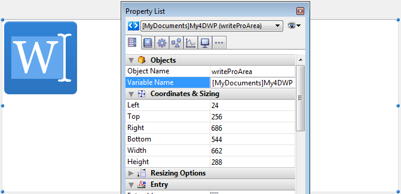

#### 

4D Write Proドキュメントを自動的に4Dデータファイルに保存できるようになりました。フォーム内に4D Write Proエリアを作成し、そのエリアの中身を保存するオブジェクトフィールドを作成すれば、エリア内に入力したテキストはレコードが評価されるごとにそれぞれのレコードへと自動的に保存されます。その後[QUERY BY ATTRIBUTE](../../commands/query-by-attribute)コマンドを使用して内部属性の値に基づいてレコードを選択する事ができます。また独自の属性を4D Write Proエリアに追加しクエリすることができます。

この章では以下の機能について説明しています:

* フォーム内の4D Write Proエリアを4D オブジェクトフィールドへと結びつける
* 標準のオブジェクトコマンド[OB SET](../../commands/ob-set)、[OB Get](../../commands/ob-get)および[QUERY BY ATTRIBUTE](../../commands/query-by-attribute)を使用して、保存されている4D Write Proドキュメントのカスタムの属性を設定、取得、そしてクエリする

#### 4D オブジェクトフィールドを4D Write Proエリアへと割り当てる 

4D Write Proエリアを4Dオブジェクトフィールドに割り当てるためには、エリアの変数名プロパティにフィールド名を入力するだけです。

##### ストラクチャー内にオブジェクトフィールドを作成 

データベースのストラクチャー内において、4Dオブジェクトフィールドであればどれでも4D Write Proドキュメントを保存するのに使用する事ができます。他のオブジェクトフィールドと同様、必要に応じて以下のフィールドの標準のプロパティを定義する必要があります:

* フィールド名
* "4D Mobile Serviceに公開"などの属性とインデックス
* 保存オプション(詳細についてはを*データをデータファイル外に保存*参照して下さい)


##### オブジェクトフィールドを4D Write Proエリアに割り当て 

4D Write Proドキュメントを保存するオブジェクトフィールドを決めたら、あとはそのエリアを含んでいるフォーム内で参照するだけです。どのようなテーブルフォームもプロジェクトフォームも使用する事ができます。フォームエディター内において、4D Write Proエリアのプロパティリスト内の、**変数名**の欄に標準の"\[Table\]Field"表記を使用してフィールド名を入力して下さい:



これで4D Write Proエリアはフィールドと関連付けがなされ、エリアの中身はレコード毎に自動的に保存されるようになりました。4D自動アクションボタンを使用しない場合、4Dコマンドを使用してエリアを手動で保存しなければならない点に注意して下さい。

#### カスタムの属性を使用 

4D Write Proエリアがオブジェクトフィールド内に保存されているとき、4D Write Proドキュメントにはカスタムの属性を保存または読み出しすることができます。例えば作者名、ドキュメントのカテゴリーなど、どんな追加情報でも有用だと思えるものは使用する事ができます。そしてカスタムの属性をクエリし、条件に合致したレコードを選択することができます

カスタムの属性は [WP EXPORT DOCUMENT](../commands/wp-export-document) または [WP EXPORT VARIABLE](../commands/wp-export-variable) コマンドで書き出されます。カスタムの属性は[JSON Stringify](../../commands/json-stringify)コマンドを使用して4D Write Pro オブジェクトフィールドをJSONに変換する際にも書き出されます(同時に4D Write Pro のメインドキュメント属性も書き出されます)。

カスタムの属性を設定または取得するためには、オブジェクト記法を使用するか、[OB Get](../../commands/ob-get) と [OB SET](../../commands/ob-set)コマンドを使用するだけです。

たとえばフォームメソッドにおいて、以下のように書くことがでカスタムの属性を設定できます:

```4d
 If(Form event code=On Validate)
    [MyDocuments]My4DWP["myatt_Last edition by"]:=Current user
    [MyDocuments]My4DWP.myatt_Category:="Memo"
    [MyDocuments]My4DWP:=[MyDocuments]My4DWP //編集を記録
 End if
```

あるいは:

```4d
 If(Form event code=On Validate)
    OB SET([MyDocuments]My4DWP;"myatt_Last edition by";Current user)
    OB SET([MyDocuments]My4DWP;"myatt_Category";"Memo")
 End if
```

また、以下のように書いて、ドキュメントのカスタムの属性を読み出すことができます:

```4d
 vAttrib:=[MyDocuments]My4DWP.myatt_Category
```

あるいは:

```4d
 vAttrib:=OB Get([MyDocuments]My4DWP;"myatt_Last edition by")
```

カスタムの4D Write Pro属性をデータファイルに保存していた場合、これらの属性をクエリして適切な属性の値を含むレコードのセレクションを作成することができます。以下の例では、レコードを選択するためにオブジェクトフィールドを含んでいるテーブルをクエリします:

```4d
 QUERY BY ATTRIBUTE([MyDocuments];[MyDocuments]My4DWP;"myatt_Category";=;"Memo")
  //MyDocuments内の、(4D Write Proエリアに割り当てられている)My4DWPオブジェクトフィールド内で
  //"myatt_Category"というカスタム属性が"Memo"という値を含んでいるレコードを全て選択します
```

**カスタム属性の名前についての注意:** カスタム属性は4D Write Pro内部属性と同じ名前空間を共有するため、内部属性とカスタム属性との衝突を避けるために、独自の属性を定義するときには必ず接頭辞をつけた名前を定義する事が強く推奨されます。接頭辞がついていない名前は4D Write Proの内部属性のために予約されているからです。接頭辞であればどのような独自の接頭辞であっても使用する事ができます(上記の例では"myatt\_" を接頭辞として使用しました)。

**注意:** カスタム属性は[WP SET ATTRIBUTES](../commands/wp-set-attributes)、[WP GET ATTRIBUTES](../commands/wp-get-attributes) および [WP RESET ATTRIBUTES](../commands/wp-reset-attributes) コマンドで管理することはできません(これらのコマンドは4D Write Pro の内部属性のみをサポートします)。詳細な情報については*4D Write Pro属性* の章を参照してください。 