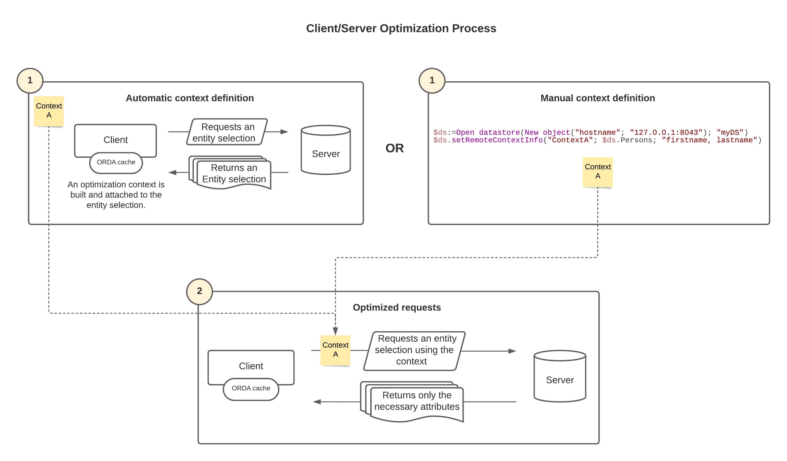

A [datastore](dsMapping.md#datastore) exposed on a 4D application can be accessed simultaneously through different clients:

- 4D remote applications using ORDA to access the main datastore with the `ds` command. この 4D リモートアプリケーションは従来のモードでもデータベースにアクセスできます。 These accesses are handled by the **4D application server**.

- Other 4D applications (4D remote, 4D Server) opening a session on the remote datastore through the [`Open datastore`](../API/DataStoreClass.md#open-datastore) command. These accesses are handled by the **HTTP REST server**.

- [4D for iOS or 4D for Android](https://developer.4d.com/go-mobile/) queries for updating mobile applications. These accesses are handled by the **HTTP server**.

## セッションの開始

When you work with a remote datastore referenced through calls to the `Open datastore` command, the connection between the requesting processes and the remote datastore is handled via sessions.

リモートデータストア上では、接続を管理するためのセッションが作成されます。 This session is identified using a internal session ID which is associated to the `localID` on the 4D application side. データ、エンティティセレクション、エンティティへのアクセスはこのセッションによって自動的に管理されます。

The `localID` is local to the machine that connects to the remote datastore, which means:

- If other processes of the same application need to access the same remote datastore, they can use the same `localID` and thus, share the same session.
- If another process of the same application opens the same remote datastore but with another `localID`, it will create a new session on the remote datastore.
- If another machine connects to the same remote datastore with the same `localID`, it will create another session with another cookie.

これらの原則を下図に示します:


> For sessions opened by REST requests, please refer to [Users and sessions](REST/authUsers.md).

### セッションの監視

データストアアクセスを管理しているセッションは 4D Server の管理ウィンドウに表示されます:

- name: "REST Handler: \<process name>"
- タイプ: HTTP Server Worker
- session: session name is the user name passed to the `Open datastore` command.

次の例では、1つのセッション上で 2つのプロセスが実行中です:


### ロッキングとトランザクション

エンティティロッキングやトランザクションに関連した ORDA 機能は、ORDA のクライアント / サーバーモードと同様に、リモートデータストアにおいてもプロセスレベルで管理されます:

- If a process locks an entity from a remote datastore, the entity is locked for all other processes, even when these processes share the same session (see [Entity locking](entities.md#entity-locking)). 同一のレコードに対応する複数のエンティティが 1つのプロセスによってロックされている場合、同プロセス内でそれらがすべてアンロックされないと、ロックは解除されません。 なお、ロックされたエンティティに対する参照がメモリ上に存在しなくなった場合にも、ロックは解除されます。
- Transactions can be started, validated or cancelled separately on each remote datastore using the `dataStore.startTransaction()`, `dataStore.cancelTransaction()`, and `dataStore.validateTransaction()` functions. これらの操作は他のデータストアには影響しません。
- Classic 4D language commands (`START TRANSACTION`, `VALIDATE TRANSACTION`, `CANCEL TRANSACTION`) only apply to the main datastore (returned by `ds`).
  リモートデータストアのエンティティがあるプロセスのトランザクションで使われている場合、セッションの共有如何に関わらず、他のすべてのプロセスはそのエンティティを更新できません。
- 次の場合にエンティティのロックは解除され、トランザクションはキャンセルされます:
  - プロセスが強制終了された
  - サーバー上でセッションが閉じられた
  - サーバー管理ウィンドウからセッションが強制終了された

### セッションの終了

アクティビティなしにタイムアウト時間が経過すると、4D は自動的にセッションを終了します。 The default timeout is 60 mn, but this value can be modified using the _connectionInfo_ parameter of the `Open datastore` command.

セッション終了後にリクエストがリモートデータストアに送信された場合、セッションは可能な限り (ライセンスがあり、サーバーが停止していない、など) 再開されます。 ただしセッションが再開しても、ロックやトランザクションに関わるコンテキストは失われていることに留意が必要です (前述参照)。

## クライアント/サーバーの最適化

4D provides optimizations for ORDA requests that use entity selections or load entities in client/server configurations (datastore accessed remotely through `ds` or via `Open datastore`). この最適化機構は、ネットワーク間でやり取りされるデータの量を大幅に縮小させることで 4Dの実行速度を向上させます。 これには以下のような機能が含まれます:

- the **optimization context**
- the **ORDA cache**

### コンテキスト

最適化コンテキストは、以下の実装に基づいています:

- クライアントがサーバーに対してエンティティセレクションのリクエストを送ると、4D はコード実行の途中で、エンティティセレクションのどの属性がクライアント側で実際に使用されているかを自動的に "学習" し、それに対応した "最適化コンテキスト" をビルドします。 このコンテキストはエンティティセレクションに付随し、使用された属性を保存していきます。 他の属性があとで使用された場合には自動的に情報を更新していきます。 以下のメソッドや関数が学習のトリガーとなります:
  - [`Create entity selection`](../API/EntitySelectionClass.md#create-entity-selection)
  - [`dataClass.fromCollection()`](../API/DataClassClass.md#fromcollection)
  - [`dataClass.all()`](../API/DataClassClass.md#all)
  - [`dataClass.get()`](../API/DataClassClass.md#get)
  - [`dataClass.query()`](../API/DataClassClass.md#query)
  - [`entitySelection.query()`](../API/EntitySelectionClass.md#query)

- サーバー上の同じエンティティセレクションに対してその後に送られたリクエストは、最適化コンテキストを再利用して、サーバーから必要な属性のみを取得していくことで、処理を速くします。 For example, in an [entity selection-based list box](#entity-selection-based-list-box), the learning phase takes place during the display of the first row. 次の行からは、表示が最適化されます。 以下の関数は、ソースのエンティティセレクションの最適化コンテキストを、戻り値のエンティティセレクションに自動的に付与します:
  - [`entitySelection.and()`](../API/EntitySelectionClass.md#and)
  - [`entitySelection.minus()`](../API/EntitySelectionClass.md#minus)
  - [`entitySelection.or()`](../API/EntitySelectionClass.md#or)
  - [`entitySelection.orderBy()`](../API/EntitySelectionClass.md#orderBy)
  - [`entitySelection.slice()`](../API/EntitySelectionClass.md#slice)
  - [`entitySelection.drop()`](../API/EntitySelectionClass.md#drop)

- An existing optimization context can be passed as a property to another entity selection of the same dataclass, thus bypassing the learning phase and accelerating the application (see [Using the context property](#reusing-the-context-property) below).

- You can build optimization contexts manually using the [`dataStore.setRemoteContextInfo()`](../API/DataStoreClass.md#setremotecontextinfo) function (see [Preconfiguring contexts](#preconfiguring-contexts)).



:::warning Compatibility Note

Contexts handled in connections established through [`Open datastore`](../API/DataStoreClass.md#open-datastore) can only be used between similar main versions of 4D. たとえば、4D v20.x リモートアプリケーションは、4D Server v20.x のデータストアのコンテキストのみを使用できます。

:::

#### 例題

以下のようなコードがあるとき:

```4d
 $sel:=$ds.Employee.query("firstname = ab@")
 For each($e;$sel)
    $s:=$e.firstname+" "+$e.lastname+" works for "+$e.employer.name // $e.employer refers to Company table
 End for each
```

Thanks to the optimization, this request will only get data from used attributes (firstname, lastname, employer, employer.name) in _$sel_ from the second iteration of the loop.

#### contextプロパティの再利用

You can increase the benefits of the optimization by using the **context** property. このプロパティは、あるエンティティセレクション用に "学習した" 最適化コンテキストを参照します。 これを新しいエンティティセレクションを返す ORDA関数に引数として渡すことで、その返されたエンティティセレクションでは学習フェーズを最初から省略して使用される属性をサーバーにリクエストできるようになります。

> You can also create contexts using the [`.setRemoteContextInfo()`](../API/DataStoreClass.md#setremotecontextinfo) function.

エンティティセレクションを扱うすべての ORDA関数は、<strong x-id="1">context</strong> プロパティをサポートします (たとえば <a href="../API/DataClassClass.md#query"><code>dataClass.query( )</code></a> あるいは <a href="../API/DataClassClass.md#all"><code>dataClass.all( )</code></a> など)。 All ORDA functions that handle entity selections support the **context** property (for example [`dataClass.query()`](../API/DataClassClass.md#query) or [`dataClass.all()`](../API/DataClassClass.md#all)). ただし、 コードの他の部分で新しい属性が使用された際にはコンテキストは自動的に更新されるという点に注意してください。 同じコンテキストを異なるコードで再利用しすぎると、コンテキストを読み込み過ぎて、結果として効率が落ちる可能性があります。

> A similar mechanism is implemented for entities that are loaded, so that only used attributes are requested (see the [`dataClass.get()`](../API/DataClassClass.md#get) function).

**Example with `dataClass.query()`:**

```4d
 var $sel1; $sel2; $sel3; $sel4; $querysettings; $querysettings2 : Object
 var $data : Collection
 $querysettings:=New object("context";"shortList")
 $querysettings2:=New object("context";"longList")
 
 $sel1:=ds.Employee.query("lastname = S@";$querysettings)
 $data:=extractData($sel1) // In extractData method an optimization is triggered   
 // and associated to context "shortList"
 
 $sel2:=ds.Employee.query("lastname = Sm@";$querysettings)
 $data:=extractData($sel2) // In extractData method the optimization associated   
 // to context "shortList" is applied
 
 $sel3:=ds.Employee.query("lastname = Smith";$querysettings2)
 $data:=extractDetailedData($sel3) // In extractDetailedData method an optimization  
 // is triggered and associated to context "longList"
 
 $sel4:=ds.Employee.query("lastname = Brown";$querysettings2)
 $data:=extractDetailedData($sel4) // In extractDetailedData method the optimization  
 // associated to context "longList" is applied
```

#### エンティティセレクション型リストボックス

クライアント/サーバー環境におけるエンティティセレクション型リストボックスにおいては、そのコンテンツを表示またはスクロールする際に、最適化が自動的に適用されます。つまり、リストボックスに表示されている属性のみがサーバーにリクエストされます。

A specific "page mode" context is also provided when loading the current entity through the **Current item** property expression of the list box (see [Collection or entity selection type list boxes](FormObjects/listbox_overview.md#list-box-types)). これによって、"ページ" が追加属性をリクエストしても、リストボックスのコンテキストのオーバーロードが避けられます。 Note that only the use of **Current item** expression will create/use the page context (access through `entitySelection\[index]` will alter the entity selection context).

その後、エンティティを走査する関数がサーバーに送信するリクエストにも、同じ最適化が適用されます。 以下の関数は、ソースエンティティの最適化コンテキストを、戻り値のエンティティに自動的に付与します:

- [`entity.next()`](../API/EntityClass.md#next)
- [`entity.first()`](../API/EntityClass.md#first)
- [`entity.last()`](../API/EntityClass.md#last)
- [`entity.previous()`](../API/EntityClass.md#previous)

たとえば、次のコードは選択したエンティティをロードし、所属しているエンティティセレクションを走査します。 エンティティは独自のコンテキストにロードされ、リストボックスのコンテキストは影響されません:

```4d
 $myEntity:=Form.currentElement //current item expression
  //... do something
 $myEntity:=$myEntity.next() //loads the next entity using the same context
```

#### コンテキストの事前設定

最高のパフォーマンスを得るには、アプリケーションの機能またはアルゴリズムごとに最適化コンテキストが定義されていることが推奨されます。 たとえば、あるコンテキストは顧客に関するクエリに、別のコンテキストは商品に関するクエリに使用することができます。

最高レベルに最適化された最終アプリケーションを提供したい場合、以下の手順でコンテキストを事前に設定することで、学習フェーズを省略することができます:

1. アルゴリズムを設計します。
2. アプリケーションを実行し、自動学習メカニズムに最適化コンテキストを作成させます。
3. Call the [`dataStore.getRemoteContextInfo()`](../API/DataStoreClass.md#getremotecontextinfo) or [`dataStore.getAllRemoteContexts()`](../API/DataStoreClass.md#getallremotecontexts) function to collect  contexts. You can use the [`entitySelection.getRemoteContextAttributes()`](../API/EntitySelectionClass.md#getremotecontextattributes) and [`entity.getRemoteContextAttributes()`](../API/EntityClass.md#getremotecontextattributes) functions to analyse how your algorithms use attributes.
4. In the final step, call the [`dataStore.setRemoteContextInfo()`](../API/DataStoreClass.md#setremotecontextinfo) function to build contexts at application startup and [use them](#reusing-the-context-property) in your algorithms.

### ORDAキャッシュ

最適化のため、ORDA経由でサーバーにリクエストしたデータは、(4Dキャッシュとは異なる) ORDAリモートキャッシュに読み込まれます。 ORDAキャッシュはデータクラスごとに構成され、30秒後に失効します。

キャッシュに含まれるデータは、タイムアウトに達すると期限切れとみなされます。 期限切れデータにアクセスする場合は、サーバーにリクエストが送信されます。 期限切れデータは、スペースが必要になるまでキャッシュに残ります。

デフォルトでは、ORDAキャッシュは 4D によって透過的に処理されます。 しかし、以下の ORDAクラスの関数を使用して、その内容を制御することができます:

- [dataClass.setRemoteCacheSettings()](../API/DataClassClass.md#setremotecachesettings)
- [dataClass.getRemoteCache()](../API/DataClassClass.md#getremotecache)
- [dataClass.clearRemoteCache()](../API/DataClassClass.md#clearremotecache)
