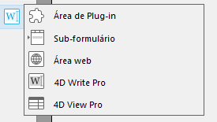
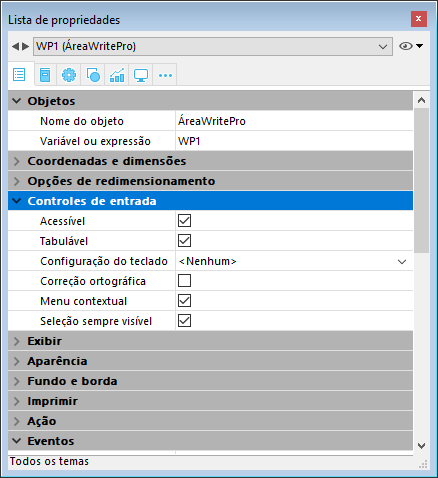
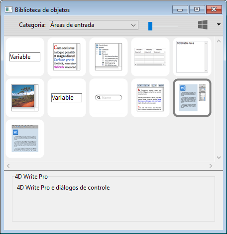
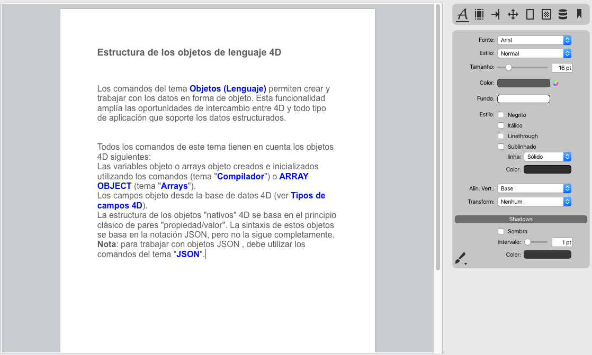
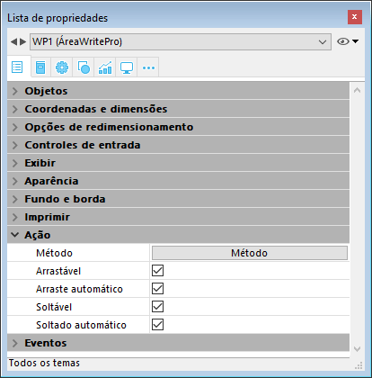
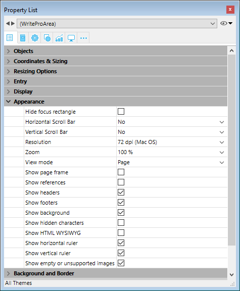
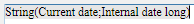

#### Criar uma área 

Os documentos 4D Write Pro podem mostrar e editar manualmente em um objeto formulário 4D, chamado **4D Write Pro**. Este objeto está disponível como parte da última ferramenta (Área Plug-in, Área Web, etc.) da barra de objetos:

Uma área 4D Write Pro form se configura por meio das propriedades estandarte da Lista de propriedades, tais como nome do objeto e nome da variável, coordenadas, entrada, visualização e aparência, e/ou eventos.

A propriedade Nome da variável pode ser utilizada na linguagem como uma referência a área 4D Write Pro. Tenha em conta que a variável deve ser do tipo [objeto](# "Estruturas de dados como objetos 4D nativos") (para mais informação, consulte o comando [C\_OBJECT](../../commands/c-object)).

As propriedades "Entrada" gerenciam funcionalidades básicas para a introdução de texto:

* **Editável**: lhe permite bloquear/desbloquear a área com o propósito de permitir ou impedir sua modificação
* **Auto revisão ortográfica**: disponível para áreas 4D Write Pro
* **Menu contextual**: lhe permite ativar/desativar o menu contextual em modo Aplicação (ver a seção *Utilizar uma área 4D Write Pro*)
* **Seleção sempre visível**: se encarrega da seleção de texto como nas áreas de texto estandarte.

#### Usar o Widget 4D Write Pro da Biblioteca de Objetos 

Pode criar uma área 4D Write Pro pré-configurada utilizando o objeto **4D Write Pro** que se encontra na biblioteca de objetos (tema "Áreas de entrada"):

Esta área vem com um painel de controle para gerenciar todos os atributos da área (fonte, cor, estilo, etc.):

Para saber mais, consulte a seção *Área 4D Write Pro*

#### Configurar Arrastar e Soltar 

Para configurar as propriedades arrastar e soltar para suas áreas 4D Write Pro, é necessário seleciar as opções apropriadas no tema "Action" na lista de Propriedades:

Áreas 4D Write Pro suporta dois modos arrastar e soltar:

* **Modo personalisado:** apenas as opções "Arrastável" e "Soltável" estão marcadas.  
Neste modo, pode selecionar texto e começar a movê-lo. O método objeto é chamado com o evento On Begin Drag Over , e assim pode definir a ação soltar usando o modo personalisado.
* **Modo Automatico**: as opções "Arrastável", "Soltável", "Arraste automático" e "Soltado automático" estão marcadas  
Neste modo, pode automativamente mover ou copiar (aperte a tecla **Alt/Option**) o texto selecionado. O evento On Begin Drag Over não é ativado.

**Nota:** Selecionar apenas as opções "Arraste automático" e "Soltado automático" não terá efeito na área 4D Write Pro area. 

#### Configurar propriedades de Vista 

As propriedades de vista do documento estão diretamennte disponíveis na lista Propriedades das áreas 4D Write pro para permitier que defina como um documento 4D Write será exibido como padrão nesta área. Estas propriedades permitem que personalise, por exemplo, se os documentos 4D Write Pro são exibidos da mesma maneira que serão impressos, ou como gerados pelo navegador. Pode estabelecer diferentes vistas do mesmo documento 4D Write Pro no mesmo formulário.

**Nota:** Configurações de Vista podem ser gerenciadas dinamicamente usando os comandos [WP SET VIEW PROPERTIES](../commands/wp-set-view-properties) e [WP Get view properties](../commands/wp-get-view-properties).

Configurações de vista de documento são gerenciadas através de itens específicos no tema **Aparência** da lista de propriedades de objetos de formulário 4D Write Pro.:

* **Resolução**: Estabelece a resolução de tela para os conteúdos de área 4D Write Pro. Como padrão, é estabelecido em **72 dpi (Mac OS)**, que é a resolução padrão para formulários 4D em todas as plataformas. Estabelecer esta propriedade para Automático faz com que oa geração do documento seja diferente entre as plataformas Mac Os e Windows. Estabelecer um valor de dpi específico faz com que a geração do documento seja a mesma nas plataformas Mac OS e Windows.
* **Zoom**: Estabelece a porcentagem do zoom para exibir os conteúdos da área 4D Write Pro. O normal é 100%.
* **Modo de Vista**: Estabelece o modo para exibir o documento 4D Write Pro na área formulário. Três valores estão disponíveis:  
   * **Página** (padrão): o modo de vista mais completo que inclui limites de página, orientação, margens, quebra de página, cabeçalhos, rodapés, etc. Para saber mais veja o parágrafo *Propriedades de visualização de página*.  
   * **Rascunho**: modo rascunho com propriedades de documento básicas  
   * **Embebido**: modo de vista adequado para áreas embebidas. Não exibe margens, cabeçalhos, rodapés, bordas de página, etc.  
   Este modo também pode ser usado para produzir uma vista de página do tipo Web (se também selecionar a resolução de 96 dpi e a opção **Show HTML WYSIWYG**).  
         
   **Nota:** A propriedade **Modo de vista** é usada apenas para geração na tela. Em quanto a configurações de impressão, regras específicas de geração são usadas automaticamente (ver *Imprimir documentos 4D Write Pro*).
* **Mostrar page frame**: Exibe ou esconde a borda da página quando o modo de vista for estabelecido como "Página". O normal é escondido.
* **Mostrar referências**: Exibe todas as expressões 4D inseridas no documento como referências. Quando esta opção não estiver marcada (padrão) as expressões 4D são exibidas como valores. Quando inserir um campo ou expressão 4D, 4D Write Pro computa e exibe o valor atual. Se quiser saber que campos ou expressões estão sendo exibidas, marque esta opção. As referências do campo ou expressão vão aparecer em seu documento, com um fundo cinza.  
Por exemplo, se inserir a data atual junto com o formato, a data é exibida:  
  
Se marcar a opção **Mostrar referências**, a referência é exibida:  
  
**Nota:** expressões 4D podem ser inseridas usando o comando [ST INSERT EXPRESSION](../../commands/st-insert-expression).
* **Mostrar cabeçalhos e rodapés**: Exibe ou esconde os cabeçalhos e rodapés quando o modo de página estiver estabelecido como "Página" (exibido como padrão). Para saber mais, veja .
* ****Mostrar fundo**: Exibe/esconde tanto as imagens de fundo quando a cor de fundo (padrão é exibido)
* ****Mostrar caracteres escondidos**: Exibe ou esconde caracteres invisíveis (padrão é escondido).
* ****Mostrar HTML WYSIWYG**: Ativa ou desativa a vista HTML WYSIWYG, na qual qualquer atributo avançado 4D Write Pro que não forem compatíveis com todos os navegadores serão removidos (padrão é desaqtivado).
* **Mostrar régua horizonta**l: horizontal. Para saber mais sobre as réguas nas áreas 4D Write Pro, consulte *Manejar réguas*.
* **Mostrar régua vertical**: mostra/oculta a régua vertical quando o documento estiver em modo Página. Para saber mais sobre as réguas nas áreas 4D Write Pro, consulte *Manejar réguas*.
* Mostrar imágens vaziaws ou não compatíveis: mostra/oculta um retângulo negro para s imagens que não podem ser carregadas ou calculadas (imagens vazias ou em um formato não compatível). Para saber mais veja *Imagens vazias*.
* Mostrar a fonte da fórmula como símbolo: mostra o texto fonte das formulas como  símbolos quando as expressões são mostradas como referencias (ver acima). Mostrar as fórmulas como símbolos faz com que os documentos de modelo sejam mais compactos e mais wysiwyg.

**Nota de compatibilidade:**

* documentos 4D Write Pro criados com versões até 4D v15 R5 são exib idos usando os valores padrão para estas propriedades, com exceção da propriedade Resolução, que é estabelecida para automático
* As réguas horizontais estão disponíveis de forma pré-determinada nos bancos de dados criados a partir de 4D v16 R2; Para os bancos de dados convertidos de versões anteriores, esta configuração nãoo está marcada de forma pré-determinada.