#### Gestão dos documentos nas áreas 4D Write Pro 

Nas aplicações 4D, os documentos, 4D Write Pro são criados importados e exportados por meio de comandos específicos que se encontram no tema **4D Write Pro** (*WP EXPORT DOCUMENT*, *WP EXPORT VARIABLE*, *WP Import document*, *WP New*). 

Também é possível associar uma área 4D Write Pro com um campo Objeto em um formulário do banco de dados. Desta maneira, cada documento 4D Write Pro é automaticamente salvo com o registro e armazenado nos dados do banco de dados (ver *Armazenar os documentos 4D Write Pro nos campos objeto 4D*).

#### Formato de documento .4wp 

É possível salvar e reabrir documentos 4D Write Pro em disco e a partir de disco sem qualquer perda usando o formato nativo **.4wp**.

O formato **.4wp** consiste de uma pasta zip cujo nome é o título do documento e cujos conteúdos são texto HTML e imagens:

* texto HTML combina HTML normal com expressões 4D (que não são computadas) assim como etiquetas 4D especificas,
* imagens são armazenadas em uma pasta com o mesmo nome que o título do documento, do lado do arquivo HTML.

Já que documentos .4wp são baseados em HTML, podem ser importados ou abertos em qualquer aplicação externa que suporta HTML.

O formato de documento interno 4D Write Pro é uma extensão HTML proprietária, compatível comHTML5/XHTML5, mas que suporta um subconjunto de atributos HTML/CSS e etiquetas. Como resultado, apenas documentos HTML exportados por 4D Write Pro podem ser abertos por 4D Write Pro sem risco de perda de dados. Importar documentos HTML que foram criados externamente pode produzir erros.

Para saber mais, [**baixe a lista de atributos 4D Write pro com definição associada como CSS style ou XHTML tag**](https://download.4d.com/Documents/Products%5FDocumentation/LastVersions/Line%5F19/4DWP-attributes-and-xhtml.pdf) em 4D Write Pro XHTML.

##### Compatibilidade com versões anteriores 

Sempre pode reabrir um documento .4wp com uma versão anterior de 4D Write Pro. Se conter atributos que foram adicionados em versões mais recentes, esses atribuos são apenas ignorados. Entretanto se salvar o documento, os atributos são removidos do documento e serão perdidos. 

#### Interface Usuário 

Se a propriedade **Menu contextual** está selecionada por uma área 4D Write Pro (ver *Criar uma área 4D Write Pro*), um menu contextual completo está disponível para os usuários em modo Aplicação:

 

Este menu oferece acesso a todas as funcionalidades de 4D Write Pro.

#### Selecionar o modo de visualização 

Os documentos 4D Write Pro podem ser visualizados em três modos de vista de página:

* **Rascunho**: modo rascunho com propriedades básicas
* **Página**: modo "vista imprimir" (novo em 4D v15 R5)
* **Embebido**: modo adequado para áreas embebidas, não exibe margens, cabeçalhos, rodapés, bordas de página, etc  
Este modo pode ser usado para produzir output do tipo Web (se selecionar também a resolução de 96 dpi e a opção **HTML WYSIWYG**).

O modo de visualização pode ser configurardo utilizando a área de menu pop-up:

**Nota:** o modo de visualização da página não são armazenadas com o documento.

Para áreas embebidas em formulários 4D, o modo vista pode ser também definido como padrão usando a lista Propriedades. Neste caso, o modo de vista é armazenado como uma propriedade do objeto de formulário 4D Write Pro (para saber mais, veja o parágrafo *Configurar propriedades de Vista*). 

#### Propriedades de visualização de página 

Quando o documento está no modo de vista Página, as seguintes propriedades do documento são mostradas ao usuário:

* Traços de página para representar os limites de impressão
* Largura de página e Altura da página (normal: 21x29.7 cm)
* Orientação da página (normal: retrato)
* Margem da página (normal: 2.5 cm)

**Nota: q**uando o documento está em modo Web ou Rascunho, as propriedades da página se podem definir, ainda que seu efeito não for visível. No modo Rascunho, os seguintes efeitos propriedad de parágrafo são visíveis:

* Limitação de altura página (línhas desenhadas)
* Colunas
* Evitar salto de página dentro da propriedade
* Controle de viúdas e órfãs.

##### Quebras de parágrafo 

Quando exibido em modo Page ou Draft (no contexto de impressão de documento), Parágrafos 4D Write Pro pode quebrar:

* automaticamente, se a altura de parágrafo for maior que a altura disponível de página
* dependendo de quebras de parágrafo estabelecidos por programação ou pelo usuário.

Quebras podem ser adicionadas por programação ou pelo usuário. Ações disponíveis incluem:

* [WP INSERT BREAK](../commands/wp-insert-break) comando
* *insertPageBreak* ação padrão
* **Insert page break** opção do menu contextual padrão

**Controle de Quebra automática**

Pode controlar quebras automáticas em parágrafos usando as funcionalidades abaixo: 

* **Widow and orphan control**: Quando essa opção for estabelecida para um parágrafo. 4D Write Pro não permite linhas viúvas (a última linha de um parágrafo isolada no topo da próxima página) ou órfãs (a primeira linha de um parágrafo isolada no fundo da página anterior) em um documento. No primeiro caso, a linha anterior do parágrafo é adicionada ao topo da página de forma que duas linhas são exibidas lá. No segundo caso, a primeira linha isolada é movida para a próxima página..
* **Avoid page break inside**: Quando essa opção for estabelecida para um parágrafo, 4D Write Pro previne que esse parágrafo seja quebrada em partes ou em duas ou mais páginas.
* **Manter com o próximo**: quando se estabelece esta opção para um parágrafo, esse parágrafo não pode separar-se do que lhe segue por uma quebra automática. Ver wk keep with next e a ação padrão correspondente (keepWithNext, ver *Usando ações padrão*).

Essas opções podem ser estabelecidas usando o menu contextual, ou atributos (wk avoid widows and orphans, wk page break inside paragraph, ver *Atributos 4D Write Pro*), ou ações padrão (*widowAndOrphanControlEnabled*, *avoidPageBreakInside*, ver *Usando ações padrão*). 

#### Fundo 

O fundo de documentos 4D Write e elementos de documentos (tabelas, parágrafos, seções, cabeçalhos/rodapés, etc) podem ser estabelecidos com os efeitos abaixo:

* cores
* bordas
* imagens
* origem, posicionamento horizontal e vertical
* área de pintura
* repetir

Esses atributos podem ser definidos programaticamente para os elementos indivíduos ou uma página ou fundos de documentos inteiros com o comando [WP SET ATTRIBUTES](../commands/wp-set-attributes) ou *Usando ações padrão*. Para ver a lista inteira de atributos de fundo disponíveis e onde podem ser aplicados, veja o artigo *Atributos 4D Write Pro*. 

Usuários podem modificar atributos de fundo via o menu contextual como mostrado abaixo:

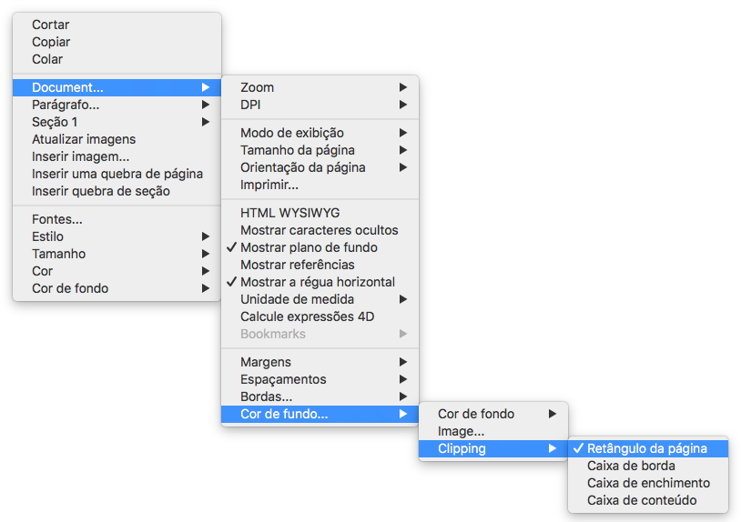

Como exemplo de adicionar uma imagem de tamanho inteiro como fundo, veja *How Do I* (HDI) demo [aqui](http://download.4d.com/Demos/).

#### Gerenciar cabeçalhos, rodapés e seções 

Documentos 4D Write Pro são compatíveis com cabeçalhos e rodapés. Cabeçalhos e rodapés são relacionadas à seções

Uma seção é uma parte do documento definida por uma faixa de páginas e pode ter seu próprio paginamento e atributos comuns. Um documento pode conter qualquer número de seções (de uma seção ao número total de páginas). Cada página pode conter apenas uma seção.

Pode definir um conjunto de cabeçalhos e rodapés para cada seção

##### Definir uma seção 

Uma seção é um subconjunto de páginas contínuas em um documento 4D Write Pro. Um documento pode conter uma ou mais seções. Uma seção pode conter qualquer número de páginas, de uma página única ao número total de páginas do documento. Uma seção pode conter de uma coluna até 20 colunas.   
  
Como padrão, um documento contém apenas uma seção, chamada **Seção 1**. O menu contextual 4D Write Pro exibe este número de seção sempre que clicar no documento.

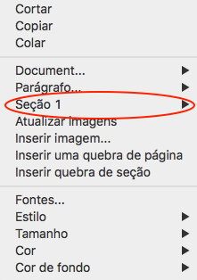

Pode criar uma nova seção adicionado uma quebra de sessão no fluxo do texto :

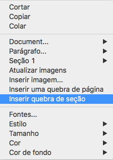

Quando uma quebra de seção for adicionada, o menu contextual exibe um número incrementado para cada seção. No entanto, pode renomear qualquer seção:

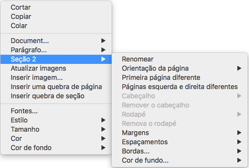

O nome que digitar será usado como nome da seção em qualquer ponto do documento

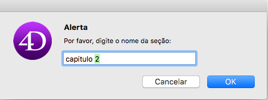 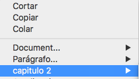

Note que se tiver definido uma primeira página diferente ou a opção de páginas da esquerda e da direita diferentes para a seção, o tipo de página também é exibido no menu (ver abaixo)

##### Inserir uma quebra de seção contínua 

Uma quebra de seção contínua cria uma nova seção na mesma página. Isso permite criar páginas com seções que tenham diferentes números de colunas (vet *Criar uma página com seções múltiplas-colunas e únicas colunas*).

As seções criadas com saltos de seção continuos são contadas no documento (têm números de seção), mas diferente das seções criadas com quebras de seção normal, seus cabeçalhos, rodapés, imagens ancoradas, etc, só são levadas em consideração quando for produzido uma quebra de página física.

**Nota:** se mudar a orientação da página da nova seção depois de inserir uma quebra de seção contínua, se converte em uma quebra de seção padrão.

##### Atributos de seção 

Seções são herdadas de atributos de documentos. Entretanto atributyos comuns de documentos, incluindo cabeçalhos e rodapés podem ser modificados separadamente para cada seção. O menu contextual pop up exibe as propriedades e atributos disponíveis ao nível de seção:

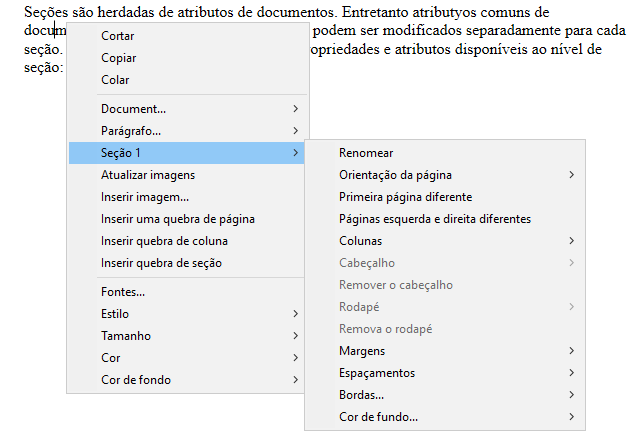

* **Orientação de Página**: permite que estabeleça uma orientação de página específica (Orientação vertical ou horizontal) por seção
* **Primeira página diferente**: permite que estabeleça atributos diferentes para a primeira página da seção. Esta propriedade pode ser usada para criar páginas em branco no começo do texto, por exemplo. Quando este atributo estiver marcado, a primeira página da seção é manejada como uma subseção e pode ter seus próprios atributos.  

* **Páginas da esquerda e da direita diferentes**: permite que estabelece atributos diferentes para páginas que estão à esquerda e à direita na seção. Quando este atributo for marcado, páginas da esquerda e da direita na seção serão manejadas como subseções e terão seus próprios atributos.  

* Comandos **Cabeçalho** e **Rodapé**: estas opções permitem que defina cabeçalhos e rodapé separados. Estas opções são detalhadas abaixo
* **Margens** / **preenchimento** / **Bordas** / **Fundo**: estes atributos podem ser definidos separadamente para cada seção. Para saber mais, veja o artigo *Atributos 4D Write Pro*.

##### Inserir cabeçalhos e rodapés 

Cada seção pode ter cabeçalhos e rodapés específicos. São exibidos apenas quando o modo de vista da página do documento for **Page**. 

 Dentro de uma seção, pode definir até três diferentes cabeçalhos ou rodapés, dependendo das opções ativadas:

* primeira página,
* páginas esquerda,
* páginas direita.

Para criar um cabeçalho ou rodapé: 

1. Veja se o documento está no modo de vista **Page**.
2. Dê duplo clique na área de cabeçalho ou rodapé da seção desejada para começar o modo editar.  
   * A área cabeçalho está no topo da página:  
   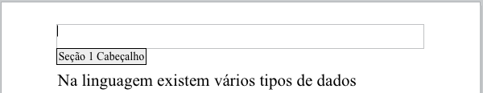  
   * A área rodapé está no fundo da página:  
   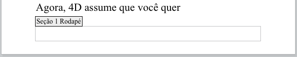

Pode entrar qualquer conteúdo estático, que será automaticamente repetido em cada página da seção (exceto para a primeira página, se ativado)

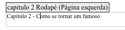

Pode inserir conteúdos dinâmicos tais como número de página ou contador de página usando o comando [ST INSERT EXPRESSION](../../commands/st-insert-expression) (para saber mais, veja o parágrafo *Inserir documentos e expressões de página*).  
  
Nota: TAmbém é possível manejar cabeçalhos e rodapés por programação, usando comandos específicos como [WP Get header](../commands/wp-get-header) ou [WP Get footer](../commands/wp-get-footer)

Quando um cabeçalho ou rodapé tiver sido definido para uma seção, pode configurar seus atributos comuns usando o menu contextual:

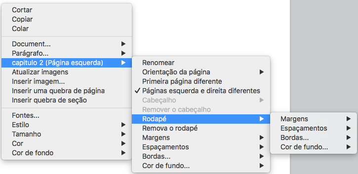

Para saber mais sobre   **Margens**, **Preenchimento**, **Bordas**, e atributos **Fundo**, veja a seção *Atributos 4D Write Pro*. 

Pode remover a definição total do cabeçalho ou rodapé (conteúdos e atributos) selecionando os comandos **Remove header** ou **Remove footer** no menu contextual. 

##### Compatibilidade 

4D Write Pro maneja cabeçalhos e rodapés de documentos convertidos do plug-in 4D Write com uma altura fixa

A expressão abaixo e propriedades também são compatíveis e convertidas do plugin 4D Write em cabeçalhos e rodapés:

* número de página e variáveis de contador de página
* primeira página diferenciada
* páginas esquerda/direita diferenciadas

#### Gerenciar caixas de texto 

As caixas de texto são áreas que se ancoram a uma página ou seção e podem ser preenchidas com texto, imagens online ou tabelas. As caixas de texto podem ser colocadas em qualquer parte da página e responder à necessidades específicas, por exemplo, para inserir o nome ou logotipo de uma empresa ou uma área de endereços.

**Nota:** uma caixa de texto não pode conter cabeçalhos, rodapés, colunas, imagens ancoradas ou outras caixas de texto.

As caixas de texto são adicionadas com uma posição absoluta, na frente/atrás do texto, assim como ancoradas a uma página ou a partes específicas de um documento no modo Página: cabeçalho, rodapé, seção, todas as seções ou uma subseção. As caixas de texto também podem ser usadas em modo aninhado (ancoradas à layer box).

Pode adicionar uma caixa de texto a um documento 4D Write Pro das maneiras abaixo:

* utilizando o comando **WP New text box**,
* utilizando a ação padrão *insertTextBox*

Para selecionar uma caixa de texto, o usuário tem que clicar nela (**Ctrl/Cmd+clique** se a caixa de texto estiver na camada de fundo). Uma vez selecionado, a caixa de texto pode ser movida ou redimensionada usando o mouse ou as teclas de flecha.

Para eliminar uma caixa de texto selecionada, pode pressionar a tecla **Delete** ou **Retrocesso**, utilizar a ação padrão **textBox/eliminar**, ou executar o comando **WP DELETE TEXT BOX**.

Os atributos das caixas de texto são manejadas com o comando [WP SET ATTRIBUTES](../commands/wp-set-attributes) ou *ações 4D Write Pro*. Estão disponíveis os seguintes atributos e ações:  
  
| **Propriedade (constante)** | **Ação padrão**       | **Comentários**                                                                                                   |
| --------------------------- | --------------------- | ----------------------------------------------------------------------------------------------------------------- |
| wk width                    | textBox/ancho         | Se forem definidas em "auto", a largura se converte a 8cm já que a largura da caixa de texto não pode ser "auto". |
| wk height                   | textBox/alto          | Se estiver em "auto", a altura se ajusta ao conteúdo.                                                             |
| wk padding                  | textBox/relleno       |                                                                                                                   |
| wk border \[...\]           | textBox/borde\[...\]  |                                                                                                                   |
| wk background \[...\]       | textBox/fondo\[...\]  |                                                                                                                   |
| wk vertical align           | textBox/verticalAlign |                                                                                                                   |
| wk id                       | \-                    | não pode estar vazio para uma caixa de texto                                                                      |
| wk anchor \[...\]           | textBox/anchor\[...\] |                                                                                                                   |
| wk owner                    | \-                    | só leitura                                                                                                        |
| wk protected                | \-                    |                                                                                                                   |
| wk style sheet              | \-                    | só leitura e sempre "" (sem folha de estilo)                                                                      |

As caixas de texto não são mostradas se:

* o modo de vista é Rascunho;
* estão centrados ou ancorados a seções e a opção **Mostrar HTML WYSIWYG** está marcada;
* a opción "fundo visível" não estiver ativada.

#### Manejar réguas 

As réguas estão disponíveis em todos os modos de visualização de 4D Write Pro e têm as seguintes características:

* Graduações em cm, mm, polegadas ou pt de acordo com a unidade de desenho atual definida no documento 4D Write Pro. Pode mudar as unidades de medida mediante o menu contextual ou modificando o atributo wk layout unit.
* Símbolo de indentação de primeira linha
* Símbolo de margem de parágrafo esquerdo
* Símbolo de margem de parágrafo direito
* Tabulações mostradas ao longo da borda inferior da régua
* O contraste de cor visível representa as margens de página esquerda e direita

As réguas verticais estão disponíveis só no modo Página e possuem as características abaixo:

* Graduações em cm, mm, polegadas ou pt segundo a unidade de desenho atual definida no documento 4D Write Pro. Pode mudar as unidades de medida utilizando o menu contextual ou modificando o atributo wk layout unit.
* Contraste de cor visível que representa as margens superior e inferior da página.

Pode mudar o estado de visualização da régua marcando ou desmarcando a opção **Mostrar régua horizontal** ou **Mostrar régua vertical** no menu contextual da área 4D Write Pro:  
  
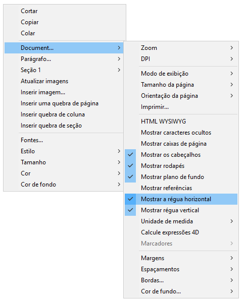  

**Nota:** uma propriedade específica da área 4D Write Pro permite definir a visualização predeterminada para as réguas (ver a seção *Configurar propriedades de Vista*).

##### Ajustar margens de texto e indentação 

Pode modificar margens, indentações e posições de abas clicando e arrastando os símbolos correspondentes:

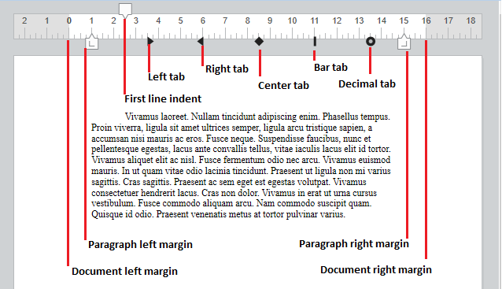

Quando colocar o mouse sobre um destes símbolos, o cursor muda para indicar que pode ser movido e aparece uma linha de guia vertical enquanto for arrastado:

Quando forem selecionados vários parágrafos, arrastar margens ou símbolos de indentação aplica estes margens ou indentações a todos os parágrafos selecionados. Mantendo pressionada a tecla Maiúsc Enquanto arrasta estes símbolos mantém os intervalos existentes entre indentações ou margens nos parágrafos selecionados.

###### Régua Horizontal 

Pode modificar margens esquerda e direita, indentações e posições de tabulação clicando e arrastando os símbolos correspondentes na régua horizontal:

Quando colocar o mouse sobre um desses símbolos, o cursor muda para indicar que pode ser movido e aparece uma linha de guia vertical enquanto for arrastado:

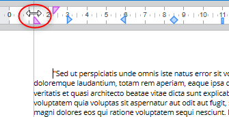

Quando vários parágrafos forem selecionados, arrastar margens ou símbolos de indentação aplica a estas margens ou indentações a todos os parágrafos selecionados. Mantendo pressionada a tecla Maiúscula (Shift) enquanto arrasta estes símbolos mantém os intervalos existentes entre as identações ou margens nos parágrafos selecionados.

###### Régua Vertical 

Pode modificar as margens superior e inferior com a régua vertical. Quando mover o mouse sobre o limite da margem, o cursor muda para indicar que é possível mover, e aparece uma linha de guia horizontal enquanto for arrastado:  
  
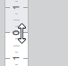

Esta ação pode ser usada para modificar o espaço entre a parte superior e inferior da página e o corpo e o cabeçalho e rodapé de um documento. 

##### Gerenciar tabulações 

É possível usar o menu contextual de regua para criar, modificar ou apagar tabulações:

Para criar uma tabulação, dê um clique direito diretamente na régua e escolha seu tipo do menu contextual; um clique esquerdo automaticamente cria uma aba esquerda padrão. Pode também dar um clique direito em tabulações existentes para modificar seu tipo usando o menu contextual.

**Remover tabulação** só está disponível quando der clique direito diretamente numa tabulação existente; também pode remover tabulações ao arrastar as tabulações fora da área de régua.

**Notea:** 

* Abas também podem ser definidas por programação com os comandos [WP SET ATTRIBUTES](../commands/wp-set-attributes), [WP GET ATTRIBUTES](../commands/wp-get-attributes), e [WP RESET ATTRIBUTES](../commands/wp-reset-attributes) com os seletores wk tab default e wk tabs
* Para separações decimais, 4D Write Pro consida o primeiro caractere ponto ou vírgula da direita como um separador decimal; essa configuração padrão pode ser modificada com o seletor wk tab decimal separator

###### Definir o signo inicial 

Os caracteres precedendo as tabulações (signos iniciais) podem ser definidos ao selecionar entre cinco caracteres pré-definidos ou definindo um caractere específico a usar. Os caracteres pré-definidos são:

* Nenhum (nenhum caractere é exibido - padrão)
* .... (pontos)
* \--- (traços)
* \_\_ (subscritos)
* \*\*\* (asteriscos)

Signos iniciais sempre aparecem antes da aba e seguem a direção do texto (da esquerda para direita ou direita para esquerda). Podem ser definidos por programação com os comandos [WP SET ATTRIBUTES](../commands/wp-set-attributes), [WP GET ATTRIBUTES](../commands/wp-get-attributes), e [WP RESET ATTRIBUTES](../commands/wp-reset-attributes) usando wk leading com os seletores wk tab default ou wk tabs , ou através do menu contextual da régua horizontal (mostrado abaixo).

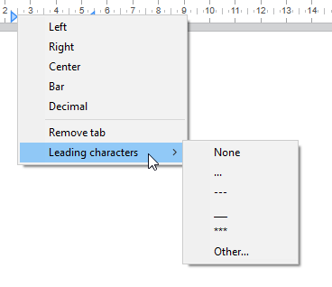

Quando **Outro...** for selecionado, um diálogo é exibido onde um caractere inicial personalizado pode ser definido.

##### Réguas Multi-coluna 

Quando duas ou mais colunas forem definidas para o documento ou seção, a régua exibe uma área específica para cada coluna:

**Nota:** propriedade Multi-coluna não está disponível em modo **Embedded**.

##### Evento On After Edit 

Um evento de formulário On After Edit é ativado para objeto de área de formulário 4D Write Pro sempre que uma aba ou controle de margem for movido, adicionado ou apagado, seja arrastando ou usando o menu contextual

#### Manejar colunas 

4D Write Pro permite que maneje colunas em seus documentos. Colunas são conectadas da coluna mais à esquerda até a mais à direita. Ou seja, quando digitar texto, o fluxo de texto vai começar preenchendo a coluna mais à esquerda e continuar com a coluna diretamente à direita até chegar ao final da página. Quando o final da página tiver sido alcançado, o fluxo de texto vai para a próxima página. Para poder balancear as configurações de páginas, 4D Write Pro permite que insira quebras de coluna.

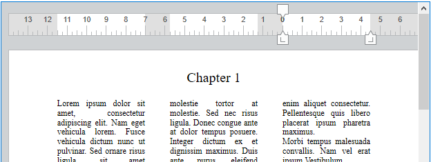

Colunas podem ser definidas ao nível de documento (são exibidos no documento inteiro) ou no nível da seção (cada seção pode ter sua própria configuração de coluna).

**Nota:** Colunas só são compatíveis nos modos **Vista de página** e **Vista rascunho** (não são exibidos em modo **Embedded** e são exportados a .docx por [WP EXPORT DOCUMENT](../commands/wp-export-document) , mas não aos formato HTML e MIME HTML wk web page complete ).

Colunas podem ser estabelecidas usando:

* o submenu **Colunas** do menu contextual de área 4D Write Pro,
* atributos 4D Write Pro (veja *Atributos 4D Write Pro*),
* ações padrão 4D Write Pro (veja *Usando ações padrão*).

Pode estabelecer ou obter as propriedades abaixo e ações para colunas:

| **Propriedade**                 | **Descrição**                                                                                                                                                                                                                                                            | *Documento* **atributos**                                                   | **Ações padrão**                                        |
| ------------------------------- | ------------------------------------------------------------------------------------------------------------------------------------------------------------------------------------------------------------------------------------------------------------------------ | --------------------------------------------------------------------------- | ------------------------------------------------------- |
| Número de colunas               | Pode definir até 20 colunas para o documento/seção                                                                                                                                                                                                                       | wk column count                                                             | *columnCount*                                           |
| Espaçamento de coluna           | Espaço entre colunas em pts, polegadas, ou cm. Note que todas as colunas vão ter o mesmo tamanho. Cada largura de coluna é automaticamente calculada por 4D Write Pro de acordo com o número de colunas, a largura de página e o espaçamento                             | wk column spacing                                                           | *columnSpacing*                                         |
| Largura de coluna               | (atributo apenas leitura) Largura atual de cada coluna, ou seja, largura computada                                                                                                                                                                                       | wk column width                                                             | \-                                                      |
| Estilo, cor e largura de coluna | Pode adicionar um separadador vertical (uma linha decorativa) entre as collunas. Essas opções permitem planejar o estilo de separador, cor e largura. Para remover o separador vertical, selecione **None** como estilo. | wk column rule style, wk column rule color, wk column rule width            | *columnRuleStyle*, *columnRuleColor*, *columnRuleWidth* |
| Inserir break                   | Insere uma quebra de coluna                                                                                                                                                                                                                                              | wk column break, veja também [WP INSERT BREAK](../commands/wp-insert-break) | *insertColumnBreak*                                     |
| Menu de Colunas                 | Crie um sub-menu Colunas                                                                                                                                                                                                                                                 | \-                                                                          | *colunas*                                               |

##### Criar uma página com seções múltiplas-colunas e únicas colunas 

*Inserir uma quebra de seção contínua* em seu documento lhe permite ter seções de várias colunas e seções de uma coluna na mesma página. 

Por exemplo:

Pode inserir uma quebra de seção continua e mudar o número de colunas a duas para a primeira seção:

